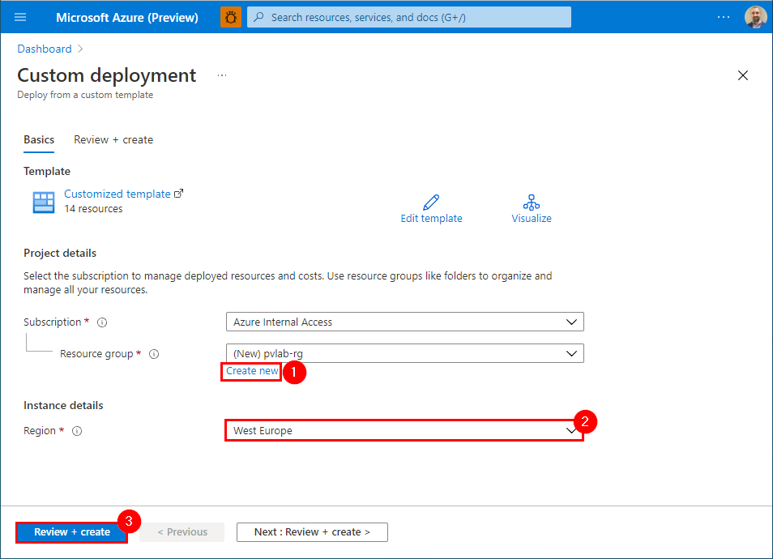
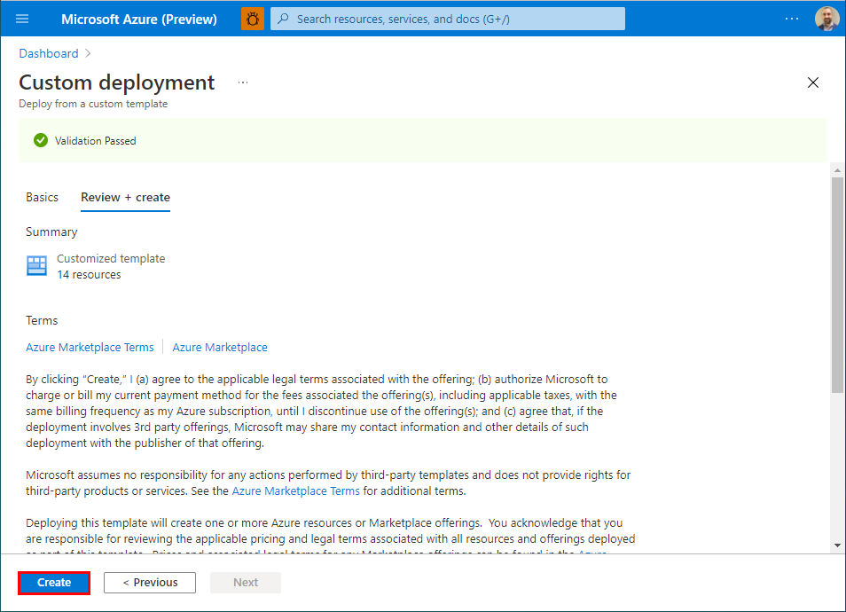
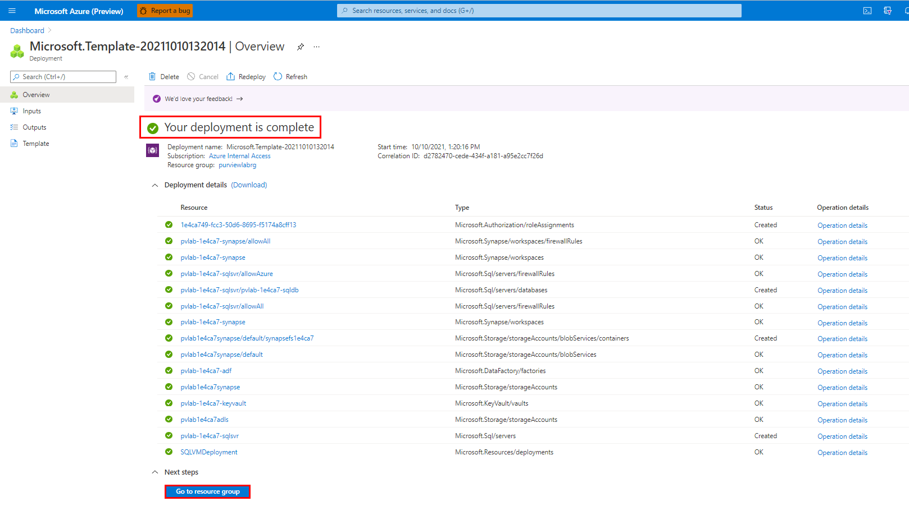

# Azure Purview Workshop

## What is Azure Purview?

Azure Purview is a unified data governance service that helps you manage and govern your on-premises, multicloud and software-as-a-service (SaaS) data. Easily create a holistic, up-to-date map of your data landscape with automated data discovery, sensitive data classification and end-to-end data lineage. Empower data consumers to find valuable, trustworthy data.

## Table of Contents

* [Prerequisites](#thinking-prerequisites)
* [Lab Environment Setup](#test_tube-lab-environment-setup)
* [Learning Modules](#books-learning-modules)

<a href="#azure-purview-workshop">↥ back to top</a>

## :thinking: Prerequisites

* An [Azure account](https://azure.microsoft.com/en-us/free/) with an active subscription.
* Owner permissions within a Resource Group to create resources and manage role assignments.
* The subscription must have the following resource providers registered.
    * Microsoft.Authorization
    * Microsoft.DataFactory
    * Microsoft.EventHub
    * Microsoft.KeyVault
    * Microsoft.Purview
    * Microsoft.Storage
    * Microsoft.Sql
    * Microsoft.Synapse

<a href="#azure-purview-workshop">↥ back to top</a>

## :test_tube: Lab Environment Setup

1. Right-click the button to open the Azure Portal in a new window.

    

2. Click **Create new** to create a new resource group (e.g. `purviewlab-rg`), select a [valid location](https://azure.microsoft.com/en-us/global-infrastructure/services/?products=purview&regions=all) (e.g. `West Europe`), and then click **Review + create**.

    

3. Once the validation has passed, click **Create**.

    

4. The deployment should take approximately 10 minutes to complete. Once you see the message **Your deployment is complete**, click **Go to resource group**.

    

5. If successful, you should see a set of 15 resources, similar to the screenshot below.

    

Note:

* The Azure Purview account resource has been purposely **excluded** from the template so that participants have an opportunity to understand how to deploy an Azure Purview account via the Azure Portal.

<a href="#azure-purview-workshop">↥ back to top</a>

## :books: Learning Modules

1. [Create an Azure Purview Account](./modules/module01.md)
2. Register & Scan: [2A. ADLS Gen2 (Managed Identity)](./modules/module02a.md) | [2B. Azure SQL DB (Azure Key Vault)](./modules/module02b.md)
3. [Search & Browse](./modules/module03.md)
4. [Glossary](./modules/module04.md)
5. [Classifications](./modules/module05.md)
6. [Lineage](./modules/module06.md)
7. [Insights](./modules/module07.md)
8. [Monitor](./modules/module08.md)
9. [Integrate with Azure Synapse Analytics](./modules/module09.md)
10. [REST API](./modules/module10.md)

<a href="#azure-purview-workshop">↥ back to top</a>

## :link: Workshop URL
[aka.ms/purviewlab](https://aka.ms/purviewlab)
