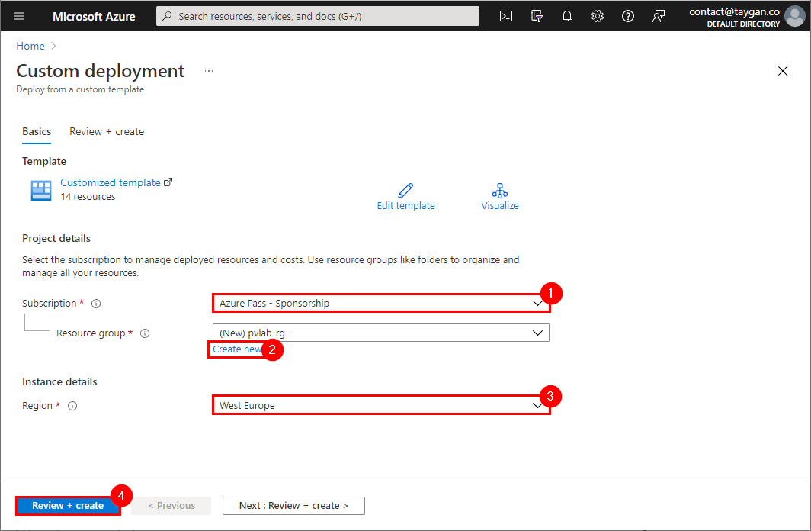
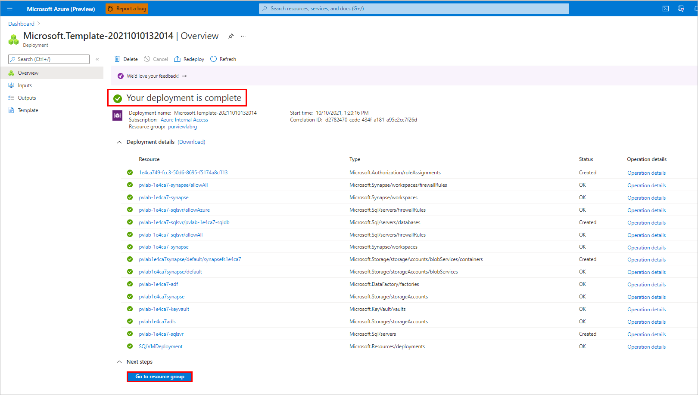
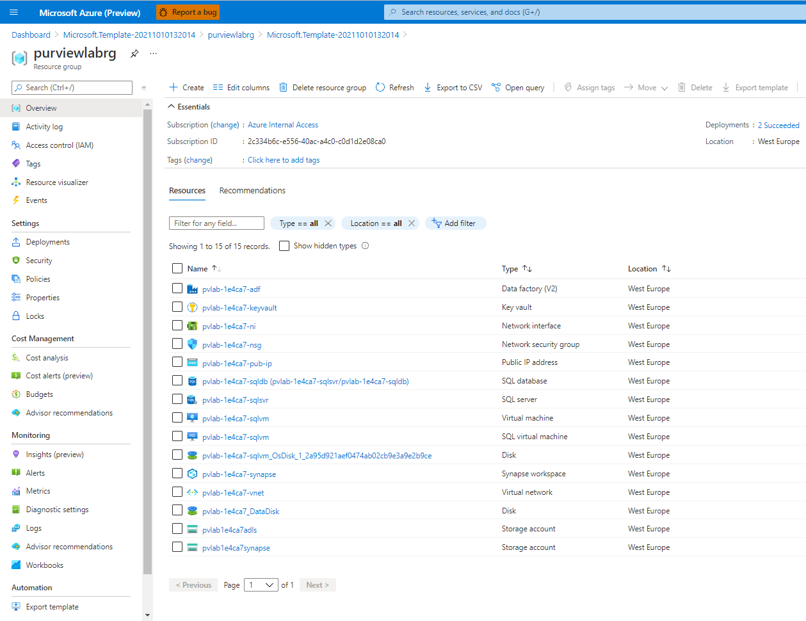

# Module 00 - Lab Environment Setup

**[Home](../README.md)** - [Next Module >](../modules/module01.md)

## :loudspeaker: Introduction

In order to follow along with the Microsoft Purview lab exercises, you need to provision a set of resources.

## :thinking: Prerequisites

* An [Azure account](https://azure.microsoft.com/free/) with an active subscription.
* Owner permissions within a Resource Group to create resources and manage role assignments.
* The subscription must have the following resource providers registered.
  * Microsoft.Authorization
  * Microsoft.DataFactory
  * Microsoft.EventHub
  * Microsoft.KeyVault
  * Microsoft.Purview
  * Microsoft.Storage
  * Microsoft.Sql
  * Microsoft.Synapse
  * Microsoft.Insights

    > :warning: If you are using an **Azure Pass promo code**, the following resource providers - `Microsoft.Storage`, `Microsoft.EventHub`, and `Microsoft.Synapse` are not registered by default. Follow the instructions on [how to register a resource provider](./providers.md) before proceeding with the lab environment deployment below.

## :test_tube: Lab Environment Setup

1. Right-click or `Ctrl + click` the button below to open the Azure Portal in a new window.

    

2. Beneath the **Resource group** field, click **Create new** and provide a unique name (e.g. `purviewlab-rg`), select a [valid location](https://azure.microsoft.com/global-infrastructure/services/?products=purview&regions=all) (e.g. `West Europe`), and then click **Review + create**.

    

3. Once the validation has passed, click **Create**.

    

4. The deployment should take approximately 10 minutes to complete. Once you see the message **Your deployment is complete**, click **Go to resource group**.

    

5. If successful, you should see a set of 15 resources, similar to the screenshot below.

    

Note: The Microsoft Purview account resource has been purposely **excluded** from the template so that participants have an opportunity to understand how to deploy a Microsoft Purview account via the Azure Portal.

## :tada: Summary

By successfully deploying the Microsoft Purview lab template, you have the Azure resources needed to follow along with the learning exercises.

[Continue >](../modules/module01.md)
