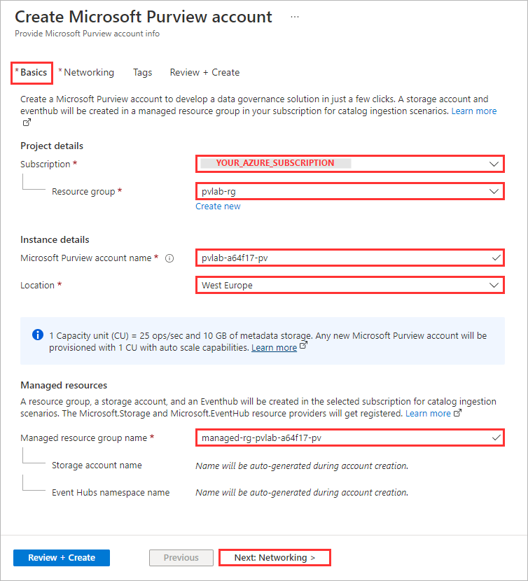
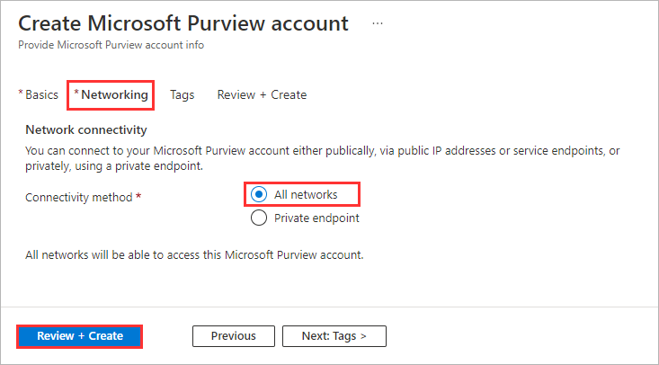
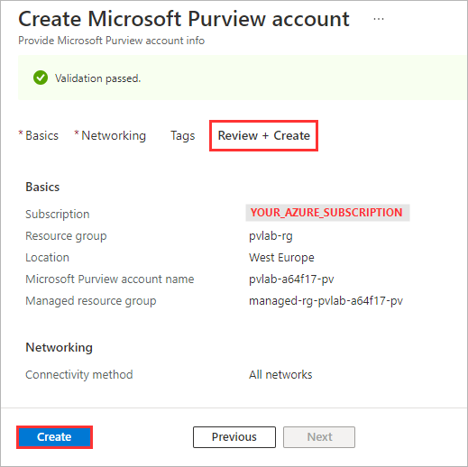
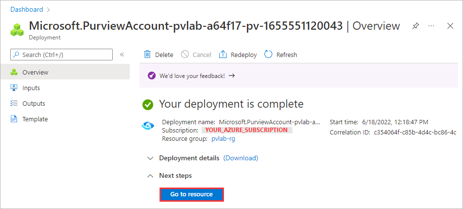
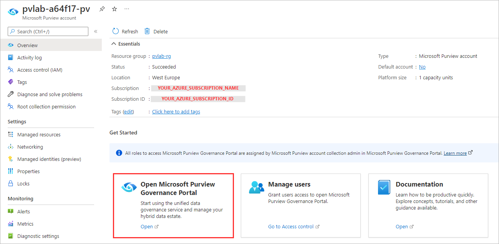
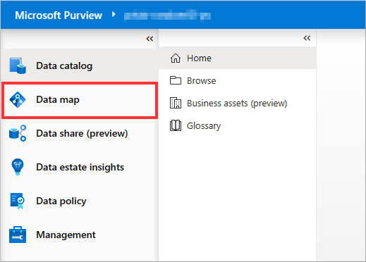
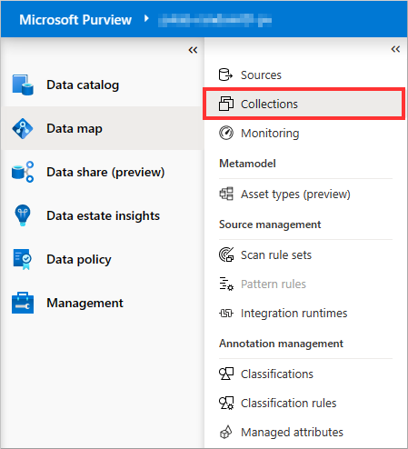
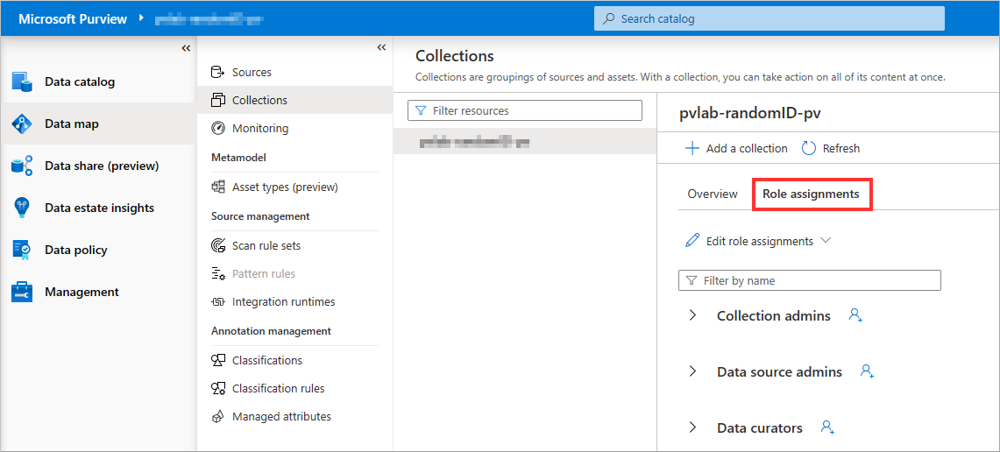
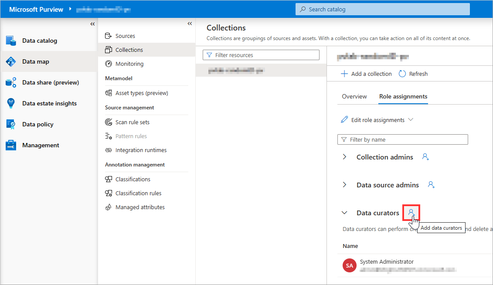
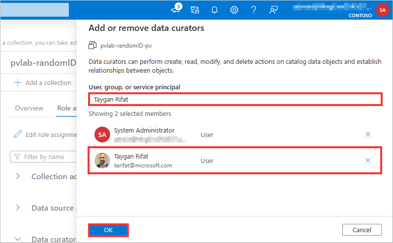

# Module 01 - Create a Microsoft Purview Account

[< Previous Module](../modules/module00.md) - **[Home](../README.md)** - [Next Module >](../modules/module02a.md)

## :loudspeaker: Introduction

Microsoft Purview is a unified data governance solution that helps you manage and govern your data at large. It combines many different services for scanning, collecting, organizing and sharing metadata. It uses a catalogue for discoverability, but also offers other features, such as automatic classification, sharing, access management and so on.

When planning your Microsoft Purview deployment, you first need to provision a Microsoft Purview account. Next, you need to define your collections for managing and grouping data assets together. A collection is a logical container in which your metadata, such as data sources, will be managed. When creating collections and placing them in a hierarchy, you need to make different considerations, such as your security requirements, governance structure and democratization needs. For example, a more centralized-alined style of data management leads to different collection structure then a more domain-oriented style of data management. Depending on your needs, different topologies can be used for managing your data. Best practices for this can be found on [this website](https://docs.microsoft.com/azure/purview/concept-best-practices-collections).

## :thinking: Prerequisites

* An [Azure account](https://azure.microsoft.com/free/) with an active subscription.
* Your must have permissions to create resources in your Azure subscription.
* Your subscription must have the following resource providers registered: **Microsoft.Purview**, **Microsoft.Storage**, and **Microsoft.EventHub**. Instructions on how to register a resource provider via the Azure Portal can be found [here](https://docs.microsoft.com/azure/azure-resource-manager/management/resource-providers-and-types#azure-portal).

## :dart: Objectives

* Create a Microsoft Purview account using the Azure portal.
* Provide additional users access to Microsoft Purview's data plane.

## :bookmark_tabs: Table of Contents

| #  | Section | Role |
| --- | --- | --- |
| 1 | [Create a Microsoft Purview Account](#1-create-a-microsoft-purview-account) | Azure Administrator |
| 2 | [Grant Access to Microsoft Purview's Data Plane](#2-grant-access-to-microsoft-purviews-data-plane) | Collection Administrator |

<a href="#module-01---create-a-microsoft-purview-account">↥ back to top</a>

## 1. Create a Microsoft Purview Account

1. Sign in to the [Azure portal](https://portal.azure.com), navigate to the **Home** screen, click **Create a resource**.

      

2. Search the Marketplace for "Microsoft Purview" and click **Create**.

    

3. Provide the necessary inputs on the **Basics** tab and click **Next: Networking >**.  

    > Note: The table below provides example values for illustrative purposes only, ensure to specify values that make sense for your deployment. If you have pre-deployed other Azure resources using the lab template, they would have been created with a `randomId`, it is recommended to use the same `randomId` for the Microsoft Purview account name as per the example below.

    | Parameter  | Example Value |
    | --- | --- |
    | Subscription | `YOUR_AZURE_SUBSCRIPTION` |
    | Resource group | `pvlab-rg` |
    | Microsoft Purview account name | `pvlab-{randomId}-pv` |
    | Location | `YOUR_LOCATION` |
    | Event Hubs namespace name | `Enable` |

    

    > :bulb: **Did you know?**
    >
    > **Capacity Units** determine the size of the platform and is a **provisioned** (always on) set of resources that is needed to keep the Microsoft Purview platform up and running. 1 Capacity Unit is able to support approximately 25 data map operations per second and includes up to 10GB of metadata storage about data assets.
    >
    > Capacity Units are required regardless of whether you plan to invoke the Microsoft Purview API endpoints directly (i.e. ISV scenario) or indirectly via the Microsoft Purview Governance Portal (GUI).
    >
    > Note: With the introduction of the [Elastic Data Map](https://docs.microsoft.com/azure/purview/concept-elastic-data-map), you no longer need to specify how many Capacity Units that you need. Microsoft Purview will scale capacity elastically based on the request load.
    >
    > **vCore Hours** on the other hand, is the unit of measure for **serverless** compute that is needed to run a scan. You only pay per vCore Hour of scanning that you consume (rounded up to the nearest minute).
    >
    > For more information, check out the [Microsoft Purview Pricing](https://azure.microsoft.com/pricing/details/purview/) page.

4. On the **Networking** tab, select **All networks**, and click **Review + Create**.

    

5. On the **Review + Create** tab, once the message in the ribbon returns "Validation passed", verify your selections and click **Create**.

    

6. Wait several minutes while your deployment is in progress. Once complete, click **Go to resource**.

    

<a href="#module-01---create-a-microsoft-purview-account">↥ back to top</a>

## 2. Grant Access to Microsoft Purview's Data Plane

By default, the identity used to create the Microsoft Purview account resource will have full access to the Microsoft Purview Governance Portal. The following instructions detail how to provide access to additional users within your Azure Active Directory.

1. Navigate to your Microsoft Purview account and click the **Open Microsoft Purview Governance Portal** tile.

    

2. On the left-hand side, navigate to **Data map**.

    

3. Select **Collections**.

    

4. Select **Role assignments**.

    

5. On the right-hand side of **Data curators**, click the **Add** icon.

    

6. Search for another user within your Azure Active Directory, select their account, click **OK**.

    

    > :bulb: **Did you know?**
    >
    > Microsoft Purview has a set of predefined data plane roles that can be used to control who can access what.
    >
    > For more information, check out [Access control in Microsoft Purview](https://docs.microsoft.com/azure/purview/catalog-permissions).

    | Role  | Collections | Catalog | Sources/Scans | Description |
    | --- | --- | --- | --- | --- |
    | Collection Admin | `Read/Write` | | | Manage collections and role assignments. |
    | Data Reader ||  `Read` |  | Access to catalog (read only). |
    | Data Curator || `Read/Write` |  | Access to catalog (read & write). |
    | Data Source Admin |  || `Read/Write` | Manage data sources and data scans. |

<a href="#module-01---create-a-microsoft-purview-account">↥ back to top</a>

## :mortar_board: Knowledge Check

[https://aka.ms/purviewlab/q01](https://aka.ms/purviewlab/q01)

1. Which of the following Microsoft Purview pricing meters is **serverless** and used to support **data map population** through scanning and ingestion jobs?

    A ) Capacity Units  
    B ) vCore Hours  
    C ) Neither

2. Which of the following Microsoft Purview pricing meters is **always on** and used to support **data map consumption** through capacity and storage?

    A ) Capacity Units  
    B ) vCore Hours  
    C ) Neither

3. Which Microsoft Purview **feature** is included and billed with the consumption of the **data map**?

    A ) Data Estate Insights  
    B ) Search and browse of data assets  
    C ) SQL DevOps access

4. Which predefined Microsoft Purview role provides access to **manage data sources**?

    A ) Purview Data Reader  
    B ) Purview Data Curator  
    C ) Purview Data Source Administrator

<a href="#module-01---create-a-microsoft-purview-account">↥ back to top</a>

## :tada: Summary

This module provided an overview of how to provision a Microsoft Purview account using the Azure Portal and how to grant the appropriate level of access to Microsoft Purview's data plane.

[Continue >](../modules/module02a.md)
