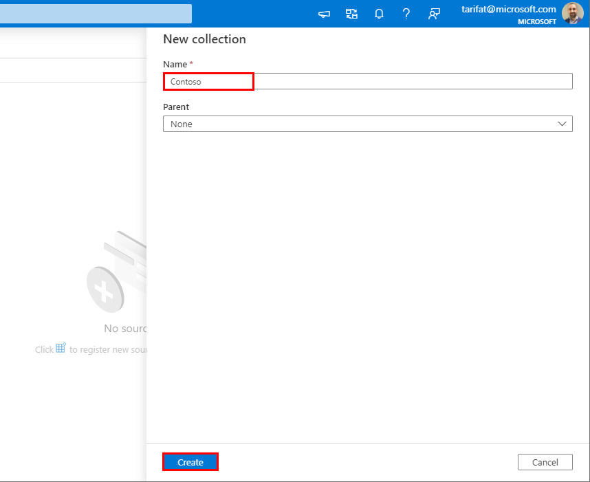
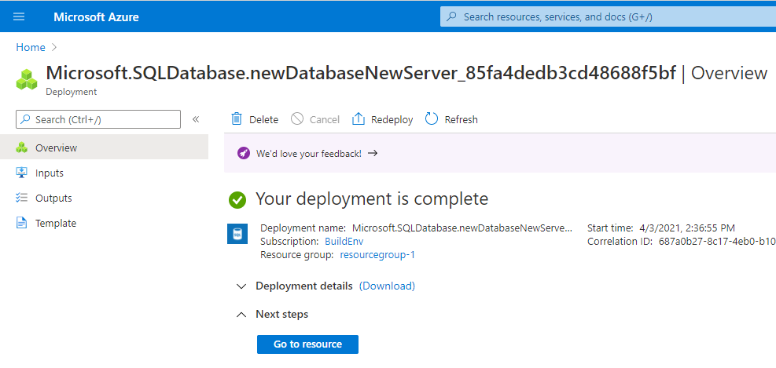
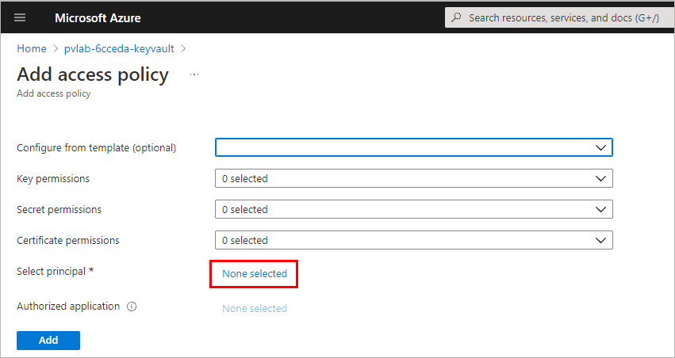
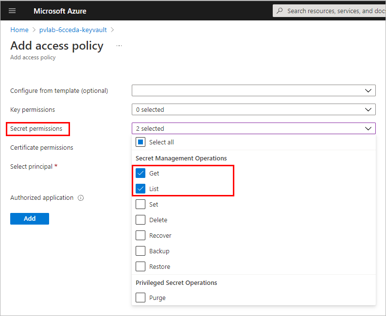
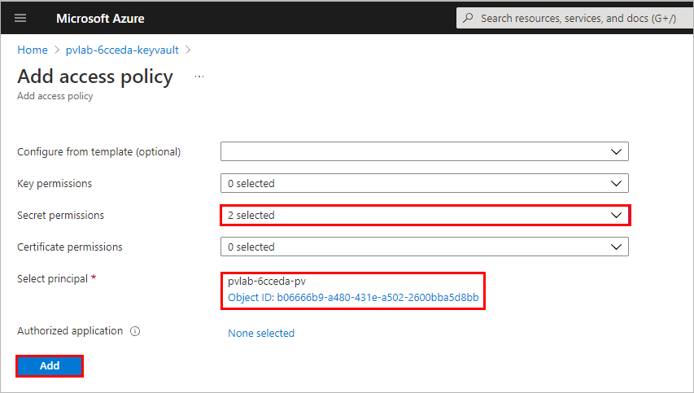

# Module 02 - Register & Scan

[< Previous Module](../modules/module01.md) - **[Home](../README.md)** - [Next Module>](../modules/module03.md)

## :thinking: Prerequisites

* An [Azure account](https://azure.microsoft.com/en-us/free/) with an active subscription.
* An Azure Azure Purview account (see [module 01](../modules/module01.md)).

## :hammer: Tools

* [Azure Storage Explorer](https://azure.microsoft.com/en-us/features/storage-explorer/) (Download and Install)

## :loudspeaker: Introduction

To populate Azure Purview with assets for data discovery and understanding, we must register sources that exist across our data estate so that we can leverage the out of the box scanning capabilities. Scanning enables Azure Purview to extract technical metadata such as the fully qualified name, schema, data types, and apply classifications by parsing a sample of the underlying data. In this module, we will walk through how to register and scan data sources.

## :dart: Objectives

* Register and scan an Azure Data Lake Storage Gen2 account using the Azure Purview managed identity.
* Register and scan an Azure SQL Database using SQL authentication credentials stored in Azure Key Vault.

## Table of Contents

1. [Create an Azure Data Lake Storage Gen2 Account](#1-create-an-azure-data-lake-storage-gen2-account)
1. [Grant the Azure Purview Managed Identity Access](#2-grant-the-azure-purview-managed-identity-access)
1. [Upload Data to Azure Data Lake Storage Gen2 Account](#3-upload-data-to-azure-data-lake-storage-gen2-account)
1. [Create a Collection](#4-create-a-collection)
1. [Register a Source (ADLS Gen2)](#5-register-a-source-adls-gen2)
1. [Scan a Source with the Azure Purview Managed Identity](#6-scan-a-source-with-the-azure-purview-managed-identity)
1. [Create an Azure SQL Database](#7-create-an-azure-sql-database)
1. [Create an Azure Key Vault](#8-create-an-azure-key-vault)
1. [Add Credentials to Azure Purview](#9-add-credentials-to-azure-purview)
1. [Register a Source (Azure SQL DB)](#10-register-a-source-azure-sql-db)
1. [Scan a Source with Azure Key Vault Credentials](#11-scan-a-source-with-azure-key-vault-credentials)
1. [View Assets](#12-view-assets)

<a href="#module-02---register--scan">↥ back to top</a>

## 1. Create an Azure Data Lake Storage Gen2 Account

1. Sign in to the [Azure portal](https://portal.azure.com) with your Azure account and from the **Home** screen, click **Create a resource**.

      

2. Under "Popular", click **Storage account**.

    

3. Provide the necessary inputs on the **Basics** tab.  
    > Note: The table below provides example values for Subscription, Resource Group, Purview account name, and Location for illustrative purposes only, ensure to specify values that make sense for your deployment.

    | Parameter  | Example Value |
    | --- | --- |
    | Subscription | `Azure Internal Access` |
    | Resource group | `purviewlab` |
    | Storage account name | `storage69426` |
    | Location | `(South America) Brazil South` |
    | Performance | `Standard` |
    | Account kind | `StorageV2 (general purpose v2)` |
    | Replication | `Locally-redundant storage (LRS)` |

    

4. On the **Advanced** tab, set the **Hierarchal namespace** to **Enabled**.

    

5. On the **Review + Create** tab, once the message in the ribbon returns "Validation passed", verify your selections and click **Create**.

    

6. Wait several minutes while your deployment is in progress. Once complete, click **Go to resource**.

    

<a href="#module-02---register--scan">↥ back to top</a>

## 2. Grant the Azure Purview Managed Identity Access

To scan a source, Azure Purview requires a set of credentials with the necessary permissions. For Azure Data Lake Storage Gen2, Azure Purview supports the following authentication methods.

* Managed Identity (recommended)
* Service Principal
* Account Key

In this module we will walk through how to grant the Azure Purview Managed Identity the necessary access to successfully configure and run a scan.

1. From your Azure Data Lake Storage Gen2 account, select **Access Control (IAM)** from the left navigation menu.

    

2. Click **Add role assignments**.

    

3. Populate the role assignment prompt as per the table below, select the Azure Purview managed from the list, click **Save**.

    | Property  | Value |
    | --- | --- |
    | Role | `Storage Blob Data Reader` |
    | Assign access to | `User, group, or service principal` |
    | Select | `<purview-account-name>` |

    

4. Navigate to the **Role assignments** tab and confirm the Azure Purview managed identity has been assigned the Storage Blob Data Reader role. Tip: Filter **Scope** to `This resource` to limit the results.

    

<a href="#module-02---register--scan">↥ back to top</a>

## 3. Upload Data to Azure Data Lake Storage Gen2 Account

Before proceeding with the following steps, you will need to:

* Download and install [Azure Storage Explorer](https://azure.microsoft.com/en-us/features/storage-explorer/).
* Open Azure Storage Explorer.
* Sign in to Azure via **View > Account Management > Add an account...**.

1. Download a copy of the **[Bing Coronavirus Query Set](https://github.com/tayganr/purviewlab/raw/main/assets/BingCoronavirusQuerySet.zip)** to your local machine. Note: This data set was originally sourced from [Microsoft Research Open Data](https://msropendata.com/datasets/c5031874-835c-48ed-8b6d-31de2dad0654).

2. Locate the downloaded zip file via File Explorer and unzip the contents by right-clicking the file and selecting **Extract All...**.

    

3. Click **Extract**.

    

4. Open Azure Storage Explorer, click on the Toggle Explorer icon, expand the Azure Subscription to find your Azure Storage Account. Right-click on Blob Containers and select **Create Blob Container**. Name the container **raw**.

    

5. With the container name selected, click on the **Upload** button and select **Upload Folder...**.

    

6. Click on the **ellipsis** to select a folder.

    

7. Navigate to the extracted **BingCoronavirusQuerySet** folder (e.g. Downloads\BingCoronavirusQuerySet) and click **Select Folder**.

    

8. Click **Upload**.

    

9. Monitor the **Activities** until the transfer is complete.

    

<a href="#module-02---register--scan">↥ back to top</a>

## 4. Create a Collection

1. Open Purview Studio, navigate to **Sources** and click **New collection**.

    

2. Provide the collection a **Name** (e.g. Contoso) and click **Create**.

    > :bulb: **Did you know?**
    >
    > **Collections** can be used to logically group data sources. Collections can also belong to other Collections to form a hierarchy (e.g. Organization Name > Business Unit). Collections can collapse or expand by clicking the circle attached to the arrow between levels.

    

<a href="#module-02---register--scan">↥ back to top</a>

## 5. Register a Source (ADLS Gen2)

1. Open Purview Studio, navigate to **Sources** and click **Register**.

    

2. Select **Azure Data Lake Storage Gen2** and click **Continue**.

    

3. Select the **Azure subscription**, **Storage account name**, and **Collection**. Click **Register**.

    > :bulb: **Did you know?**
    >
    > At this point, we have simply registered a data source. Assets are not written to the catalog until after a scan has finished running.

    

<a href="#module-02---register--scan">↥ back to top</a>

## 6. Scan a Source with the Azure Purview Managed Identity

1. Open Purview Studio, navigate to **Sources**, and within the Azure Data Lake Storage Gen2 source tile, click the **New Scan** button.

    

2. Click **Test connection** to ensure the Azure Purview managed identity has the appropriate level of access to read the Azure Data Lake Storage Gen2 account. If successful, click **Continue**.

    

3. Expand the hierarchy to see which assets will be within the scans scope, and click **Continue**.

    

4. Select the system default scan rule set and click **Continue**.

    > :bulb: **Did you know?**
    >
    > **Scan Rule Sets** determine which **File Types** and **Classification Rules** are in scope. If you want to include a custom file type or custom classification rule as part of a scan, a custom scan rule set will need to be created.

    

5. Select **Once** and click **Continue**.

    

6. Click **Save and Run**.

    

7. To monitor the progress of the scan run, click **View Details**.

    

8. Click **Refresh** to periodically update the status of the scan. Note: It will take approximately 5 minutes to complete.

    

<a href="#module-02---register--scan">↥ back to top</a>

## 7. Create an Azure SQL Database

1. Sign in to the [Azure portal](https://portal.azure.com) with your Azure account and from the **Home** screen, click **Create a resource**.

      

2.  Search for `Azure SQL` and click **Create**.

    

3. Select **Single database** and click **Create**.

    

4. Under the **Basics** tab, select a **Resource group** (e.g. `resourcegroup-1`), provide a **Database name** (e.g. `sqldb-team01`) and under **Server** click **Create new**.
 
    

5. Provide the necessary inputs and click **OK**.

    > Note: The table below provides example values for illustrative purposes only, ensure to specify values that make sense for your deployment.

    | Property  | Example Value |
    | --- | --- |
    | Server name | `sqlsvr-team01` |
    | Server admin login | `team01` |
    | Password | `<your-sql-admin-password>` |
    | Confirm password | `<your-sql-admin-password>` |
    | Location | `East US 2` |

    > Note: The **admin login** and **password** will be required later in the module. Make note of these two values.

    

6. Click **Configure database**.

    

7. Select **Serverless** and click **Apply**.

    

8. Navigate to the **Additional settings** tab, select **Sample**, click **Review + create**.

    

9. Click **Create**.

    

10. Once the deployment is complete, click **Go to resource**.

    

11. Navigate to the **Server**.

    

12. Click **Firewalls and virtual networks**, set **Allow Azure services and resources to access this server** to **Yes**, click **Save**.

    

<a href="#module-02---register--scan">↥ back to top</a>

## 8. Create an Azure Key Vault

1. From the **Home** screen of the Azure Portal, click **Create a resource**.

      

2. Search for `Key Vault` and click **Create**.

    

3. Under the **Basics** tab, select a **Resource group** (e.g. `resourcegroup-1`), provide a **Key vault name** (e.g. `vault-team01`), select a Region (e.g. `East US 2`). 

    

4. Navigate to the **Access policy** tab and click **Add Access Policy**.

    

5. Under **Select principal**, click **None selected**.

    

6. Search for the name of your Azure Purview account (e.g. `purview-team01`), select the item, click **Select**.

    

7. Under **Secret permissions**, select **Get** and **List**.

    

8. Review your selections and click **Add**.

    

9. Click **Review + create**.

    

10. Click **Create**.

    

11. Once your deployment is complete, click **Go to resource**.

    

12. Navigate to **Secrets** and click **Generate/Import**.

    

13. Under **Name** type `sql-secret`. Under **Value** provide the same password that was specified for the SQL Server admin account created earlier in step 7.5. Click **Create**.

    

<a href="#module-02---register--scan">↥ back to top</a>

## 9. Add Credentials to Azure Purview

1. To make the secret accessible to Azure Purview, we must establish a connection to Azure Key Vault. Open **Purview Studio**, navigate to **Management Center** > **Credentials**, click **Manage Key Vault connections**.

    

2. Click **New**.

    

3. Use the drop-down menus to select the appropriate **Subscription** and **Key Vault name**. Click **Create**.

    

4. Since we have already granted the Purview managed identity access to our Azure Key Vault, click **Confirm**.

    

5. Click **Close**.

    

6. Under **Credentials** click **New**.

    

7. Provide the necessary details and click **Create**.

    * Overwrite the **Name** to `credential-SQL`
    * Set the **Authentication method** to `SQL authentication`
    * Set the **User name** to the SQL Server admin login specified earlier (e.g. `team01`)
    * Select the **Key Vault connection**
    * Set the **Secret name** to `sql-secret`

    

<a href="#module-02---register--scan">↥ back to top</a>

## 10. Register a Source (Azure SQL DB)

1. Open Purview Studio, navigate to **Sources** and click **Register**.

    

2. Navigate to the **Azure** tab, select **Azure SQL Database**, click **Continue**.

    

3. Select the **Azure subscritpion**, **Server name**, and **Collection**. Click **Register**.

    

<a href="#module-02---register--scan">↥ back to top</a>

## 11. Scan a Source with Azure Key Vault Credentials

1. Open Purview Studio, navigate to **Sources**, and within the Azure SQL Database source tile, click the **New Scan** button.

    

2. Select the **Database** and **Credential** from the drop-down menus. Click **Test connection**. Click **Continue**.

    

3. Click **Continue**.

    

4. Click **Continue**.

    

5. Set the trigger to **Once**, click **Continue**.

    

6. Click **Save and Run**.

    

7. To monitor the progress of the scan, click **View Details**.

    

8. Click **Refresh** to periodically update the status of the scan. Note: It will take approximately 5 minutes to complete.

    

<a href="#module-02---register--scan">↥ back to top</a>

## 12. View Assets

1. To view the assets that have materialised as an outcome of running the scans, perform a wildcard search by typing the asterisk character (`*`) into the search bar and hitting the Enter key to submit the query and return the search results.

    

<a href="#module-02---register--scan">↥ back to top</a>

## :mortar_board: Knowledge Check

1. What type of object can help organize data sources into logical groups?

    A ) Buckets    
    B ) Collections  
    C ) Groups  

2. At which point does Azure Purview begin to populate the data map with assets?

    A ) After an Azure Purview account is created  
    B ) After a Data Source has been registered    
    C ) After a Data Source has been scanned

3. Which of the following attributes is **not** automatically assigned to an asset as a result of the system-built scanning functionality?

    A ) Technical Metadata (e.g. Fully Qualified Name, Path, Schema, etc)  
    B ) Glossary Terms (e.g. column `Sales Tax` is tagged with the `Sales Tax` glossary term)  
    C ) Classifications (e.g. column `ccnum` is tagged with the `Credit Card Number` classification)  

<a href="#module-02---register--scan">↥ back to top</a>

## :tada: Summary

This module provided an overview of how to create a collection, register a source, and trigger a scan.
