# Module 02A - Register & Scan (ADLS Gen2)

[< Previous Module](../modules/module01.md) - **[Home](../README.md)** - [Next Module >](../modules/module02b.md)

## :thinking: Prerequisites

* An [Azure account](https://azure.microsoft.com/en-us/free/) with an active subscription.
* An Azure Data Lake Storage Gen2 account (see [module 00](../modules/module00.md)).
* An Azure Azure Purview account (see [module 01](../modules/module01.md)).

## :hammer: Tools

* [Azure Storage Explorer](https://azure.microsoft.com/en-us/features/storage-explorer/) (Download and Install)

## :loudspeaker: Introduction

To populate Azure Purview with assets for data discovery and understanding, we must register sources that exist across our data estate so that we can leverage the out of the box scanning capabilities. Scanning enables Azure Purview to extract technical metadata such as the fully qualified name, schema, data types, and apply classifications by parsing a sample of the underlying data. In this module, we will walk through how to register and scan data sources.

## :dart: Objectives

* Create a collection.
* Register and scan an Azure Data Lake Storage Gen2 account using the Azure Purview managed identity.

##  :bookmark_tabs: Table of Contents

| #  | Section | Targeted Role |
| --- | --- | --- |
| 1 | [Grant the Azure Purview Managed Identity Access](#1-grant-the-azure-purview-managed-identity-access) | Azure Administrator |
| 2 | [Upload Data to Azure Data Lake Storage Gen2 Account](#2-upload-data-to-azure-data-lake-storage-gen2-account) | Azure Administrator |
| 3 | [Create a Collection](#3-create-a-collection) | Collection Administrator |
| 4 | [Register a Source (ADLS Gen2)](#4-register-a-source-adls-gen2) | Data Source Administrator |
| 5 | [Scan a Source with the Azure Purview Managed Identity](#5-scan-a-source-with-the-azure-purview-managed-identity) | Data Source Administrator |
| 6 | [View Assets](#6-view-assets) | Data Reader |

<a href="#module-02a---register--scan-adls-gen2">↥ back to top</a>

## 1. Grant the Azure Purview Managed Identity Access

> :bulb: **Did you know?**
>
> To scan a source, Azure Purview requires a set of **credentials**. For Azure Data Lake Storage Gen2, Azure Purview supports the following [authentication methods](https://docs.microsoft.com/en-gb/azure/purview/register-scan-adls-gen2#setting-up-authentication-for-a-scan).
>
> * Managed Identity (recommended)
>* Service Principal
> * Account Key
> 
> In this module we will walk through how to grant the Azure Purview Managed Identity the necessary access to successfully configure and run a scan.

1. Navigate to your Azure Data Lake Storage Gen2 account (e.g. `pvlab{randomId}adls`) and select **Access Control (IAM)** from the left navigation menu.

    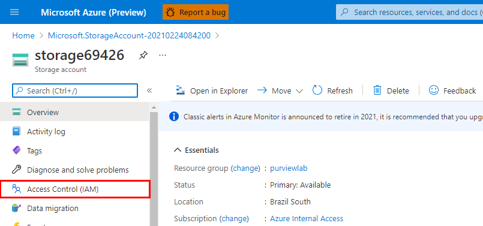

2. Click **Add role assignments**.

    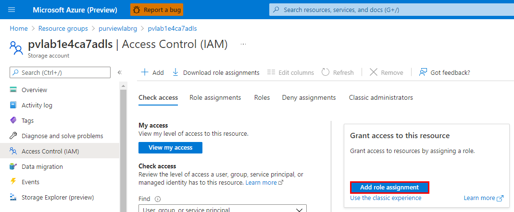

3. Filter the list of roles by searching for `Storage Blob Data Reader`, click the row to select the role, and then click **Next**.

    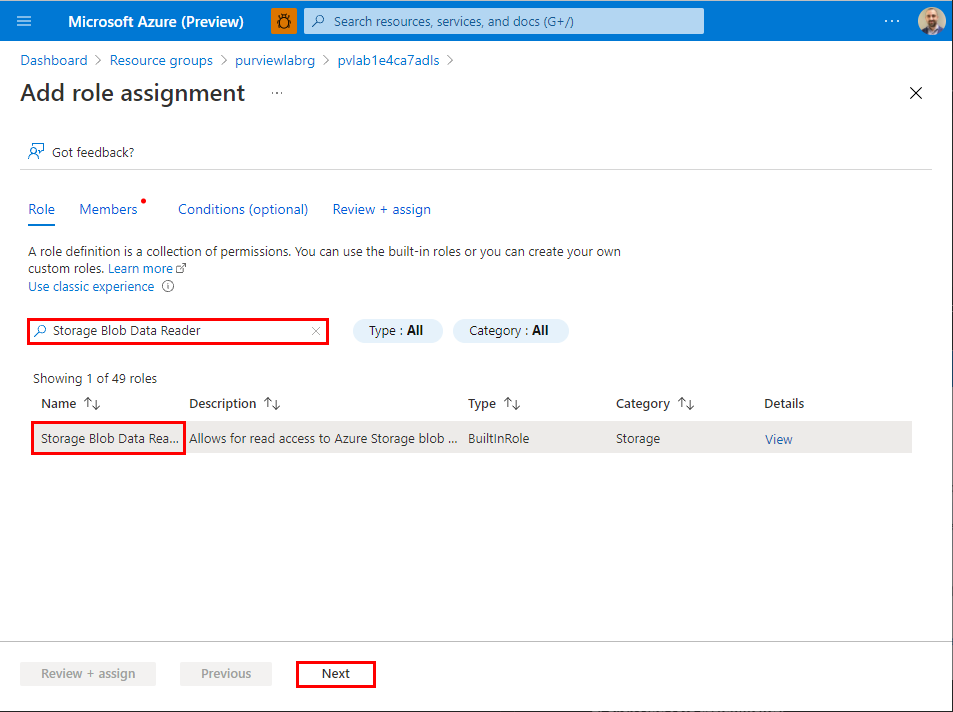

4. Under **Assign access to**, select **Managed identity**, click **+ Select members**, select **Purview account** from the **Managed Identity** drop-down menu, select the managed identity for your Azure Purview account (e.g. `pvlab-{randomId}-pv`), click **Select**. Finally, click **Review + assign**.

    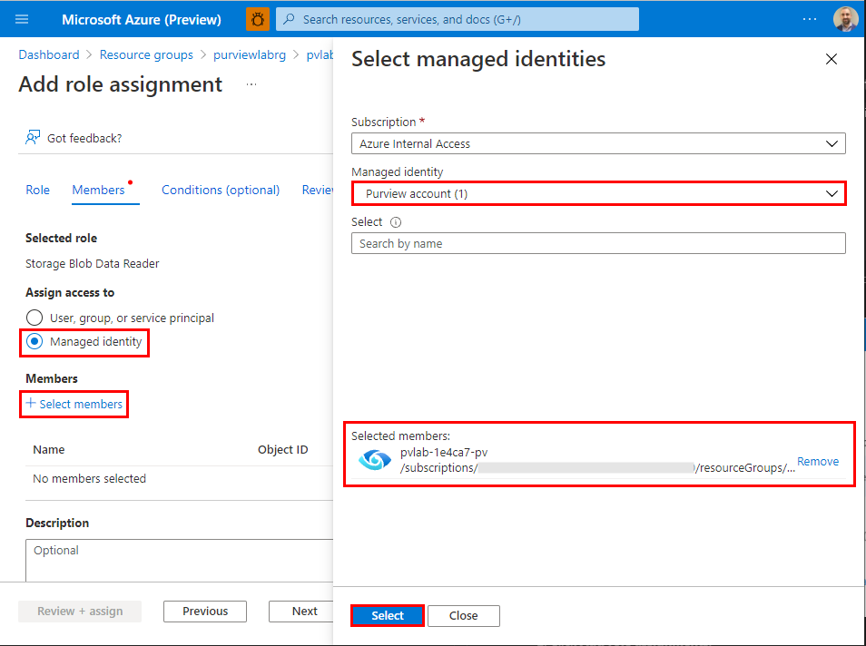

5. Click **Review + assign** once more to perform the role assignment.

    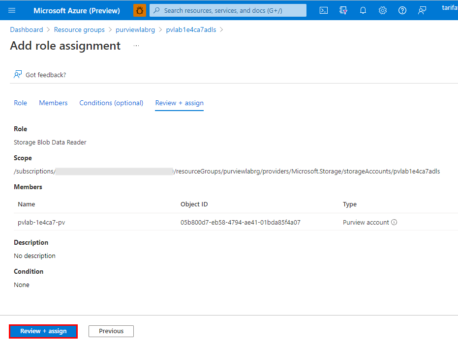

4. To confirm the role has been assigned, navigate to the **Role assignments** tab and filter the **Scope** to `This resource`. You should be able to see that the Azure Purview managed identity has been granted the **Storage Blob Data Reader** role.

    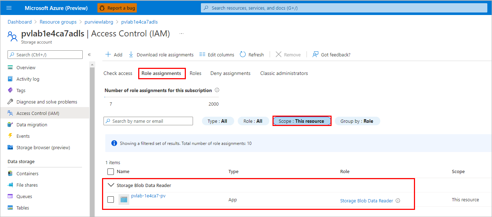

<a href="#module-02a---register--scan-adls-gen2">↥ back to top</a>

## 2. Upload Data to Azure Data Lake Storage Gen2 Account

Before proceeding with the following steps, you will need to:

* Download and install [Azure Storage Explorer](https://azure.microsoft.com/en-us/features/storage-explorer/).
* Open Azure Storage Explorer.
* Sign in to Azure via **View > Account Management > Add an account...**.

1. Download a copy of the **[Bing Coronavirus Query Set](https://github.com/tayganr/purviewlab/raw/main/assets/BingCoronavirusQuerySet.zip)** to your local machine. Note: This data set was originally sourced from [Microsoft Research Open Data](https://msropendata.com/datasets/c5031874-835c-48ed-8b6d-31de2dad0654).

2. Locate the downloaded zip file via File Explorer and unzip the contents by right-clicking the file and selecting **Extract All...**.

    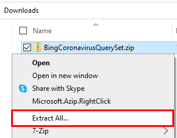

3. Click **Extract**.

    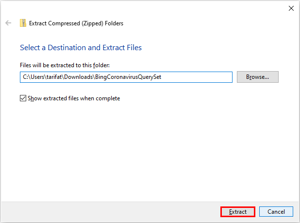

4. Open Azure Storage Explorer, click on the Toggle Explorer icon, expand the Azure Subscription to find your Azure Storage Account. Right-click on Blob Containers and select **Create Blob Container**. Name the container **raw**.

    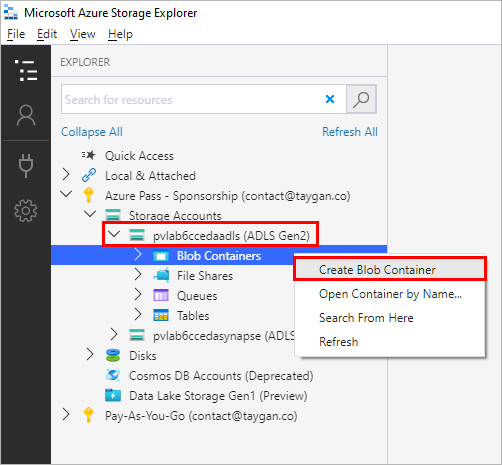

5. With the container name selected, click on the **Upload** button and select **Upload Folder...**.

    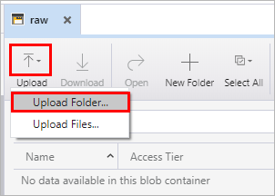

6. Click on the **ellipsis** to select a folder.

    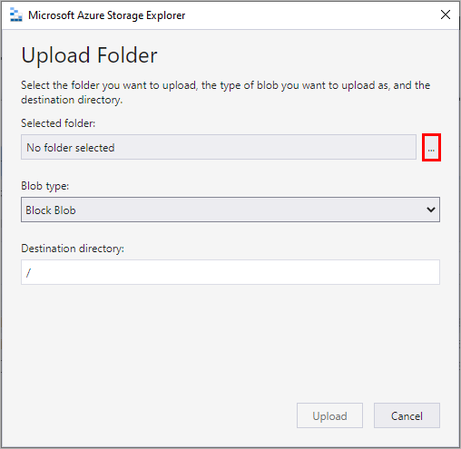

7. Navigate to the extracted **BingCoronavirusQuerySet** folder (e.g. Downloads\BingCoronavirusQuerySet) and click **Select Folder**.

    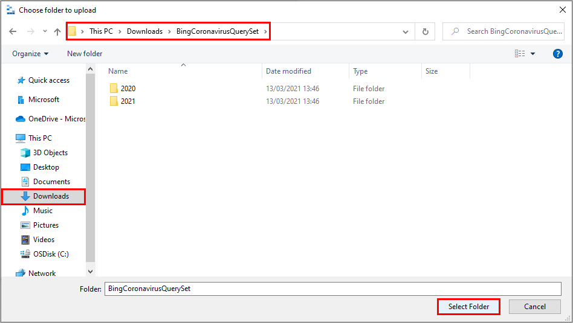

8. Click **Upload**.

    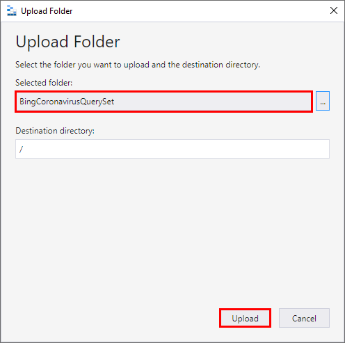

9. Monitor the **Activities** until the transfer is complete.

    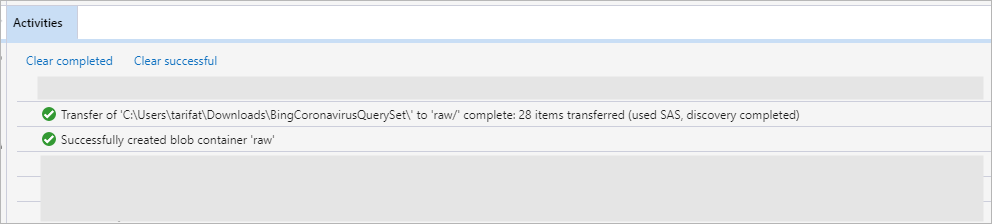

<a href="#module-02a---register--scan-adls-gen2">↥ back to top</a>

## 3. Create a Collection

1. Open Purview Studio, navigate to **Data Map** > **Collections**, and click  **Add a collection**.

    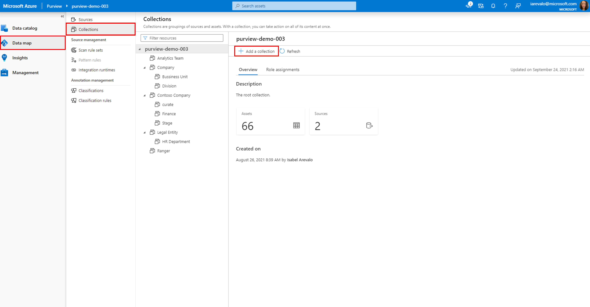

2. Provide the collection a **Name** (e.g. Contoso) and click **Create**.

    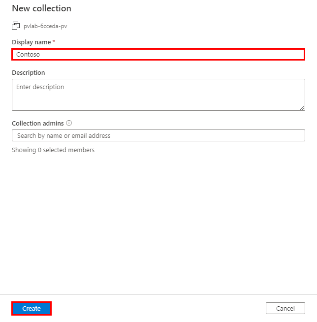

    > :bulb: **Did you know?**
    >
    > Collections in Azure Purview support organizational mapping of metadata. By using collections, you can manage and maintain data sources, scans, and assets in a hierarchy instead of a flat structure. In addition, a collection also provides a security boundary for your metadata in the data map. 
    >
    > For more information, check out [Collection Architectures and Best Practices](https://docs.microsoft.com/en-us/azure/purview/concept-best-practices-collections).

<a href="#module-02a---register--scan-adls-gen2">↥ back to top</a>

## 4. Register a Source (ADLS Gen2)

1. Open Purview Studio, navigate to **Data Map** go to Sources and click on**Register**.

    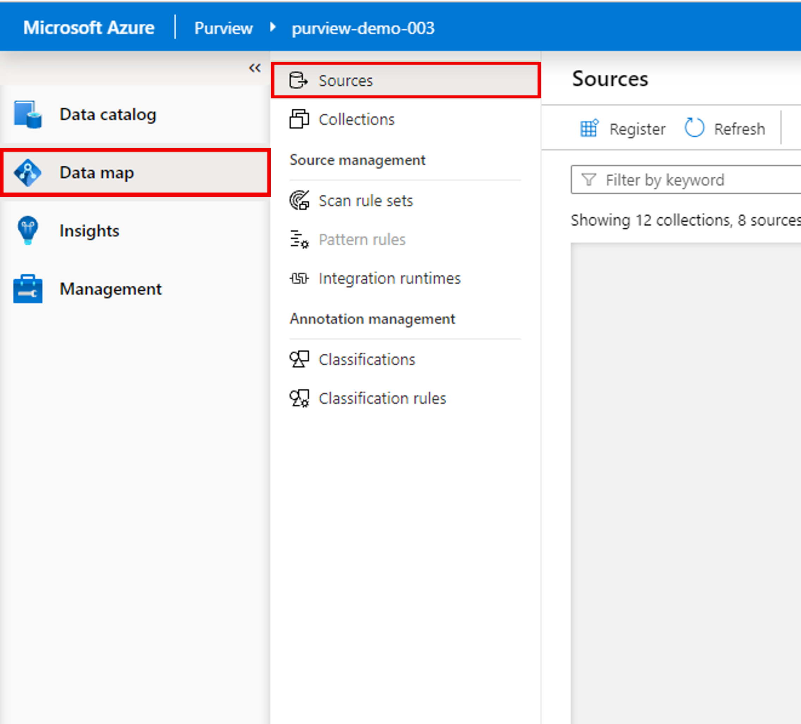

2. Select **Azure Data Lake Storage Gen2** and click **Continue**.

    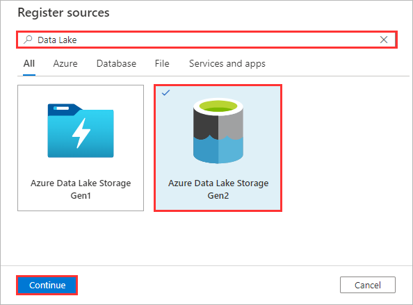

3. Select the **Azure subscription**, **Storage account name**, and **Collection**. Click **Register**.

    > :bulb: **Did you know?**
    >
    > At this point, we have simply registered a data source. Assets are not written to the catalog until after a scan has finished running.

    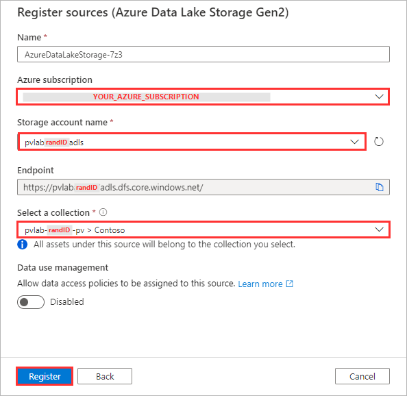

<a href="#module-02a---register--scan-adls-gen2">↥ back to top</a>

## 5. Scan a Source with the Azure Purview Managed Identity

1. Open Purview Studio, navigate to **Sources**, and within the Azure Data Lake Storage Gen2 source tile, click the **New Scan** button.

    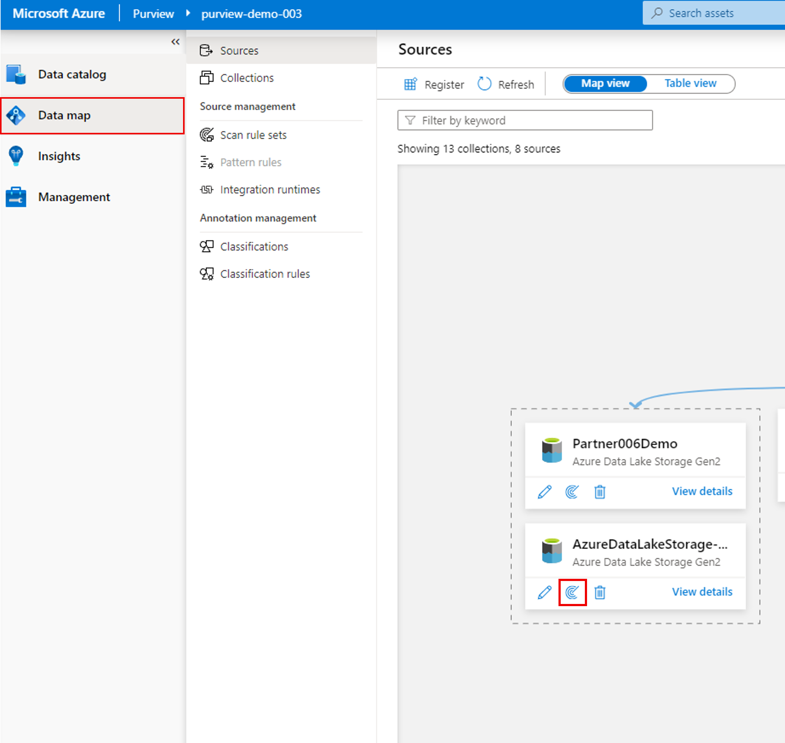

2. Click **Test connection** to ensure the Azure Purview managed identity has the appropriate level of access to read the Azure Data Lake Storage Gen2 account. If successful, click **Continue**.

    

3. Expand the hierarchy to see which assets will be within the scans scope, and click **Continue**.

    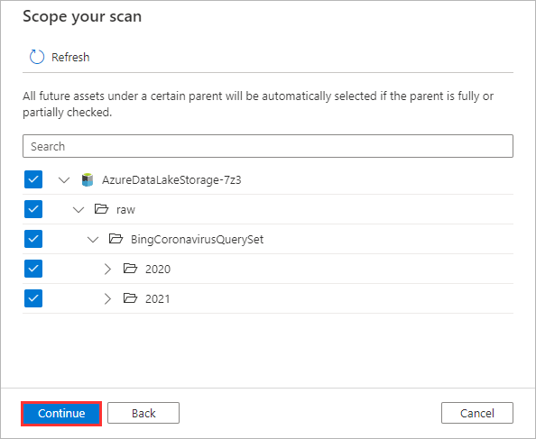

4. Select the system default scan rule set and click **Continue**.

    > :bulb: **Did you know?**
    >
    > **Scan Rule Sets** determine which **File Types** and **Classification Rules** are in scope. If you want to include a custom file type or custom classification rule as part of a scan, a custom scan rule set will need to be created.

    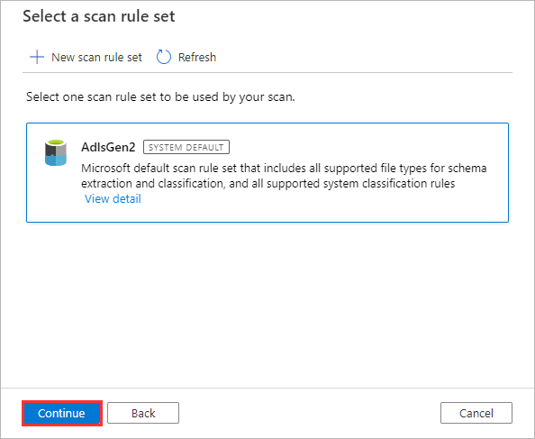

5. Select **Once** and click **Continue**.

    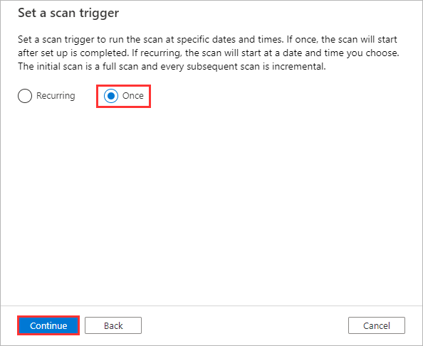

6. Click **Save and Run**.

    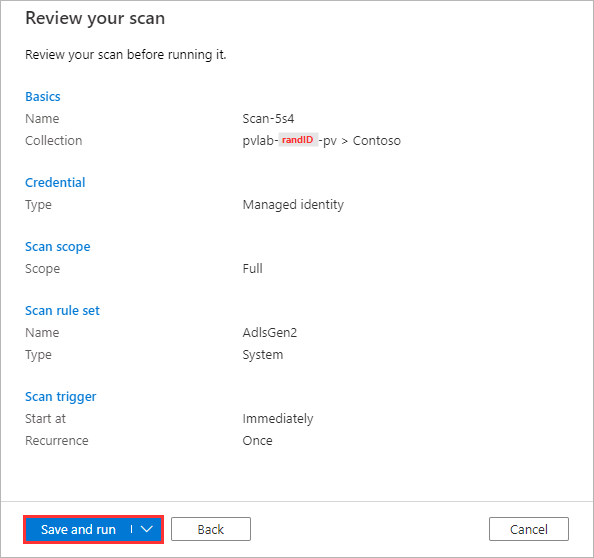

7. To monitor the progress of the scan run, click **View Details**.

    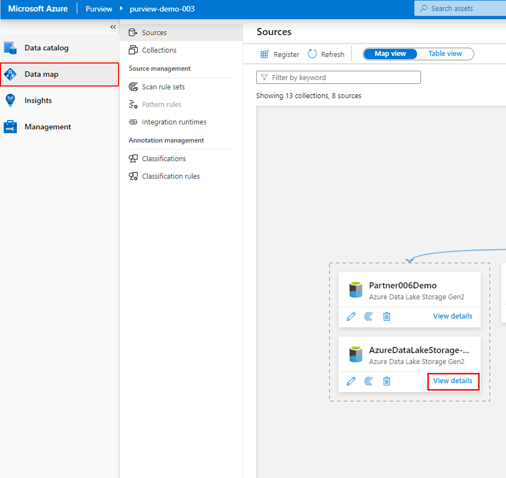

8. Click **Refresh** to periodically update the status of the scan. Note: It will take approximately 5 minutes to complete.

    

<a href="#module-02a---register--scan-adls-gen2">↥ back to top</a>

## 6. View Assets

1. To view the assets that have materialised as an outcome of running the scan, perform a wildcard search by typing the asterisk character (`*`) into the search bar and hitting the Enter key to submit the query and return the search results.

    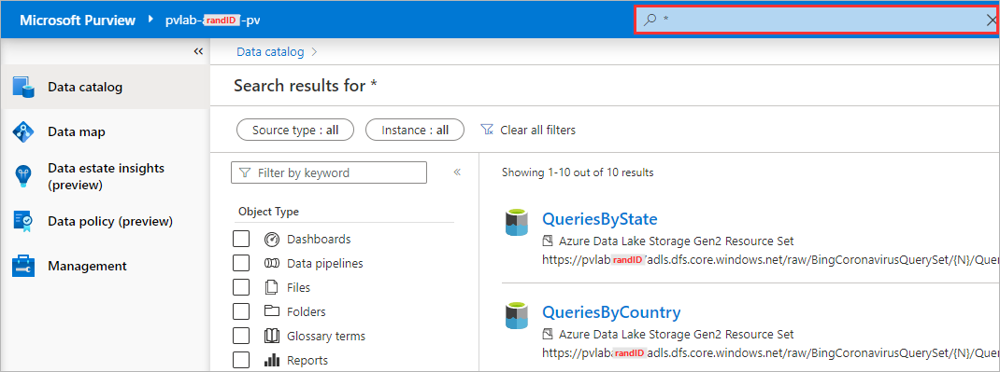

<a href="#module-02a---register--scan-adls-gen2">↥ back to top</a>

## :mortar_board: Knowledge Check

[http://aka.ms/purviewlab/q02](http://aka.ms/purviewlab/q02)

1. What type of object can help organize data sources into logical groups?

    A ) Buckets    
    B ) Collections  
    C ) Groups  

2. At which point does Azure Purview begin to populate the data map with assets?

    A ) After an Azure Purview account is created  
    B ) After a Data Source has been registered    
    C ) After a Data Source has been scanned

3. Which of the following attributes is **not** automatically assigned to an asset as a result of the system-built scanning functionality?

    A ) Technical Metadata (e.g. Fully Qualified Name, Path, Schema, etc)  
    B ) Glossary Terms (e.g. column `Sales Tax` is tagged with the `Sales Tax` glossary term)  
    C ) Classifications (e.g. column `ccnum` is tagged with the `Credit Card Number` classification)  

<a href="#module-02a---register--scan-adls-gen2">↥ back to top</a>

## :tada: Summary

This module provided an overview of how to create a collection, register a source, and trigger a scan.

[Continue >](../modules/module02b.md)
