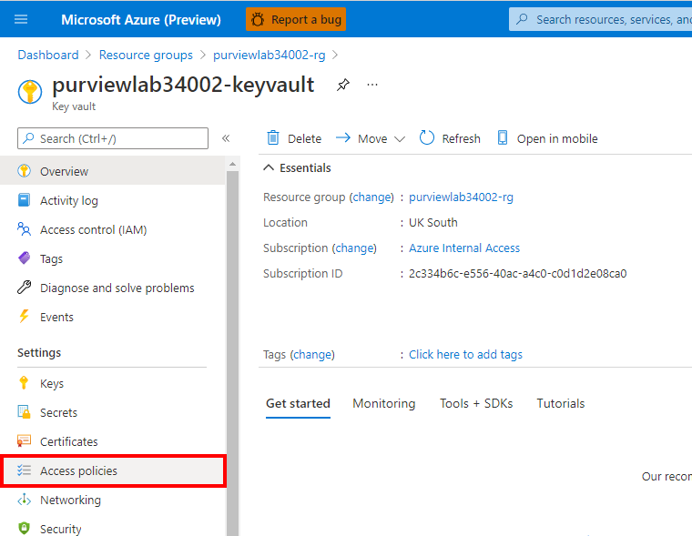
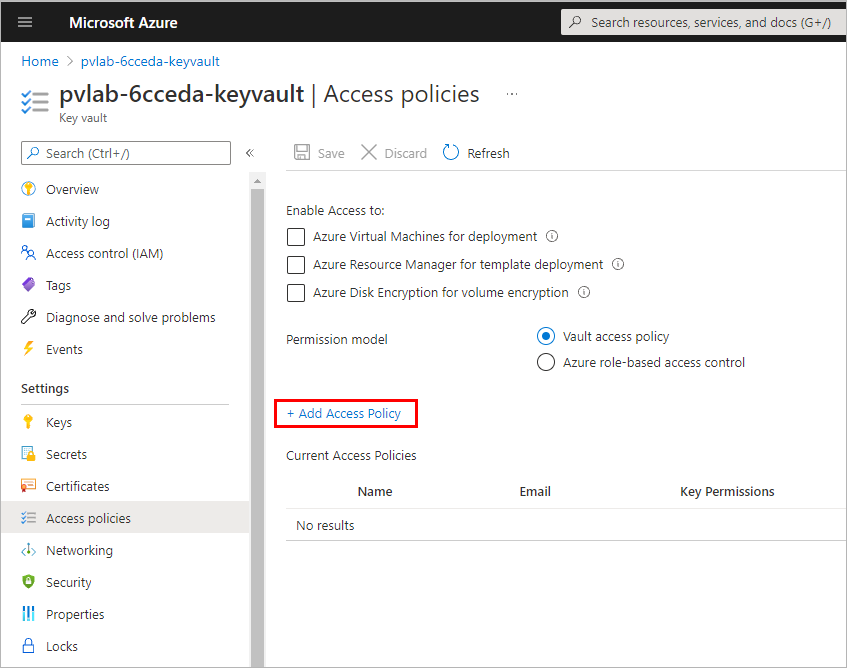
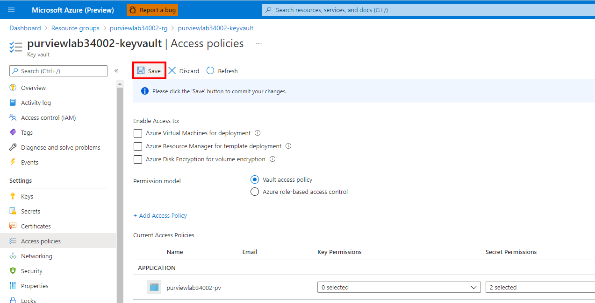

# Module 02B - Register & Scan (Azure SQL DB)

[< Previous Module](../modules/module02a.md) - **[Home](../README.md)** - [Next Module >](../modules/module03.md)

## :thinking: Prerequisites

* An [Azure account](https://azure.microsoft.com/en-us/free/) with an active subscription.
* An Azure SQL Database (see [module 00](../modules/module00.md)).
* An Azure Azure Purview account (see [module 01](../modules/module01.md)).

## :loudspeaker: Introduction

To populate Azure Purview with assets for data discovery and understanding, we must register sources that exist across our data estate so that we can leverage the out of the box scanning capabilities. Scanning enables Azure Purview to extract technical metadata such as the fully qualified name, schema, data types, and apply classifications by parsing a sample of the underlying data. In this module, we will walk through how to register and scan data sources.

## :dart: Objectives

* Register and scan an Azure SQL Database using SQL authentication credentials stored in Azure Key Vault.

##  :bookmark_tabs: Table of Contents

| #  | Section | Targeted Role |
| --- | --- | --- |
| 1 | [Grant Access to Azure Purview using Key Vault Access Policy](#1-grant-access-to-azure-purview-using-key-vault-access-policy) | Azure Administrator |
| 2 | [Generate a Secret](#2-generate-a-secret) | Azure Administrator |
| 3 | [Add Credentials to Azure Purview](#3-add-credentials-to-azure-purview) | Azure Purview Administrator |
| 4 | [Register a Source (Azure SQL DB)](#4-register-a-source-azure-sql-db) | Data Source Administrator |
| 5 | [Scan a Source with Azure Key Vault Credentials](#5-scan-a-source-with-azure-key-vault-credentials) | Data Source Administrator |
| 6 | [View Assets](#6-view-assets) | Data Reader |

<a href="#module-02b---register--scan-azure-sql-db">↥ back to top</a>

## 1. Grant Access to Azure Purview using Key Vault Access Policy 

1. Navigate to your **Azure Key Vault** resource and click **Access policies**
    
    

2. Click **Add Access Policy**.

    

3. Under **Select principal**, click **None selected**.

    

4. Search for the name of your Azure Purview account (e.g. `pvlab-{randomId}-pv`), select the item, click **Select**.

    

5. Under **Secret permissions**, select **Get** and **List**.

    

6. Review your selections and click **Add**.

    

7. Click **Save**.

    

<a href="#module-02b---register--scan-azure-sql-db">↥ back to top</a>

## 2. Generate a Secret

1. Navigate to **Secrets** and click **Generate/Import**.

    

2. Under **Name** type `sql-secret`. Under **Value** provide the same password that was specified for the SQL Server admin account created earlier in step 7.5. Click **Create**.

    

<a href="#module-02b---register--scan-azure-sql-db">↥ back to top</a>

## 3. Add Credentials to Azure Purview

1. To make the secret accessible to Azure Purview, we must establish a connection to Azure Key Vault. Open **Purview Studio**, navigate to **Management Center** > **Credentials**, click **Manage Key Vault connections**.

    

2. Click **New**.

    

3. Use the drop-down menus to select the appropriate **Subscription** and **Key Vault name**. Click **Create**.

    

4. Since we have already granted the Purview managed identity access to our Azure Key Vault, click **Confirm**.

    

5. Click **Close**.

    

6. Under **Credentials** click **New**.

    

7. Provide the necessary details and click **Create**.

    * Overwrite the **Name** to `credential-SQL`
    * Set the **Authentication method** to `SQL authentication`
    * Set the **User name** to the SQL Server admin login specified earlier (e.g. `team01`)
    * Select the **Key Vault connection**
    * Set the **Secret name** to `sql-secret`

    

<a href="#module-02b---register--scan-azure-sql-db">↥ back to top</a>

## 4. Register a Source (Azure SQL DB)

1. Open Purview Studio, navigate to **Sources** and click **Register**.

    

2. Navigate to the **Azure** tab, select **Azure SQL Database**, click **Continue**.

    

3. Select the **Azure subscritpion**, **Server name**, and **Collection**. Click **Register**.

    

<a href="#module-02b---register--scan-azure-sql-db">↥ back to top</a>

## 5. Scan a Source with Azure Key Vault Credentials

1. Open Purview Studio, navigate to **Sources**, and within the Azure SQL Database source tile, click the **New Scan** button.

    

2. Select the **Database** and **Credential** from the drop-down menus. Click **Test connection**. Click **Continue**.

    

3. Click **Continue**.

    

4. Click **Continue**.

    

5. Set the trigger to **Once**, click **Continue**.

    

6. Click **Save and Run**.

    

7. To monitor the progress of the scan, click **View Details**.

    

8. Click **Refresh** to periodically update the status of the scan. Note: It will take approximately 5 minutes to complete.

    

<a href="#module-02b---register--scan-azure-sql-db">↥ back to top</a>

## 6. View Assets

1. To view the assets that have materialised as an outcome of running the scans, perform a wildcard search by typing the asterisk character (`*`) into the search bar and hitting the Enter key to submit the query and return the search results.

    

<a href="#module-02b---register--scan-azure-sql-db">↥ back to top</a>

## :mortar_board: Knowledge Check

[http://aka.ms/purviewlab/q02](http://aka.ms/purviewlab/q02)

1. What type of object can help organize data sources into logical groups?

    A ) Buckets    
    B ) Collections  
    C ) Groups  

2. At which point does Azure Purview begin to populate the data map with assets?

    A ) After an Azure Purview account is created  
    B ) After a Data Source has been registered    
    C ) After a Data Source has been scanned

3. Which of the following attributes is **not** automatically assigned to an asset as a result of the system-built scanning functionality?

    A ) Technical Metadata (e.g. Fully Qualified Name, Path, Schema, etc)  
    B ) Glossary Terms (e.g. column `Sales Tax` is tagged with the `Sales Tax` glossary term)  
    C ) Classifications (e.g. column `ccnum` is tagged with the `Credit Card Number` classification)  

<a href="#module-02b---register--scan-azure-sql-db">↥ back to top</a>

## :tada: Summary

This module provided an overview of how to create a collection, register a source, and trigger a scan.

[Continue >](../modules/module03.md)
