# Module 03 - Search & Browse

[< Previous Module](../modules/module02.md) - **[Home](../README.md)** - [Next Module >](../modules/module04.md)

## :thinking: Prerequisites

* An [Azure account](https://azure.microsoft.com/en-us/free/) with an active subscription.
* An Azure Azure Purview account (see [module 01](../modules/module01.md)).
* An Azure Purview catalog with some assets (see [module 02](../modules/module02.md)).

## :loudspeaker: Introduction

Once sources have been registered and scanned, the underlying data catalog will begin to populate with assets that represent real-world objects (e.g. a table in an Azure SQL Database, a Power BI report, etc.) The surfacing of these assets via Azure Purview's search experience helps empower data consumers to find data assets that matters to them.

## :dart: Objectives

* Search the catalog by keyword.
* Browse the catalog by source.
* Update an existing asset.
* Perform a bulk edit operation.

## Table of Contents

1. [Search Catalog](#1-search-catalog)
2. [Update an Asset](#2-update-an-asset)
3. [Browse Assets](#3-browse-assets)
4. [Bulk Edit](#4-bulk-edit)

<a href="#module-03---search--browse">↥ back to top</a>

## 1. Search Catalog

1. Open Purview Studio and from the **Home** screen, type the asterisk character (**\***) into the search bar and hit **Enter**.

    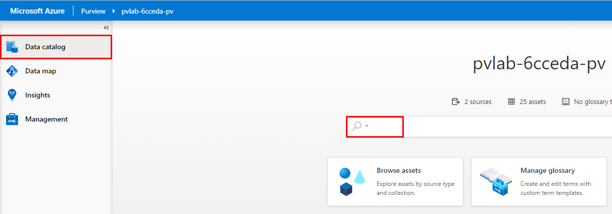

2. Filter the search results by **Classification** (e.g. Country/Region) and click the hyperlinked asset name to view the details (e.g. QueriesByState).

    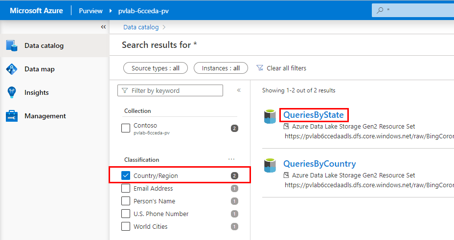

<a href="#module-03---search--browse">↥ back to top</a>

## 2. Update an Asset

1. Click **Edit** to modify the asset details.

    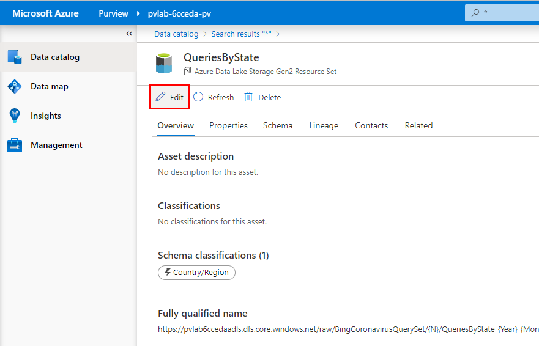

2. Update the **Description** by copying and pasting the sample text below.

    > This dataset was curated from the Bing search logs (desktop users only) over the period of Jan 1st, 2020 – (Current Month - 1). Only searches that were issued many times by multiple users were included. The dataset includes queries from all over the world that had an intent related to the Coronavirus or Covid-19. In some cases this intent is explicit in the query itself (e.g., “Coronavirus updates Seattle”), in other cases it is implicit , e.g. “Shelter in place”.

    

3. Assign a **Classification** (e.g. World Cities) using the drop-down menu.

    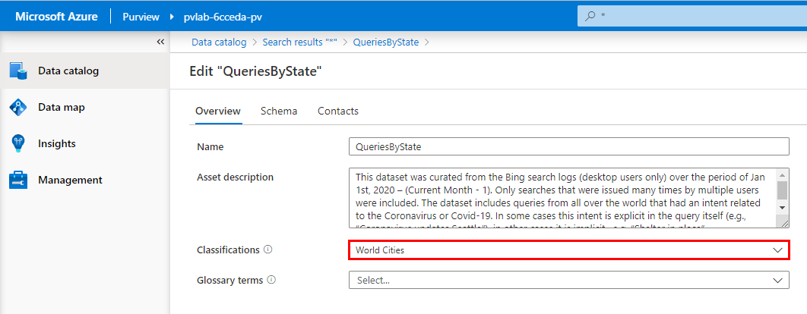

4. Navigate to the **Schema** tab and update the **column descriptions** using the sample text below.

    | Column Name  | Description |
    | --- | --- |
    | Date | `Date on which the query was issued.` |
    | Query | `The actual search query issued by user(s).` |
    | IsImplicitIntent | `True if query did not mention covid or coronavirus or sarsncov2 (e.g, “Shelter in place”). False otherwise.` |
    | State | `State from where the query was issued.` |
    | Country | `Country from where the query was issued.` |
    | PopularityScore | `Value between 1 and 100 inclusive. 1 indicates least popular query on the day/State/Country with Coronavirus intent, and 100 indicates the most popular query for the same geography on the same day.` |

    > :bulb: **Did you know?**
    >
    > **Classifications** and **Glossary Terms** can be assigned at the asset level (e.g. a Table within a Database) as well as at the schema level (e.g. a Column within a Table Schema).

    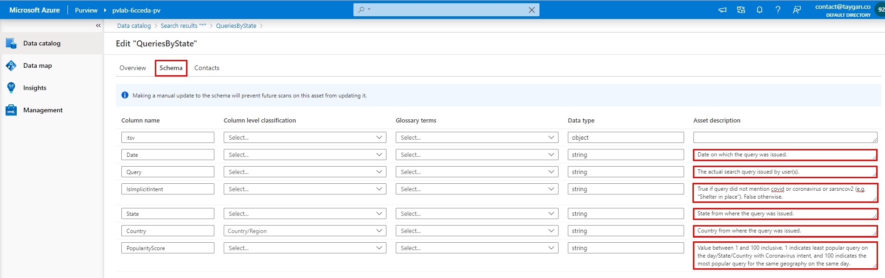

5. Navigate to the **Contacts** tab and set someone within your organization to be an **Expert** and an **Owner**. Click **Save**.

    > :bulb: **Did you know?**
    >
    > Assets can be related to two different types of contacts. **Experts** are often business process or subject matter experts. Where as **Owners** are often senior executives or business area owners that define governance or business processes over certain data areas.

    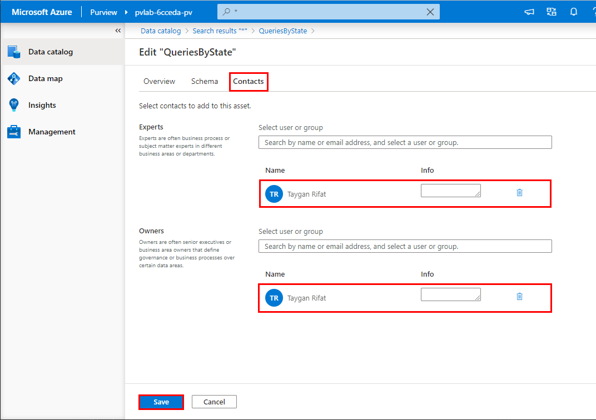

6. To see other assets within the same path, navigate to the **Related** tab.

    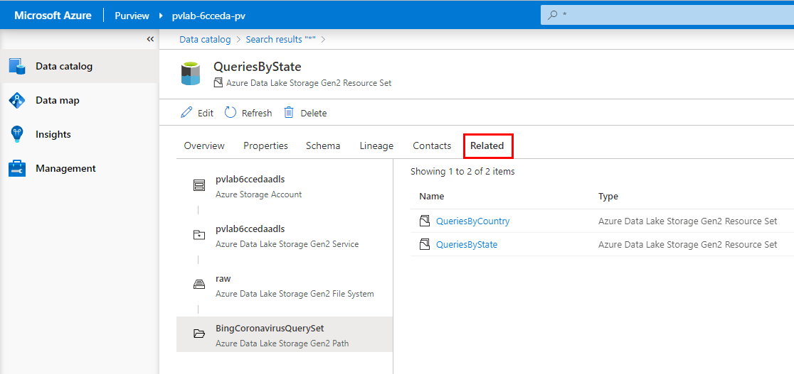

<a href="#module-03---search--browse">↥ back to top</a>

## 3. Browse Assets

While the search experience is ideal for keyword based discovery, Purview Studio also allows users to navigate the catalog by source.

1. Open Purview Studio and from the **Home** screen, click **Browse assets**.

    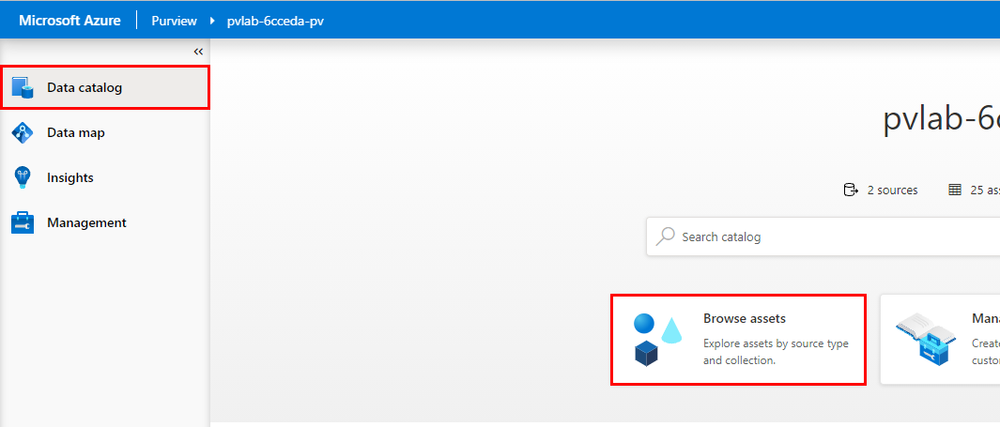

2. Select a **source** (e.g. Azure Data Lake Storage Gen2).

    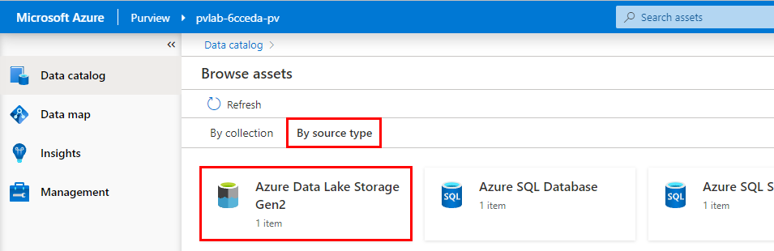

3. Select an **account** (e.g. storage2486).

    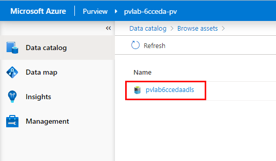

4. Select a **container** (e.g. raw).

    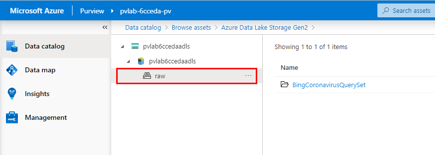

<a href="#module-03---search--browse">↥ back to top</a>

## 4. Bulk Edit

Azure Purview allows us to perform certain operations (add/replace/remove) against a subset of attributes (Expert, Owner, Term, Classification) in bulk directly within Purview Studio.

1. Open Purview Studio and from the **Home** screen, type the asterisk character (**\***) into the search bar and hit **Enter**.

    

2. Hover your mouse over an item in the list to reveal the checkbox on the right-hand side. Select five items and click **View selected**.

    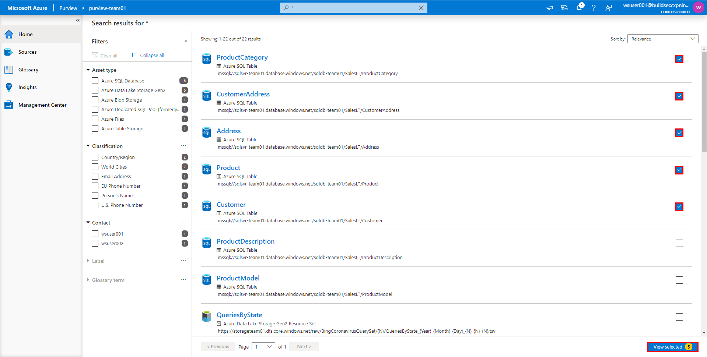

3. Click **Bulk edit**.

    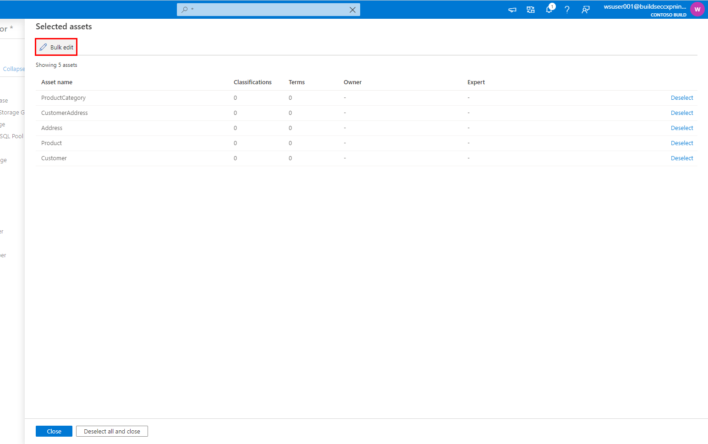

4. Set the **Attribute** to `Owner`, set **Operation** to `Add`, select two users in your organization and click **Apply**.
 
    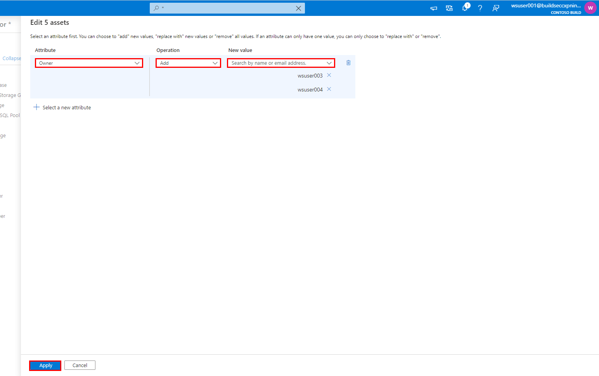

5. Click **Deselect all and close**.

    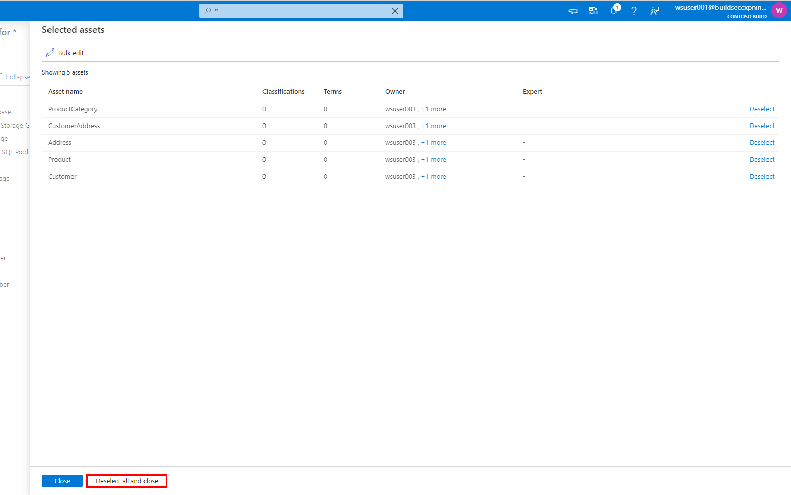

<a href="#module-03---search--browse">↥ back to top</a>

## :mortar_board: Knowledge Check

1. There are a number of attributes that we can use to narrow our search results via the filter pane, which of the following is **not** available as a quick filter?

    A ) Asset Type  
    B ) Classification  
    C ) Size  

2. Using Purview Studio (UI), you can edit an asset and manually update an assets Description?

    A ) True  
    B ) False  

3. Using Purview Studio (UI), you can edit an asset and manually add and remove Classifications?

    A ) True  
    B ) False  

4. Using Purview Studio (UI), you can edit an asset and manually update an assets Technical Properties (e.g. qualifiedName, partitionCount, totalSizeBytes, etc)?

    A ) True  
    B ) False  

5. Assets in the catalog can be assigned contacts, which of the following is an invalid contact type?

    A ) Expert  
    B ) Owner  
    C ) Reader  

<a href="#module-03---search--browse">↥ back to top</a>

## :tada: Summary

This module provided an overview of how to search, browse, and update assets.

[Continue >](../modules/module04.md)
