# Module 05 - Classifications

[< Previous Module](../modules/module04.md) - **[Home](../README.md)** - [Next Module>](../modules/module06.md)

## Prerequisites

* An Azure account with an active subscription.
* An Azure Azure Purview account (see [module 01](../modules/module01.md)).
* An Azure Data Lake Storage Gen2 Account (see [module 02](../modules/module02.md)).

## Table of Contents

1. [Create a Classification](#1-create-a-classification)
2. [Create a Classification Rule (Regular Expression)](#2-create-a-custom-classification-rule-regular-expression)
3. [Create a Scan Rule Set](#3-create-a-scan-rule-set)
4. [Upload Data to an Azure Data Lake Storage Gen2 Account](#4-upload-data-to-an-azure-data-lake-storage-gen2-account)
5. [Scan an Azure Data Lake Storage Gen2 Account](#5-scan-an-azure-data-lake-storage-gen2-account)
6. [Search by Classification](#6-search-by-classification)

<a href="#module-05---classifications">↥ back to top</a>

## 1. Create a Classification

1. Do A

    

2. Do B

    

<a href="#module-05---classifications">↥ back to top</a>

## 2. Create a Custom Classification Rule (Regular Expression)

1. Do A

    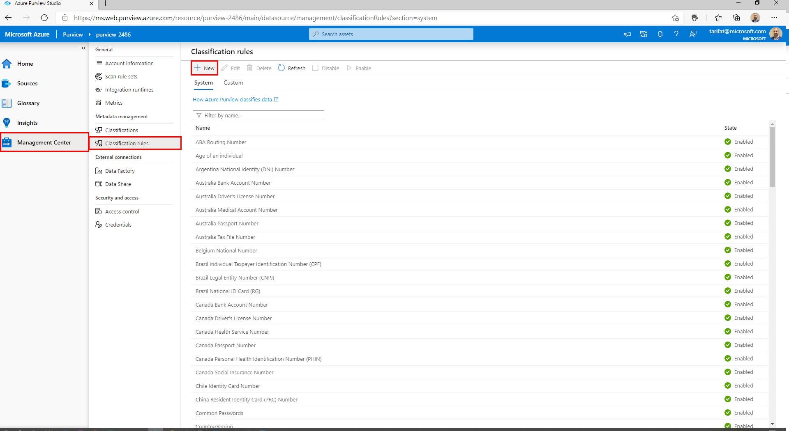

2. Do B

    

3. Do C

    

4. Do D

    

<a href="#module-05---classifications">↥ back to top</a>

## 3. Create a Scan Rule Set

1. Do A

    

2. Do B

    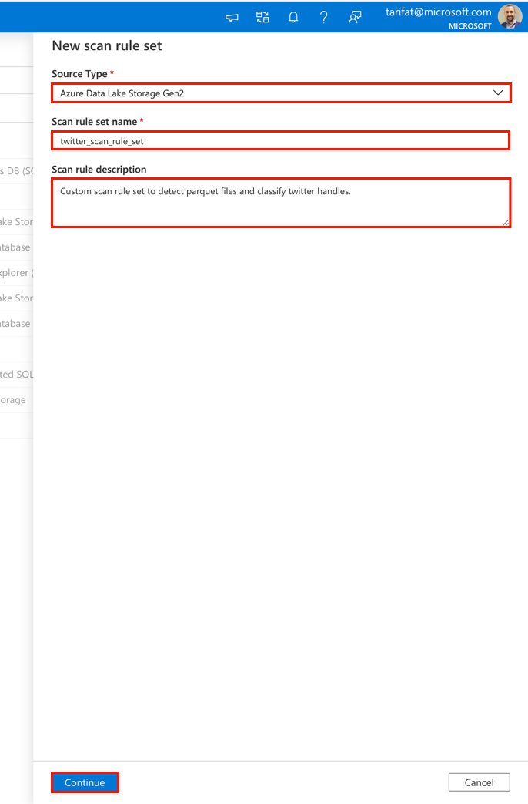

3. Do C

    

4. Do D

    

<a href="#module-05---classifications">↥ back to top</a>

## 4. Upload Data to an Azure Data Lake Storage Gen2 Account

1. Do A

    

2. Do B

    

3. Do C

    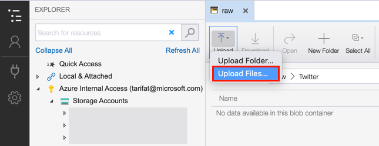

4. Do D

    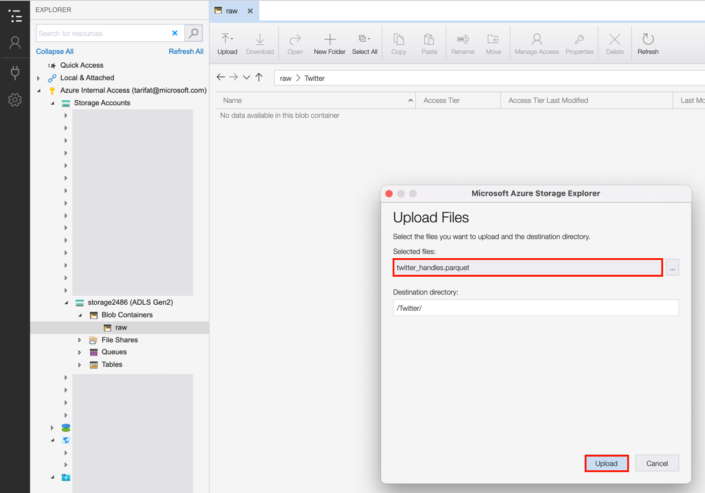

<a href="#module-05---classifications">↥ back to top</a>

## 5. Scan an Azure Data Lake Storage Gen2 Account

1. Do A

    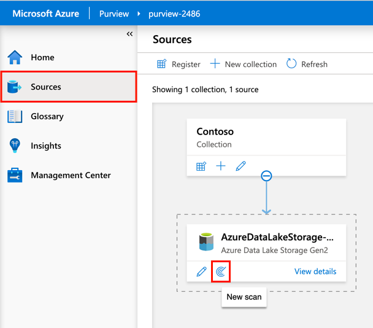

2. Do B

    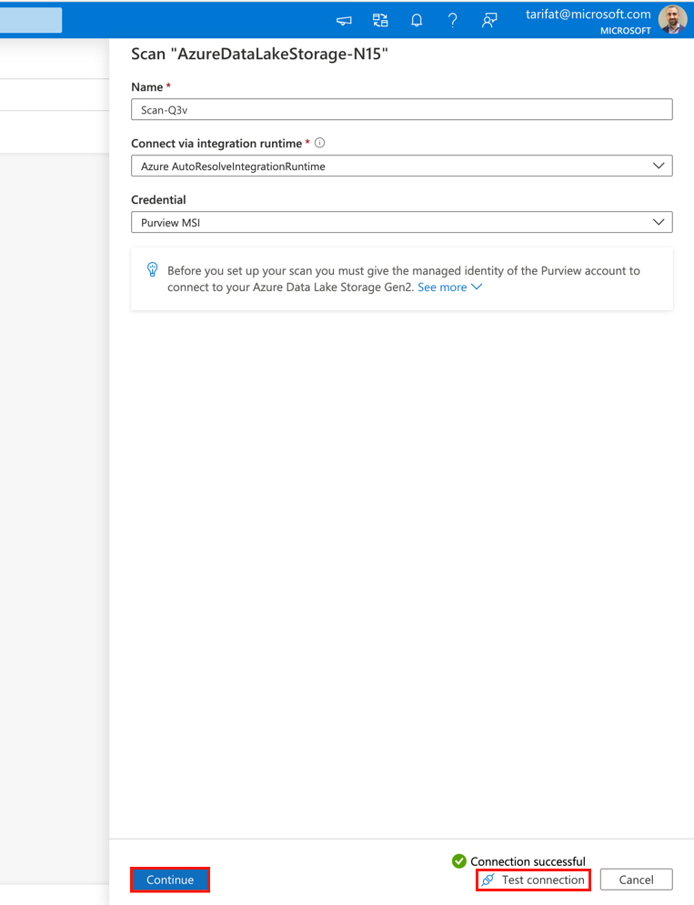

3. Do C

    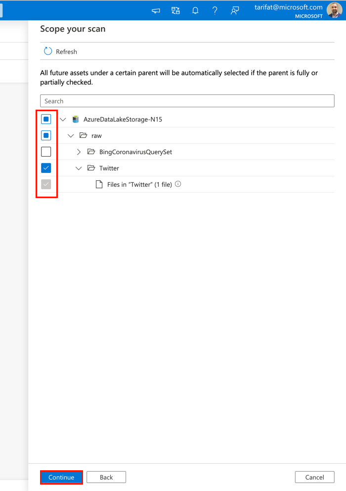

4. D

    

5. E

    

6. F

    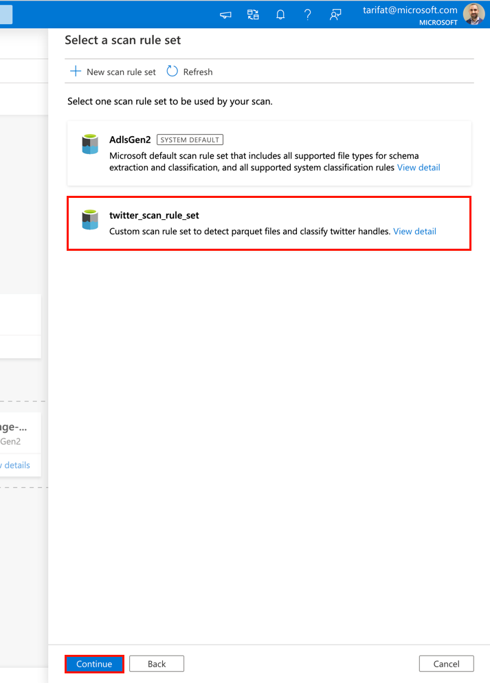

7. G

    

8. H

    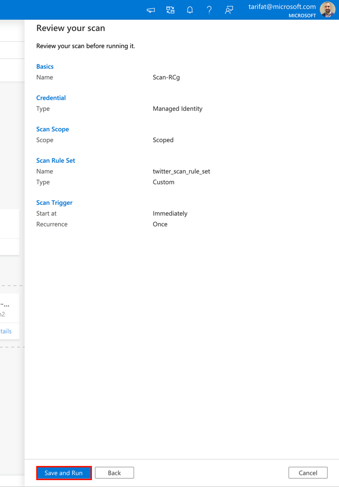

9. I

    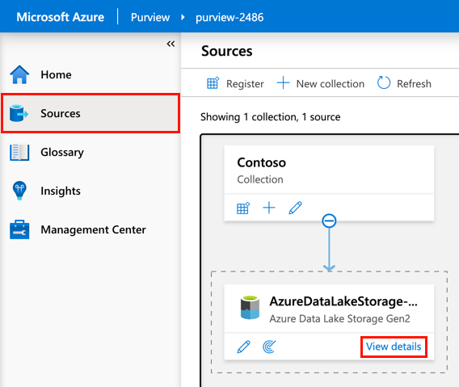

10. J

    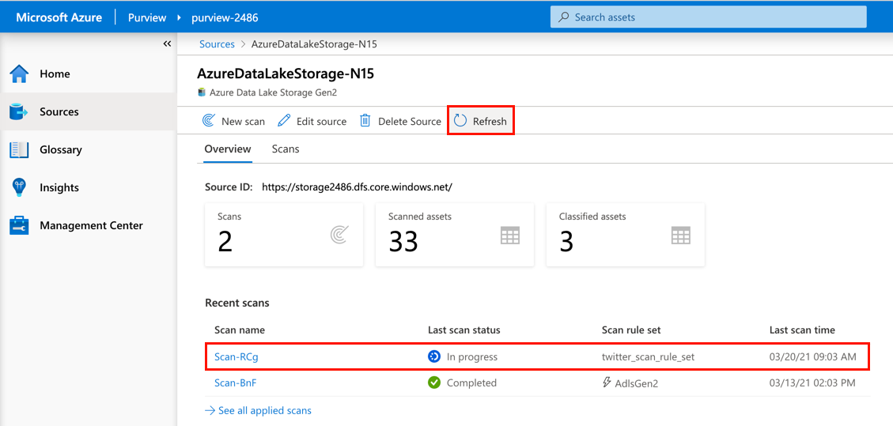

<a href="#module-05---classifications">↥ back to top</a>

## 6. Search by Classification

1. Do A

    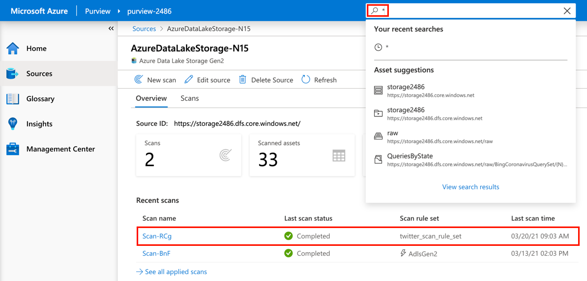

2. Do B

    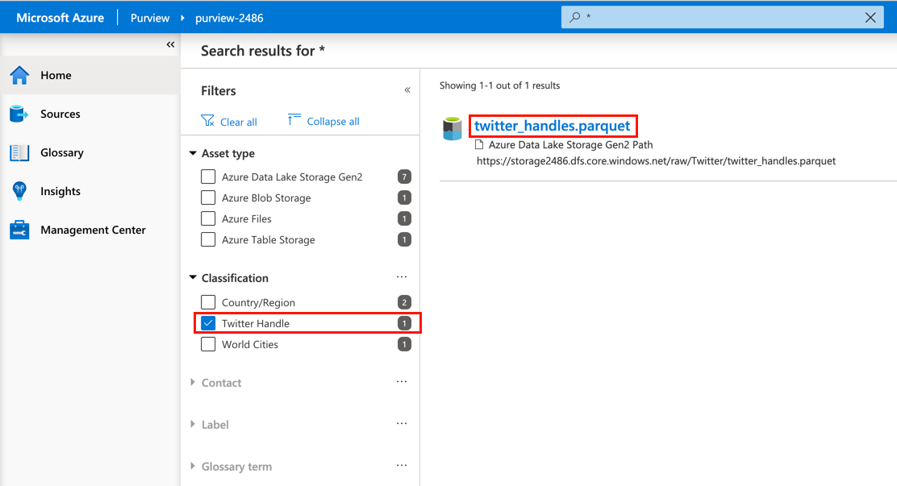

3. Do C

    

4. D

    

<a href="#module-05---classifications">↥ back to top</a>

## Summary

This module provided an overview of how to create a custom classification, and how to have the classification automatically applied as part of a scan using a custom scan rule set.
