# Module 07 - Insights

[< Previous Module](../modules/module06.md) - **[Home](../README.md)** - [Next Module >](../modules/module08.md)

```diff
!                               << PLEASE READ BEFORE PROCEEDING >>                                
!                                                                                                  
! * Insights within Azure Purview can take several hours to surface post the completion of a scan. 
! * At this point of the workshop, only a limited number of data visualisations may be populated.  
! * To populate all reports with data, Azure Purview requires an environment with a variety of     
! sources and assets to be scanned that is beyond the scope of this workshop.                      
! * The screenshots and information below, has been provided so that you can conceptualise the type
! of insights that can be gleaned from a fully populated environment.                              
```

## :thinking: Prerequisites

* An [Azure account](https://azure.microsoft.com/en-us/free/) with an active subscription.
* An Azure Azure Purview account (see [module 01](../modules/module01.md)).
* Set up and complete a scan (see [module 02](../modules/module02.md)).

## :loudspeaker: Introduction

Insights provides customers, a single pane of glass view into their catalog and further aims to provide specific insights to the data source administrators, business users, data stewards, data officer, and security administrators. Azure Purview currently has the following reports available:

* Assets
* Scans
* Glossary
* Classification
* Sensitivity Labels

## :dart: Objectives

* Understand the different types of insights that can be gleaned from the out of the box reporting.

## Table of Contents

1. [Asset Insights](#1-asset-insights)
2. [Scan Insights](#2-scan-insights)
3. [Glossary Insights](#3-glossary-insights)
4. [Classification Insights](#4-classification-insights)
5. [Sensitivity Labels Insights](#5-sensitivity-labels-insights)
6. [File Extensions Insights](#6-file-extensions-insights)

<div align="right"><a href="#module-07---insights">↥ back to top</a></div>

## 1. Asset Insights

1. Open Purview Studio, navigate to **Insights** > **Assets**.

    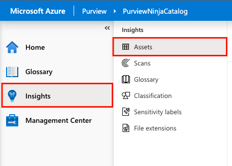

2. The Assets page displays the following **high-level metrics**.
    * Number of Source Types
    * Number of Discovered Assets
    * Number of Classified Assets

    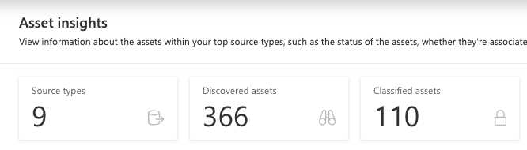

3. Further down the page you will find additional **data visualizations**, typically these tiles will allow interactive filtering and the ability to drill-down into the underlying detail by clicking **View more**. The Assets page includes the following **graphs**:

    **Asset Count per Source Type**

    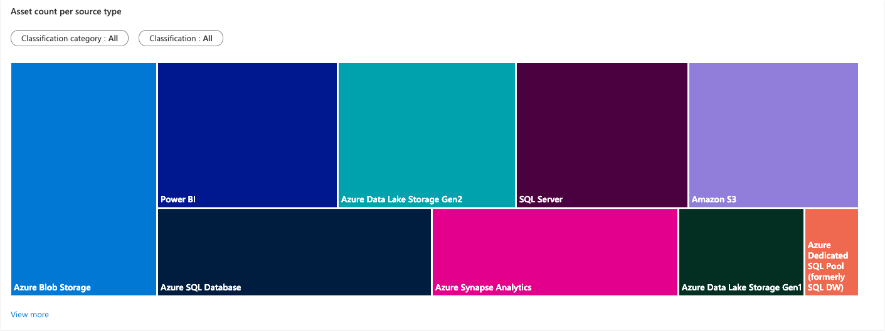

    **Size Trend (GB) of File Type within Source Types**

    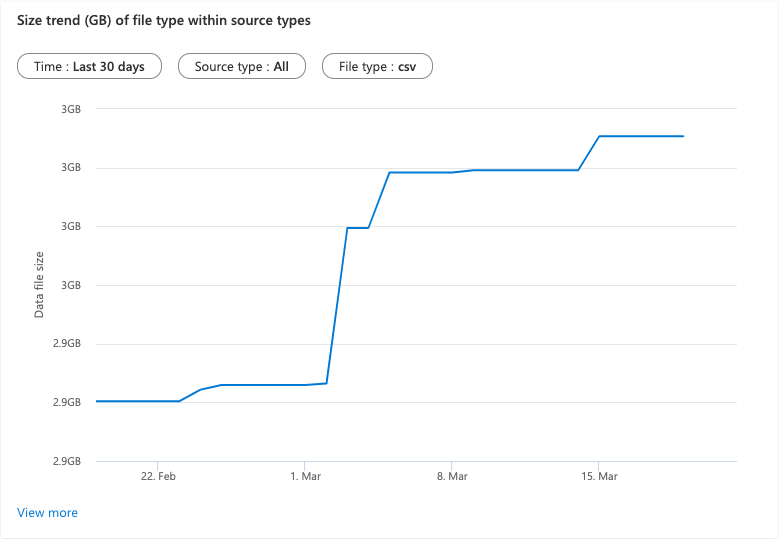

    **Files Not Associated with a Resource Set**

    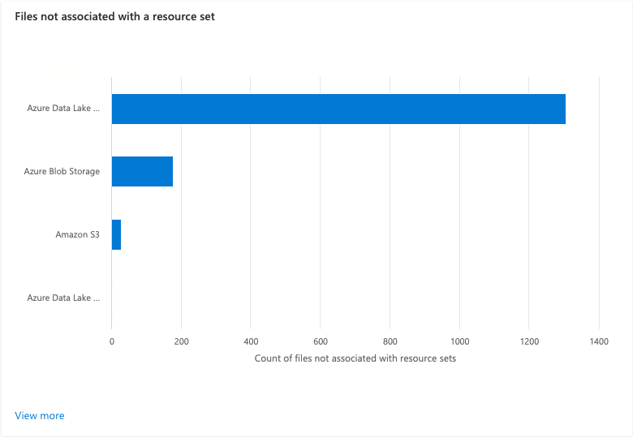

    > :bulb: **Did you know?**
    >
    > Using the quick filters on the **Asset Count per Source Type** graph and drilling into the details by clicking **View more**, is a quick and easy way of identifying which sources contain certain types of data.

<div align="right"><a href="#module-07---insights">↥ back to top</a></div>

## 2. Scan Insights

1. Open Purview Studio, navigate to **Insights** > **Scans**.

    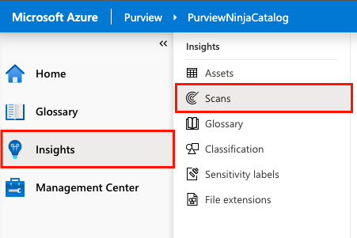

2. The Scans page displays the following **high-level metrics**.
    * Number of Scans
    * Number of Successful Scans
    * Number of Canceled Scans
    * Number of Failed Scans

    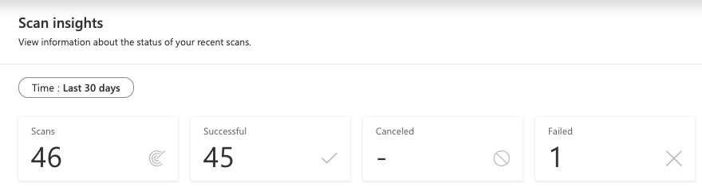

3. The Scans page includes the following **graphs**:
    
    **Number of Scans by Date and Status**

    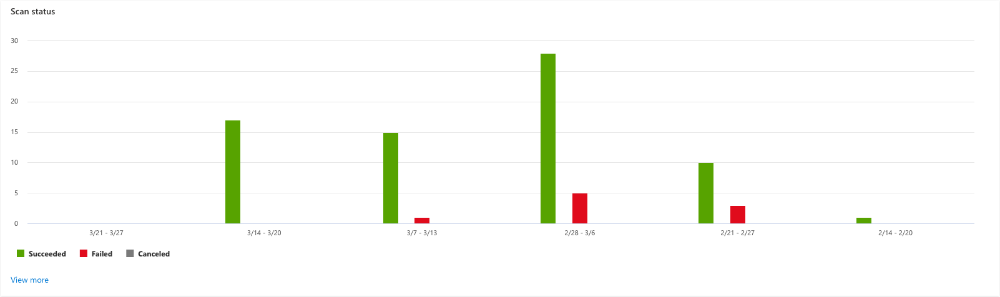

    > :bulb: **Did you know?**
    >
    > Clicking **View more** on the **Scan Status** graph will show scans that have occurred over the last 30 days with aggregated counts by status (Success, Failed, Canceled). Drilling further by clicking on a scan name will reveal the scan run history with quick action buttons to edit, delete, or run.

<div align="right"><a href="#module-07---insights">↥ back to top</a></div>

## 3. Glossary Insights

1. Open Purview Studio, navigate to **Insights** > **Glossary**.

    

2. The Glossary page displays the following **high-level metrics**.
    * Total Number of Terms
    * Number of Approved Terms without Assets
    * Number of Expired Terms with Assets

    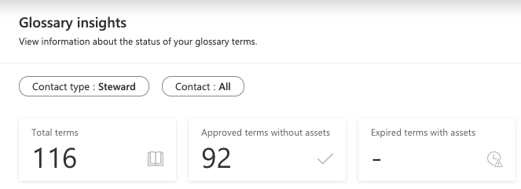

3. The Glossary page includes the following **graphs**:
     
    **Terms by Asset Count**

    

    **Terms by Status (with and without assets)**

    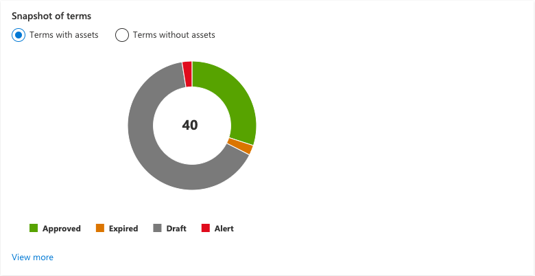

    **Number of Incomplete Terms**

    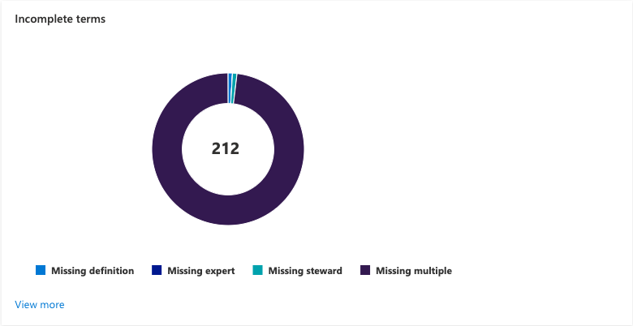

    > :bulb: **Did you know?**
    >
    > Terms are considered **incomplete** if they are missing a definition, expert, or steward. If a term is missing more than one of these things, it is shown as **Missing multiple**.

<div align="right"><a href="#module-07---insights">↥ back to top</a></div>

## 4. Classification Insights

1. Open Purview Studio, navigate to **Insights** > **Classification**.

    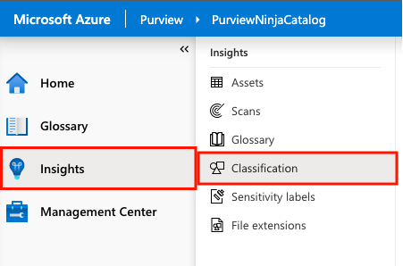

2. The Classification page displays the following **high-level metrics**.
    * Number of Subscriptions (with Classifications)
    * Unique Number of Classifications Found
    * Number of Sources Classified
    * Number of Files Classified
    * Number of Tables Classified

    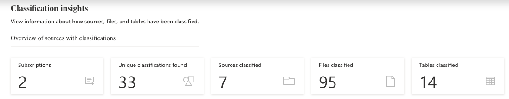

3. The Classification page includes the following **graphs**:
     
    **Top Sources with Classified Data by Date**

    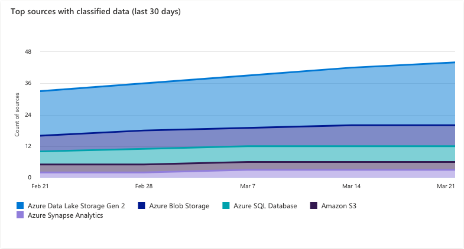

    **Top Classification Categories by Sources**

    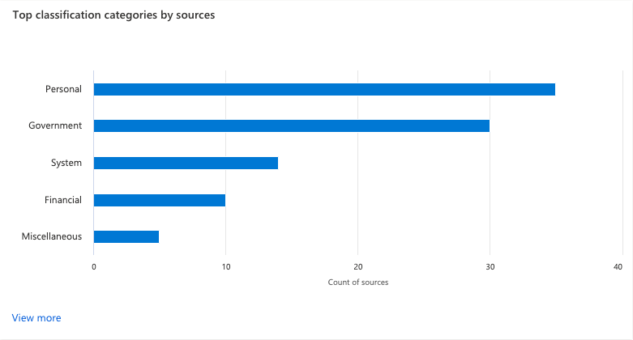

    **Top Classifications for Files**

    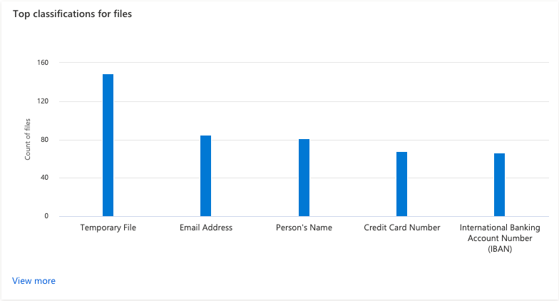

    **Top Classifications for Tables**

    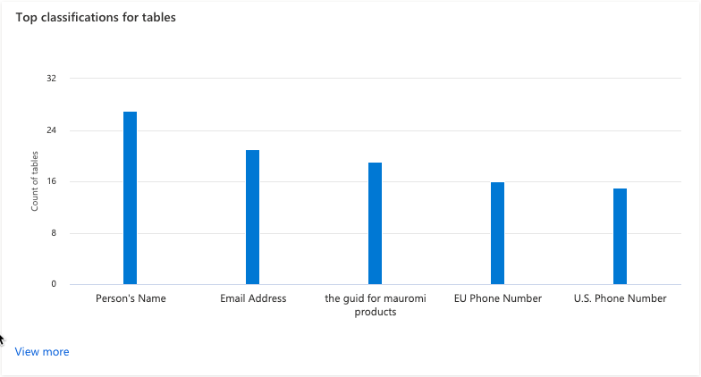

<div align="right"><a href="#module-07---insights">↥ back to top</a></div>

## 5. Sensitivity Labels Insights

1. Open Purview Studio, navigate to **Insights** > **Sensitivity Labels**.

    > :bulb: **Did you know?**
    >
    > **Sensitivity labels** state how sensitive data is in your organization. For example, data contained within a particular asset might be `highly confidential`. **Classifications** on the other hand indicate the type of data values (e.g. Driver's License Number, Email Address, SWIFT Code, etc) 
    >
    > Azure Purview's ability to apply sensitivity labels is due to the close integration with **Microsoft Information Protection** offered in Microsoft 365. Note: You must turn on Information Protection for Azure Purview in the Microsoft 365 compliance center. For more information, check out how to [Automatically label your data in Azure Purview](https://docs.microsoft.com/en-us/azure/purview/create-sensitivity-label).

    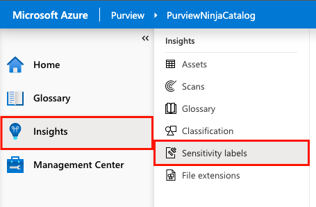

2. The Sensitivity Labels page displays the following **high-level metrics**.
    * Number of Subscriptions (with Sensitivity Labels)
    * Unique Number of Labels Found
    * Number of Sources Labeled
    * Number of Files Labeled
    * Number of Tables Labeled

    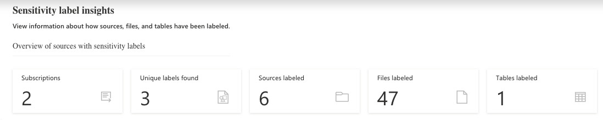

3. The Sensitivity Labels page includes the following **graphs**:
    
    **Top Sources with Labeled Data by Date**

    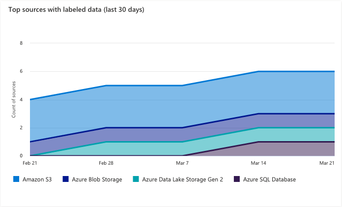

    **Top Labels Applied Across Sources**

    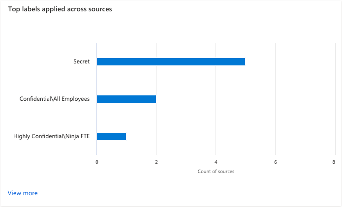

    **Top Labels Applied on Files**

    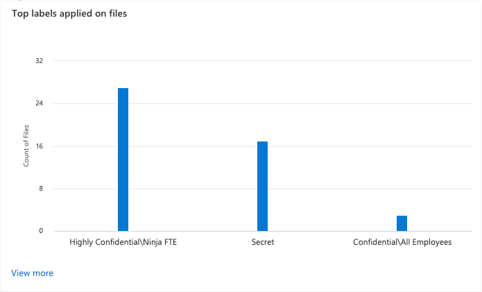

    **Top Labels Applied on Tables**

    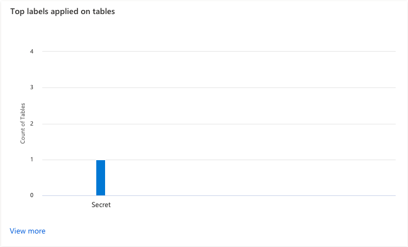

<div align="right"><a href="#module-07---insights">↥ back to top</a></div>

## 6. File Extensions Insights

1. Open Purview Studio, navigate to **Insights** > **File Extensions**.

    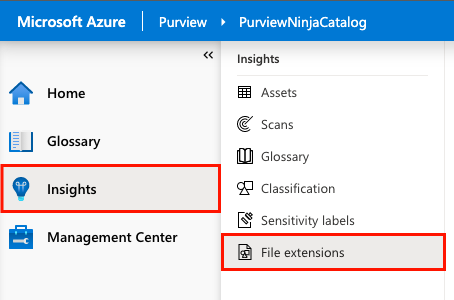

2. The File Extensions page displays the following **high-level metrics**.
    * Unique Number of File Extensions Found

    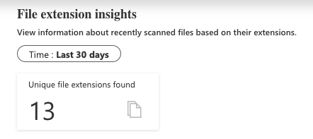

3. The File Extensions page includes the following **graphs**:
    
    **Top File Extensions**

    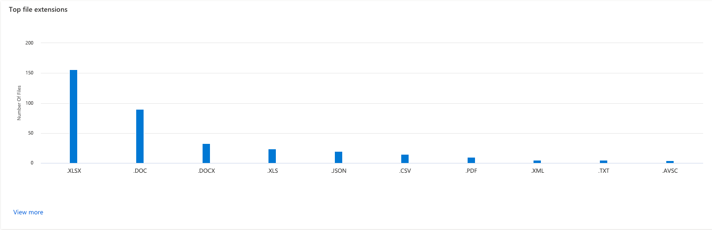
   
<div align="right"><a href="#module-07---insights">↥ back to top</a></div>

## :mortar_board: Knowledge Check

[http://aka.ms/purviewlab/q07](http://aka.ms/purviewlab/q07)

1. Which section would show the **number of discovered assets**?

    A ) Assets  
    B ) Scans  
    C ) File extensions

2. A glossary term that does not have a steward (i.e. an assigned contact), is shown as an **incomplete term**.

    A ) True  
    B ) False

3. An asset has been tagged as `highly confidential`. Which type of tag is this?

    A ) Classification  
    B ) Category  
    C ) Sensitivity Label

<div align="right"><a href="#module-07---insights">↥ back to top</a></div>

## :tada: Summary

This module provided an overview of how to glean insights on Assets, Scans, Glossary Terms, Classifications, Sensitivity Labels, and File Extensions across your data estate.

[Continue >](../modules/module08.md)
