# Module 09 - Integrate with Azure Synapse Analytics

[< Previous Module](../modules/module08.md) - **[Home](../README.md)** - [Next Module >](../modules/module10.md)

## :loudspeaker: Introduction

Azure Synapse Analytics, formerly known as Azure SQL Data Warehouse, is a big data analytics solution with enterprise data warehousing features. It provides different types of compute environments for different workloads. It is often used to process large volumes of data and can be used to design a data lake, data warehouse or big data analytics platform.

Registering a Microsoft Purview account to a Synapse workspace allows you to discover Microsoft Purview assets, interact with them through Synapse specific capabilities, and push lineage information to Microsoft Purview. This enables you to see what data is ingested, processed and consumed by what analytical processes.

## :thinking: Prerequisites

* An [Azure account](https://azure.microsoft.com/en-us/free/) with an active subscription.
* A Microsoft Purview account (see [module 01](../modules/module01.md)).
* An Microsoft Purview catalog with some assets (see [module 02](../modules/module02.md)).

## :dart: Objectives

* Register a Microsoft Purview account to a Synapse workspace.
* Query a dataset that exists in the Microsoft Purview catalog with Azure Synapse Analytics.

## Table of Contents

1. [Azure Data Lake Storage Gen2 Account Access](#1-azure-data-lake-storage-gen2-account-access)
2. [Connect to a Purview Account](#2-connect-to-a-purview-account)
3. [Search a Purview Account](#3-search-a-purview-account)

<a href="#module-09---integrate-with-azure-synapse-analytics">↥ back to top</a>

## 1. Azure Data Lake Storage Gen2 Account Access

> :bulb: **Did you know?**
>
> One of the key benefits of integrating Azure Synapse Analytics with Microsoft Purview, is the ability to discover Microsoft Purview assets from within Synapse Studio (i.e. no need to swtich between user experiences), with added abilities using Synapse specific capabilities (e.g. SELECT TOP 100). 
>
> Note: Before we can demonstrate the ability to query external data sources from Azure Synapse Analytics, we need to ensure our account has the appropriate level of access (i.e. `Storage Blob Data Reader`).

1. Navigate to the **Azure Data Lake Storage Gen2 account** (e.g. `pvlab{randomId}adls`), select **Access Control (IAM)**, and then click **Add role assignment**.

    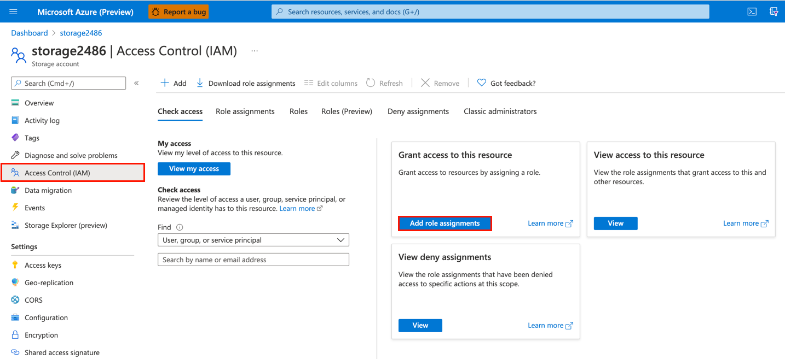

2. Filter the list of roles available by searching for `Storage Blob Data Reader`, select the **Storage Blob Data Reader** role from the list, and click **Next**.

    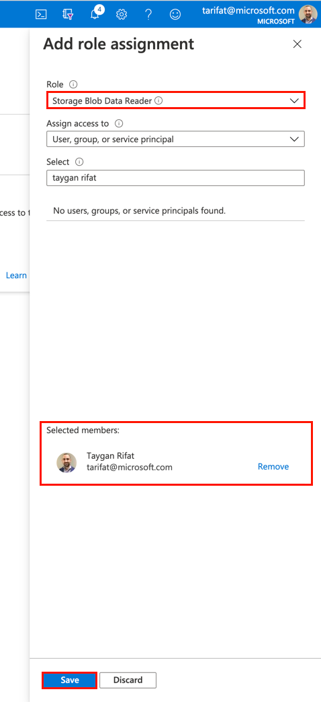

3. To add your account click **Select members**, search for your account by typing your username into the text box, select your account from the list, and click **Select**.

    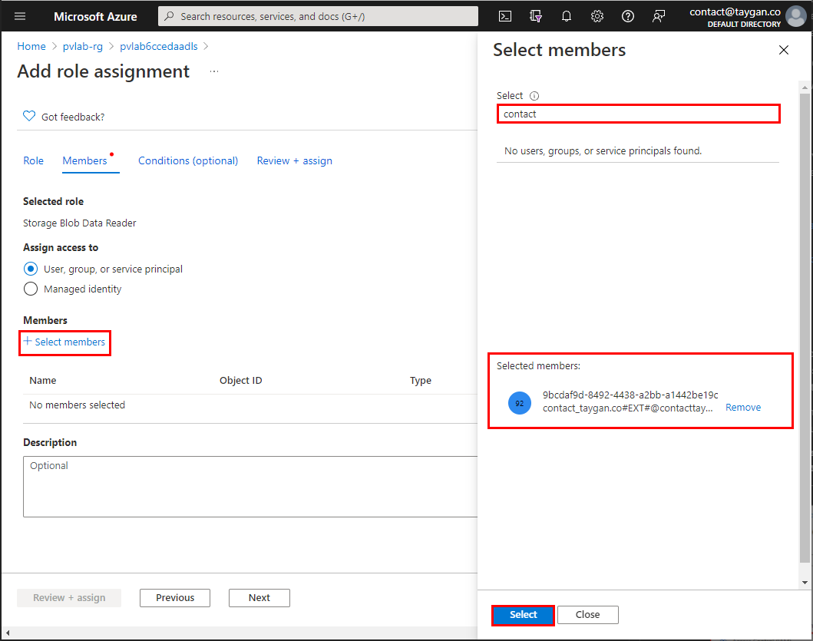

4. Click **Review + assign** to progress to the final confirmation screen and then click **Review + assign** once more.

    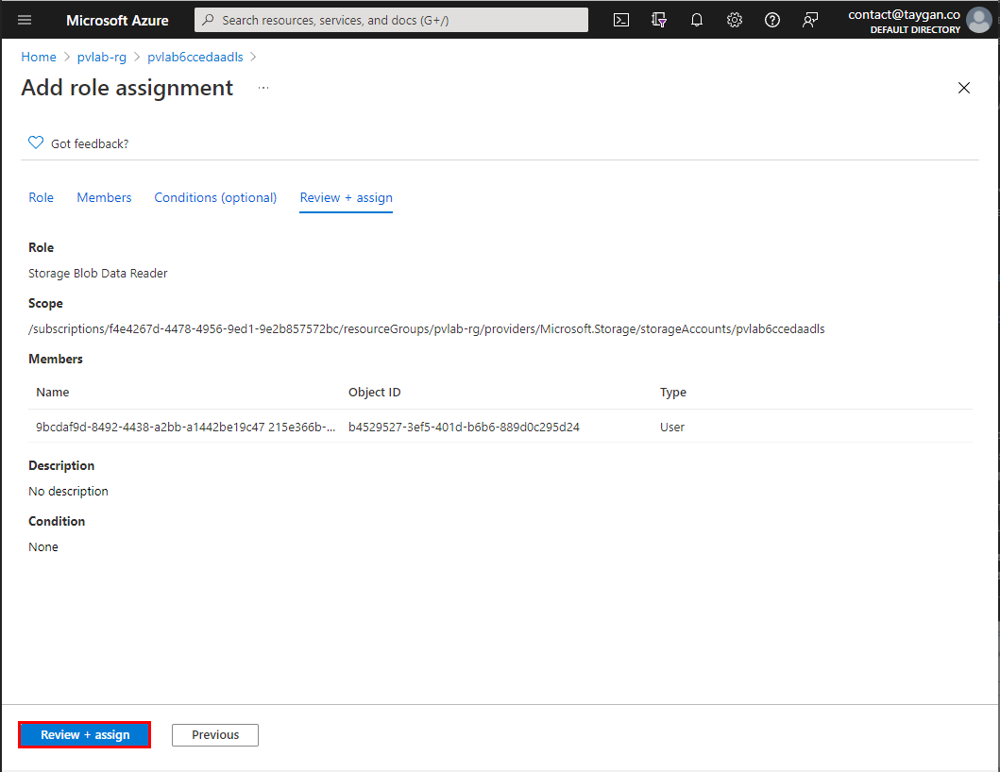

<a href="#module-09---integrate-with-azure-synapse-analytics">↥ back to top</a>

## 2. Connect to a Purview Account

1. Within the Azure portal, open the Synapse workspace and click **Open Synapse Studio**.

    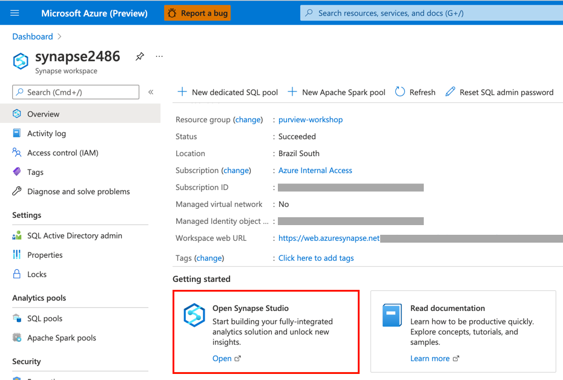

2. Navigate to **Manage** > **Microsoft Purview (Preview)** and click **Connect to a Purview account**.

    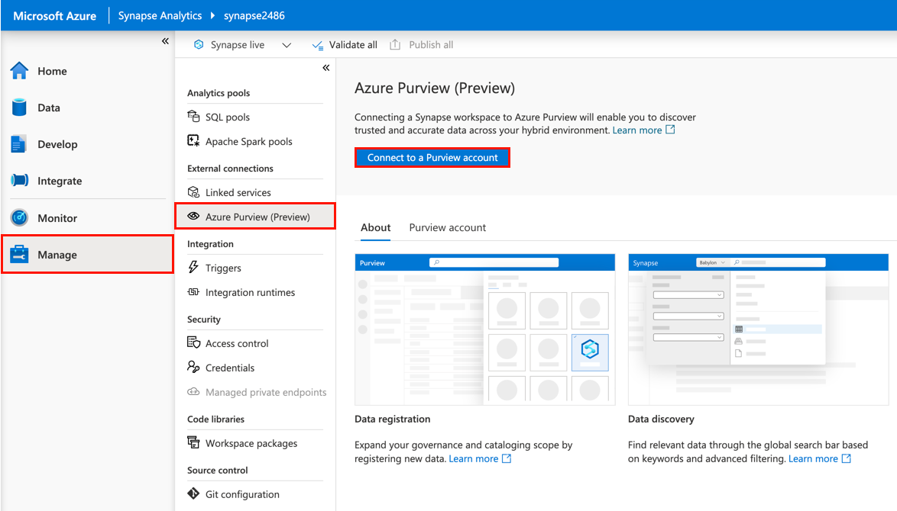

3. Select your **Purview account** from the drop-down menu and click **Apply**.

    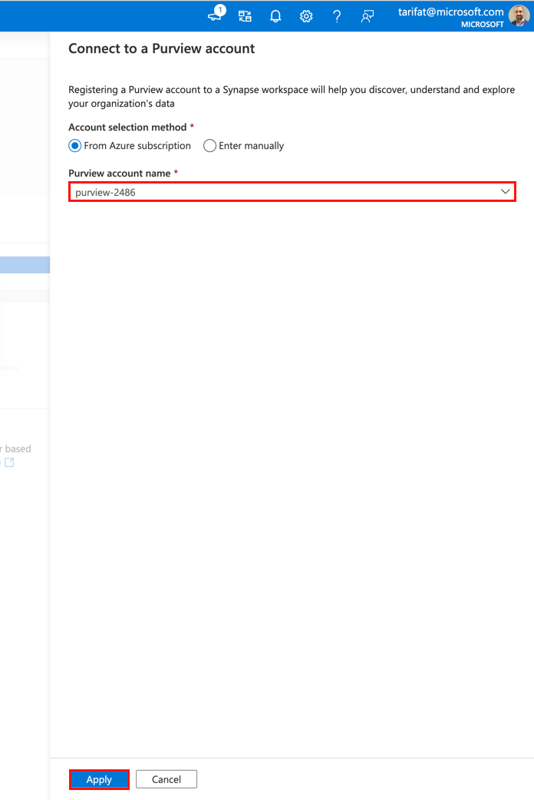

4. Once the connection has been established, you will receive a notification that **Registration succeeded**. Switch to the **Purview account** tab to confirm that the Purview account is connected. On this page, you will also see a list of integration capabilities that are now available (e.g. Microsoft Purview search, Synapse Pipeline lineage, etc).

    > :bulb: **Did you know?**
    >
    > When connecting a Synapse workspace to Purview, Synapse will attempt to add the necessary Purview role assignment (i.e. `Data Curator`) to the Synapse managed identity automatically. This operation will be successful if you belong to the **Collection admins** role on the Purview root collection and have access to the Microsoft Purview account. For more information, check out [Connect a Synapse workspace to a Microsoft Purview account](https://docs.microsoft.com/en-us/azure/synapse-analytics/catalog-and-governance/quickstart-connect-microsoft-purview).

    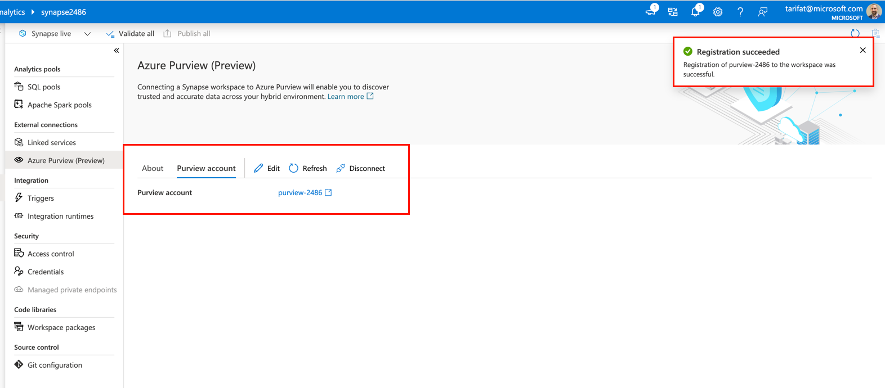

5. To validate that Synapse was able to succesfully add the Synapse managed identity to the Data Curator role, navigate to the **Microsoft Purview Governance Portal** > **Data map** > **Collections** > **YOUR_ROOT_COLLECTION**, switch to the **Role assignments** tab and expand **Data curators**. You should be able to see the Synapse Service Principal listed as one of the Data curators. This will provide Synapse read/write access to the catalog.

    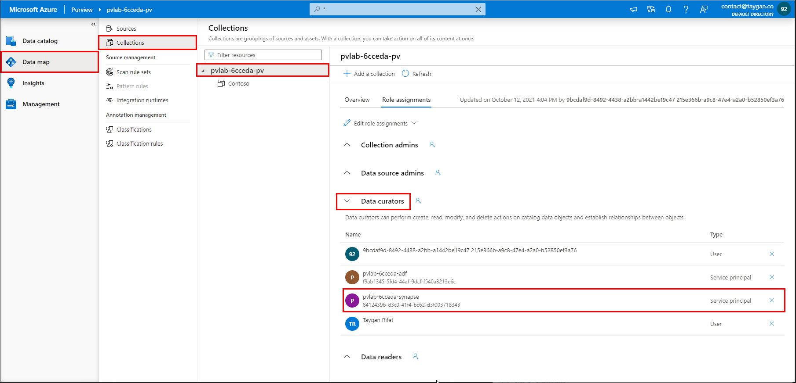

<a href="#module-09---integrate-with-azure-synapse-analytics">↥ back to top</a>

## 3. Search a Purview Account

1. Within the Synapse workspace, navigate to the **Data** screen and perform a **keyword search** (e.g. `parquet`). Notice that the search bar now defaults to searching the entire Purview catalog as opposed to the Synapse workspace only.

    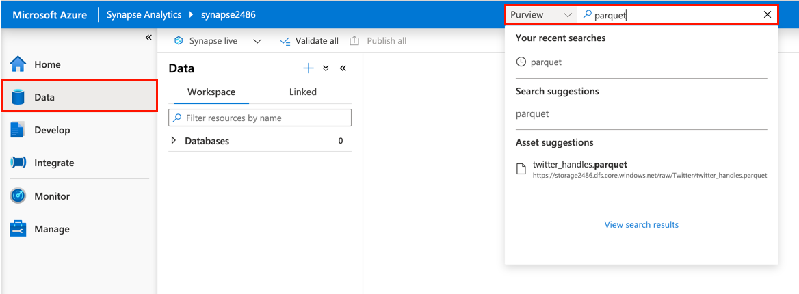

2. Click to open the **asset details** of one of the items (e.g. `twitter_handles.parquet`).

    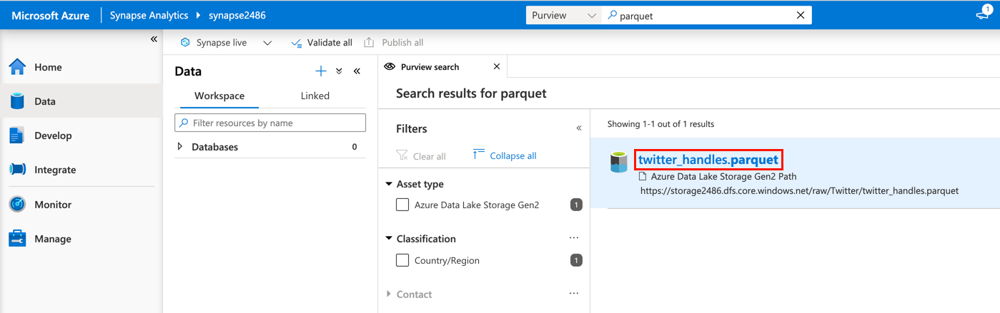

3. Notice the special Synapse-specific menu items such as **Connect** and **Develop**. For supported file types such as parquet, you can quickly generate sample code to query the external source by navigating to **Develop** > **New SQL script** > **Select top 100**.

    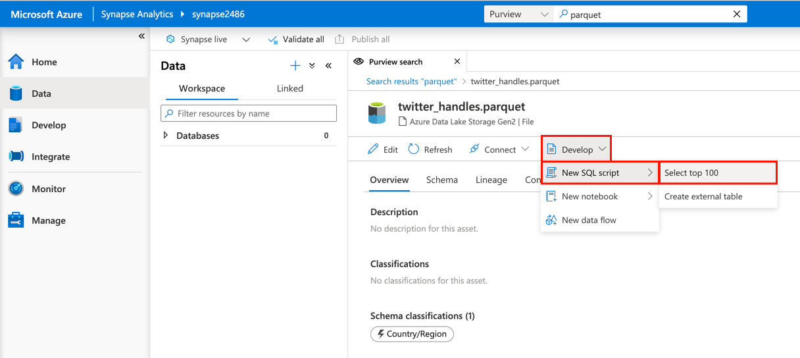

4. To execute the query, click **Run**. Note: The user executing the query must have the appropriate level of access (e.g. Storage Blob Data Reader), see step 1 for more details..

    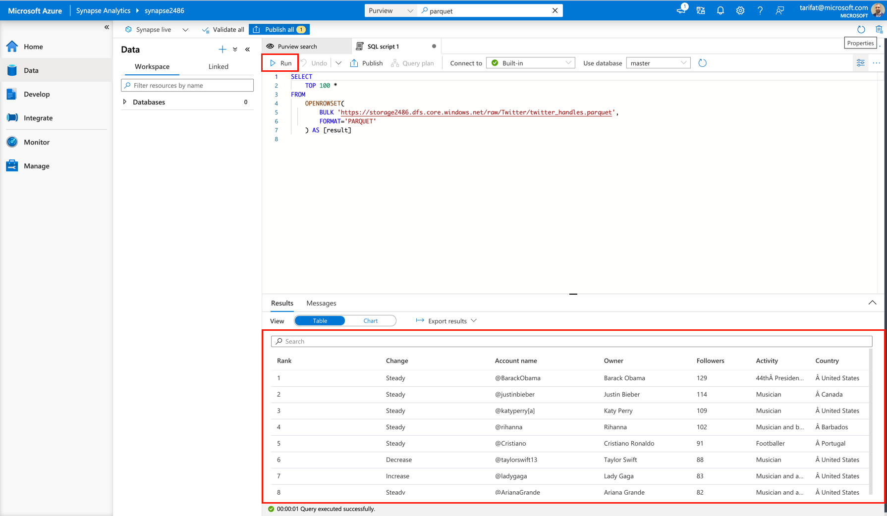

<a href="#module-09---integrate-with-azure-synapse-analytics">↥ back to top</a>

## :mortar_board: Knowledge Check

[http://aka.ms/purviewlab/q09](http://aka.ms/purviewlab/q09)

1. Connecting a Synapse workspace to Microsoft Purview enables you to discover data assets that live **outside** of the Azure Synapse Analytics workspace?

    A ) True  
    B ) False  

2. A single Synapse Analytics workspace can connect to **multiple** Microsoft Purview accounts?

    A ) True  
    B ) False  

3. Once Synapse Analytics is connected to a Microsoft Purview account, users can quickly generate a new linked service or integration dataset via the action buttons (for supported file types)?

    A ) True    
    B ) False  

<a href="#module-09---integrate-with-azure-synapse-analytics">↥ back to top</a>

## :tada: Summary

This module provided an overview of how to register a Microsoft Purview account to an Azure Synapse Analytics Workspace, view the details of an asset that exists outside of the Synapse workspace, and how you can quickly query an external source.

[Continue >](../modules/module10.md)
