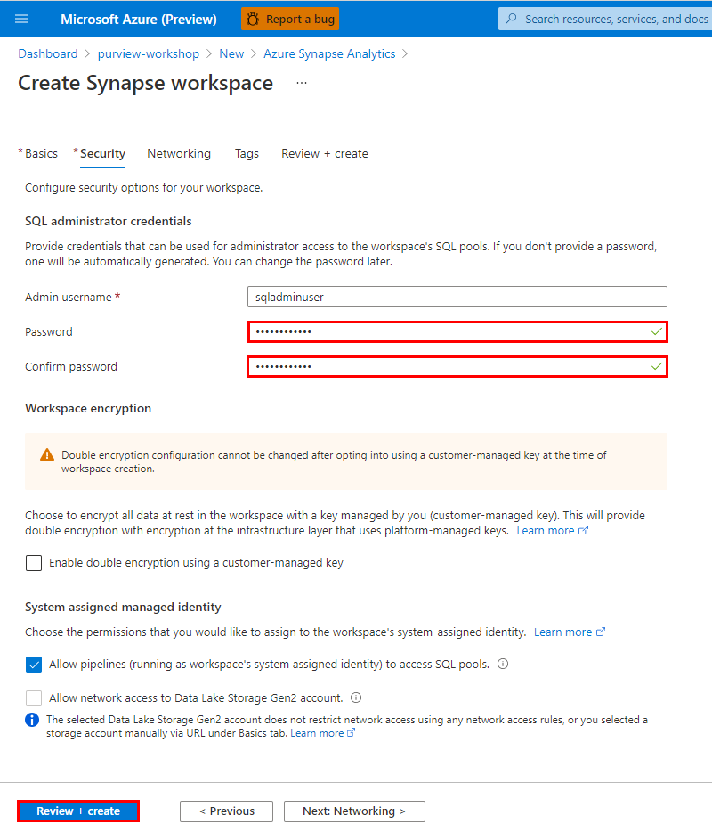

# Module 09 - Integrate with Azure Synapse Analytics

[< Previous Module](../modules/module08.md) - **[Home](../README.md)** - [Next Module>](../modules/module10.md)

## :thinking: Prerequisites

* An Azure account with an active subscription.
* An Azure Azure Purview account (see [module 01](../modules/module01.md)).
* An Azure Purview catalog with some assets (see [module 02](../modules/module02.md)).

## :loudspeaker: Introduction

Registering an Azure Purview account to a Synapse workspace allows you to discover Azure Purview assets and interact with them through Synapse specific capabilities.

## :dart: Objectives

* Regiser Azure Purview to a Synapse workspace.
* Query a dataset that exists in the Azure Purview catalog with Azure Synapse Analytics.

## Table of Contents

1. [Azure Data Lake Storage Gen2 Account Access](#1-azure-data-lake-storage-gen2-account-access)
2. [Create an Azure Synapse Analytics Workspace](#2-create-an-azure-synapse-analytics-workspace)
3. [Connect to a Purview Account](#3-connect-to-a-purview-account)
4. [Search a Purview Account](#4-search-a-purview-account)

<a href="#module-09---integrate-with-azure-synapse-analytics">↥ back to top</a>

## 1. Azure Data Lake Storage Gen2 Account Access

* This particular unit builds upon  previous modules (e.g. pre-provisioned Azure Purview account with an Azure Data Lake Storage Gen2 account registered and scanned, see prerequisites for more details).
* While this exercise will focus on how to integrate Azure Purview with Azure Synapse Analytics, if you would like to test the ability to connect to external sources within Synapse Studio, you will need to ensure the account being used to perform ad-hoc queries has sufficient privleges (e.g. Storage Blob Data Reader).

1. Navigate to the **Access Control (IAM)** screen within the storage account provisioned in [module 02](../modules/module02.md) and click **Add role assignments**.

    

2. Select the **Storage Blob Data Reader** role and assign this to the account that will query the external data source via Synapse Workspace (i.e. your account). Click **Save**.

    | Property  | Value |
    | --- | --- |
    | Role | `Storage Blob Data Reader` |
    | Assign access to | `User, group, or service principal` |
    | Select | `<account-name>` |

    

<a href="#module-09---integrate-with-azure-synapse-analytics">↥ back to top</a>

## 2. Create an Azure Synapse Analytics Workspace

1. Navigate to the Azure Portal and create an **Azure Synapse Analytics** resource.

    

2. Provide the necessary inputs on the **Basics** tab and click **Next: Security >**.

    | Parameter  | Example Value |
    | --- | --- |
    | Subscription | `Azure Internal Access` |
    | Resource group | `purview-workshop` |
    | Workspace name | `synapse2486` |
    | Region | `Brazil South` |
    | (ADLS Gen2) Account name | `(Create new) synapseadls2486` |
    | (ADLS Gen2)  File system name | `(Create new) synapsefs2486` |

    

3. Enter a **password** for the SQL administrator and click **Review + create**.

    

4. Click **Create**.

    

5. Monitor your deployment until the status changes to **Your deployment is complete**.

    

<a href="#module-09---integrate-with-azure-synapse-analytics">↥ back to top</a>

## 3. Connect to a Purview Account

1. Within the Azure portal, open the Synapse workspace and click **Open Synapse Studio**.

    

2. Navigate to **Manage** > **Azure Purview (Preview)** and click **Connect to a Purview account**.

    

3. Select your **Purview account** from the drop-down menu and click **Apply**.

    

4. Once the connection has been established, you will receive a notification that **Registration succeeded**.

    

<a href="#module-09---integrate-with-azure-synapse-analytics">↥ back to top</a>

## 4. Search a Purview Account

1. Within the Synapse workspace, navigate to the **Data** screen and perform a **keyword search** (e.g. `parquet`). Notice that the search bar now defaults to searching the entire Purview catalog as opposed to the Synapse workspace only.

    

2. Click to open the **asset details** of one of the items (e.g. `twitter_handles.parquet`).

    

3. Notice the special Synapse-specific menu items such as **Connect** and **Develop**. For supported file types such as parquet, you can quickly generate sample code to query the external source by navigating to **Develop** > **New SQL script** > **Select top 100**.

    

4. To execute the query, click **Run**. Note: The user executing the query must have the appropriate level of access (e.g. Storage Blob Data Reader), see step 1 for more details..

    

<a href="#module-09---integrate-with-azure-synapse-analytics">↥ back to top</a>

## :tada: Summary

This module provided an overview of how to register an Azure Purview account to an Azure Synapse Analytics Workspace, view the details of an asset that exists outside of the Synapse workspace, and how you can quickly query an external source.
