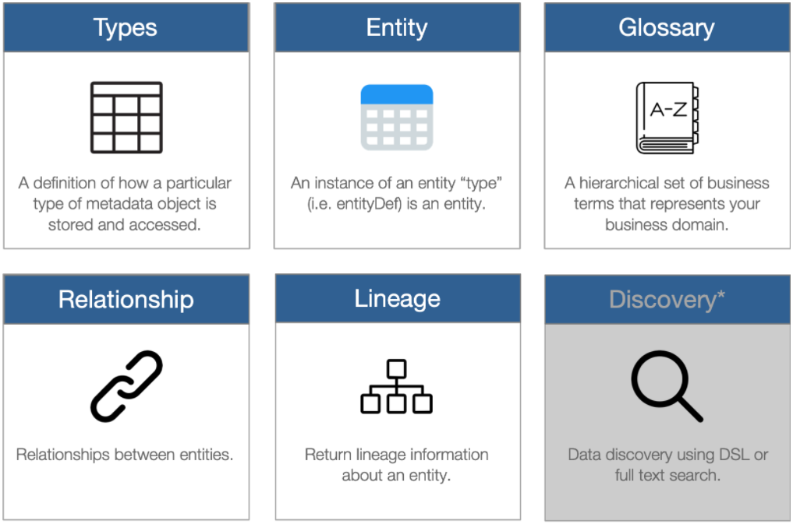
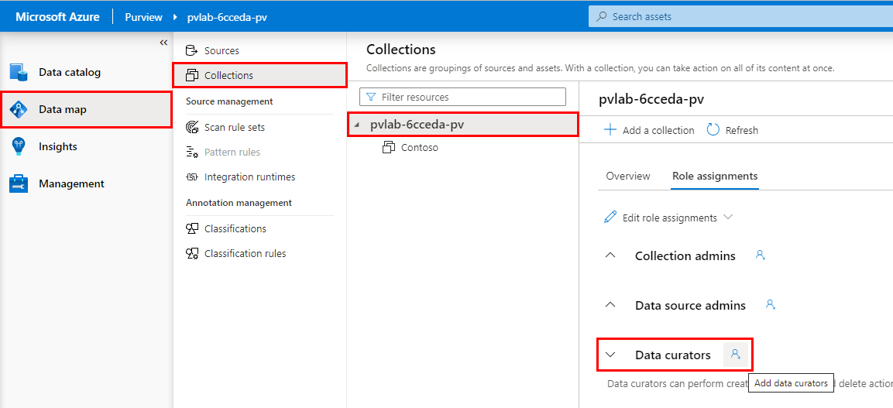
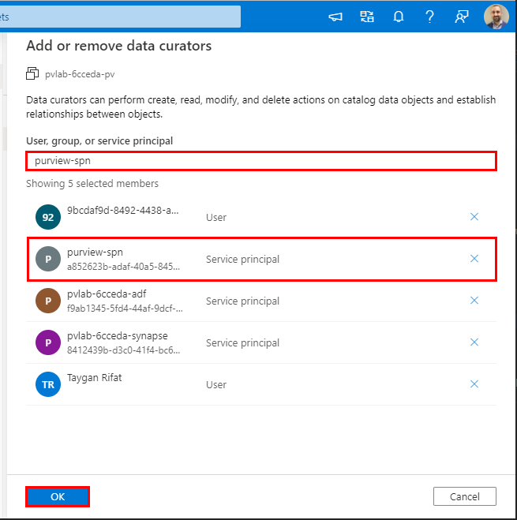
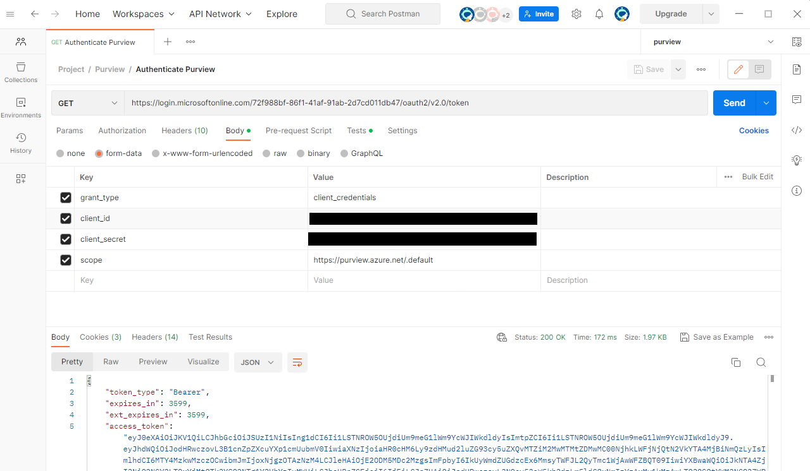
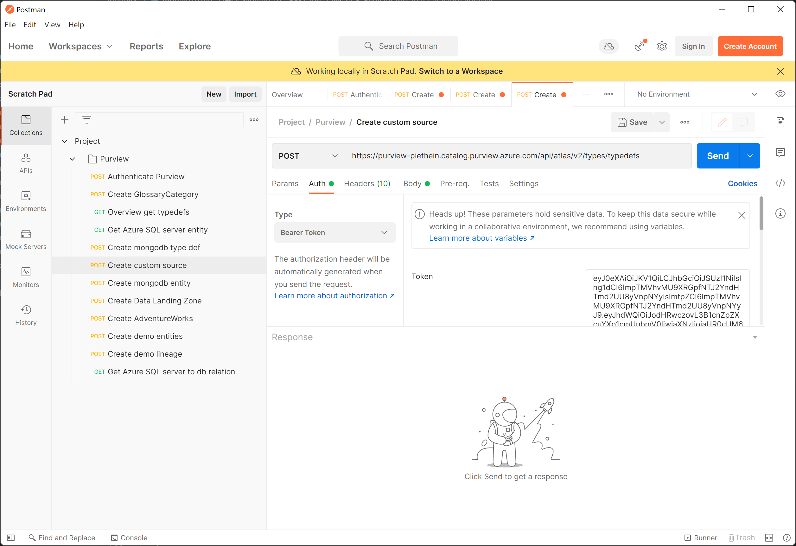
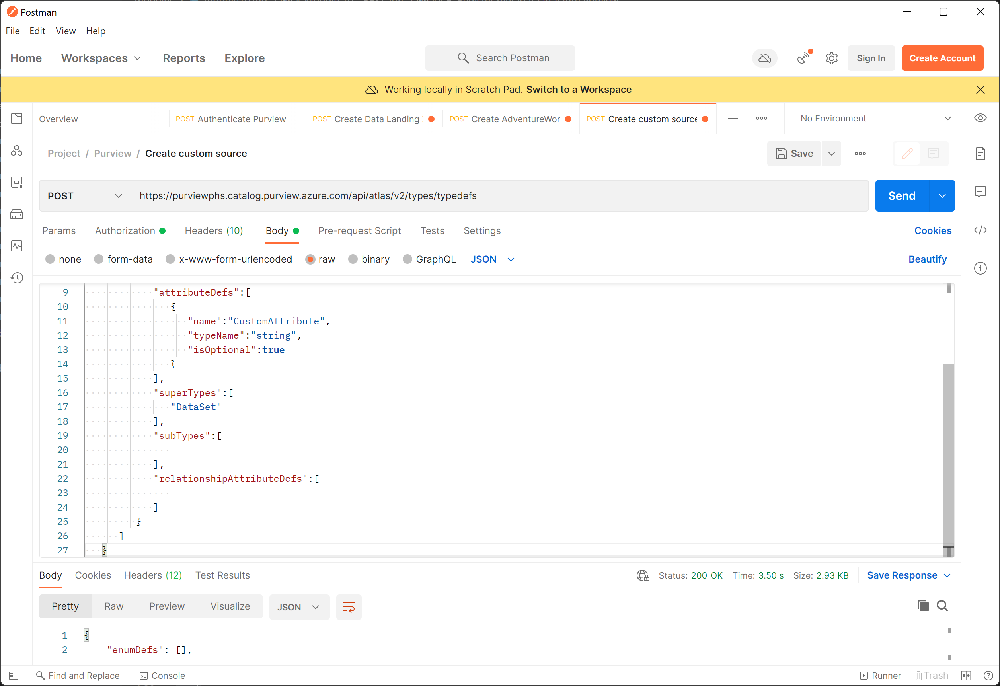

# Module 10 - REST API

[< Previous Module](../modules/module09.md) - **[Home](../README.md)**

## :loudspeaker: Introduction

While Purview Studio is the default interface for Azure Purview, the underlying platform can be accessed via a set of APIs. This opens up the possibility of a variety of scenarios including:

  * Working with Azure Purview assets programmatically (e.g. bulk create/read/update/delete).
  * Adding support for other data sources beyond those supported out of the box.
  * Extending the lineage functionality to other ETL processes.
  * Embedding Azure Purview asset data within custom user experiences.
  * Triggering Azure Purview scans to run off the back of a custom event.

The primary focus of this module is the **catalog** which is based on the open-source [Apache Atlas](https://atlas.apache.org/) project. Read below for more details on Apache Atlas and how it relates to Azure Purview.

## :thinking: Prerequisites

* An [Azure account](https://azure.microsoft.com/en-us/free/) with an active subscription.
* An Azure Azure Purview account (see [module 01](../modules/module01.md)).

## :hammer: Tools

* [Postman](https://www.postman.com/product/rest-client/) (Download and Install)

## :dart: Objectives

* Understand the high-level Apache Atlas concepts.
* Generate an access token.
* Read data from the Azure Purview platform.

## Table of Contents

1. [Apache Atlas](#1-apache-atlas)
2. [Register an Application](#2-register-an-application)
3. [Generate a Client Secret](#3-generate-a-client-secret)
4. [Provide Service Principal Access to Azure Purview](#4-provide-service-principal-access-to-azure-purview)
5. [Get an Access Token](#5-get-an-access-token)
6. [Read data from Azure Purview](#6-read-data-from-azure-purview)


<div align="right"><a href="#module-10---rest-api">↥ back to top</a></div>

## 1. Apache Atlas

> :world_map: **What is Apache Atlas?**
>
> *"Apache Atlas provides open metadata management and governance capabilities for organizations to build a catalog of their data assets, classify and govern these assets and provide collaboration capabilities around these data assets for data scientists, analysts and the data governance team."* 
>
> Source: [Apache.org](https://atlas.apache.org/#/)

Azure Purview's **data catalog** is largely based on **Apache Atlas**, and therefore shares much of the same surface area that allows users to programmatically perform CRUD (CREATE/READ/UPDATE/DELETE) operations over Azure Purview assets.


**Atlas Endpoints**

As can be seen in the [Apache Atlas Swagger](https://atlas.apache.org/api/v2/ui/index.html#/), Atlas has a variety of REST endpoints that handle different aspects of the catalog (e.g. types, entities, glossary, etc). 



**Types**

A definition (or blueprint) as to how a particular type of metadata object can be created. This is similar to the concept of a Class in object-oriented programming. For example: The type definition for an `azure_sql_table` is of category `ENTITY` and contains attributes such as `guid`, `qualifiedName`, `description`, etc.

<details><summary>JSON Code Snippet: Azure SQL Table (Type)</summary>
<p>

```json
{
    "attributeDefs":[
        {
            "cardinality":"SINGLE",
            "includeInNotification":false,
            "isIndexable":false,
            "isOptional":true,
            "isUnique":false,
            "name":"principalId",
            "typeName":"int",
            "valuesMaxCount":1,
            "valuesMinCount":0
        },
        {
            "cardinality":"SINGLE",
            "includeInNotification":false,
            "isIndexable":false,
            "isOptional":true,
            "isUnique":false,
            "name":"objectType",
            "typeName":"string",
            "valuesMaxCount":1,
            "valuesMinCount":0
        },
        {
            "cardinality":"SINGLE",
            "includeInNotification":false,
            "isIndexable":false,
            "isOptional":true,
            "isUnique":false,
            "name":"createTime",
            "typeName":"date",
            "valuesMaxCount":1,
            "valuesMinCount":0
        },
        {
            "cardinality":"SINGLE",
            "includeInNotification":false,
            "isIndexable":false,
            "isOptional":true,
            "isUnique":false,
            "name":"modifiedTime",
            "typeName":"date",
            "valuesMaxCount":1,
            "valuesMinCount":0
        }
    ],
    "category":"ENTITY",
    "createTime":1616124550225,
    "createdBy":"admin",
    "description":"azure_sql_table",
    "guid":"7d92a449-f7e8-812f-5fc8-ca6127ba90bd",
    "lastModifiedTS":"1",
    "name":"azure_sql_table",
    "options":{
        "purviewEntityExtDef":"{}",
        "schemaElementsAttribute":"columns"
    },
    "relationshipAttributeDefs":[
        {
            "cardinality":"SET",
            "includeInNotification":false,
            "isIndexable":false,
            "isLegacyAttribute":false,
            "isOptional":true,
            "isUnique":false,
            "name":"schema",
            "relationshipTypeName":"avro_schema_associatedEntities",
            "typeName":"array<avro_schema>",
            "valuesMaxCount":-1,
            "valuesMinCount":-1
        },
        {
            "cardinality":"SET",
            "includeInNotification":false,
            "isIndexable":false,
            "isLegacyAttribute":false,
            "isOptional":true,
            "isUnique":false,
            "name":"inputToProcesses",
            "relationshipTypeName":"dataset_process_inputs",
            "typeName":"array<Process>",
            "valuesMaxCount":-1,
            "valuesMinCount":-1
        },
        {
            "cardinality":"SINGLE",
            "includeInNotification":false,
            "isIndexable":false,
            "isLegacyAttribute":false,
            "isOptional":false,
            "isUnique":false,
            "name":"dbSchema",
            "relationshipTypeName":"azure_sql_schema_tables",
            "typeName":"azure_sql_schema",
            "valuesMaxCount":-1,
            "valuesMinCount":-1
        },
        {
            "cardinality":"SET",
            "constraints":[
                {
                "type":"ownedRef"
                }
            ],
            "includeInNotification":false,
            "isIndexable":false,
            "isLegacyAttribute":false,
            "isOptional":true,
            "isUnique":false,
            "name":"columns",
            "relationshipTypeName":"azure_sql_table_columns",
            "typeName":"array<azure_sql_column>",
            "valuesMaxCount":-1,
            "valuesMinCount":-1
        },
        {
            "cardinality":"SET",
            "includeInNotification":false,
            "isIndexable":false,
            "isLegacyAttribute":false,
            "isOptional":true,
            "isUnique":false,
            "name":"attachedSchema",
            "relationshipTypeName":"dataset_attached_schemas",
            "typeName":"array<schema>",
            "valuesMaxCount":-1,
            "valuesMinCount":-1
        },
        {
            "cardinality":"SET",
            "includeInNotification":false,
            "isIndexable":false,
            "isLegacyAttribute":false,
            "isOptional":true,
            "isUnique":false,
            "name":"meanings",
            "relationshipTypeName":"AtlasGlossarySemanticAssignment",
            "typeName":"array<AtlasGlossaryTerm>",
            "valuesMaxCount":-1,
            "valuesMinCount":-1
        },
        {
            "cardinality":"SET",
            "includeInNotification":false,
            "isIndexable":false,
            "isLegacyAttribute":false,
            "isOptional":true,
            "isUnique":false,
            "name":"outputFromProcesses",
            "relationshipTypeName":"process_dataset_outputs",
            "typeName":"array<Process>",
            "valuesMaxCount":-1,
            "valuesMinCount":-1
        },
        {
            "cardinality":"SINGLE",
            "includeInNotification":false,
            "isIndexable":false,
            "isLegacyAttribute":false,
            "isOptional":true,
            "isUnique":false,
            "name":"tabular_schema",
            "relationshipTypeName":"tabular_schema_datasets",
            "typeName":"tabular_schema",
            "valuesMaxCount":-1,
            "valuesMinCount":-1
        }
    ],
    "serviceType":"Azure SQL Database",
    "subTypes":[
        
    ],
    "superTypes":[
        "DataSet"
    ],
    "typeVersion":"1.0",
    "updateTime":1616124550225,
    "updatedBy":"admin",
    "version":1
}
```
</p>
</details>

**Entity**

An instance of an entity type (e.g. `azure_sql_table`). For example: An instance of an `azure_sql_table` contains the following example values:
* name: `Address`
* qualifiedName: `mssql://sqlsvr.database.windows.net/sqldb/SalesLT/Address`
* status: `ACTIVE`
* typeName: `azure_sql_table`

<details><summary>JSON Code Snippet: Azure SQL Table (Entity)</summary>
<p>

```json
{
    "typeName":"azure_sql_table",
    "attributes":{
        "owner":null,
        "modifiedTime":1634050303000,
        "replicatedTo":null,
        "replicatedFrom":null,
        "createTime":1634050301000,
        "qualifiedName":"mssql://pvlab-6cceda-sqlsvr.database.windows.net/pvlab-6cceda-sqldb/SalesLT/Address",
        "name":"Address",
        "description":null,
        "principalId":0,
        "objectType":"U "
    },
    "lastModifiedTS":"2",
    "guid":"cdb7dd83-2212-4c62-af86-1bf6f6f60000",
    "status":"ACTIVE",
    "createdBy":"ServiceAdmin",
    "updatedBy":"b4529527-3ef5-401d-b6b6-889d0c295d24",
    "createTime":1634069153211,
    "updateTime":1634383588977,
    "version":0,
    "collectionId":"pj8epk"
}
```
</p>
</details>

**Glossary**

A hierarchical set of business terms that represents your business domain. For example:
* Term Name: `Focus Time`
* Term Definition: `Uninterrupted time blocks of two hours or more with no meetings.`

<details><summary>JSON Code Snippet: Focus Time (Glossary Term)</summary>
<p>

```json
{
    "guid":"7da365c4-078b-4e5f-8292-3c18534c0936",
    "qualifiedName":"Workplace Analytics_Focus time@Glossary",
    "name":"Workplace Analytics_Focus time",
    "longDescription":"Uninterrupted time blocks of two hours or more with no meetings.",
    "lastModifiedTS":"1",
    "abbreviation":"FT",
    "createdBy":"b4529527-3ef5-401d-b6b6-889d0c295d24",
    "updatedBy":"b4529527-3ef5-401d-b6b6-889d0c295d24",
    "createTime":1634389133979,
    "updateTime":1634389133979,
    "status":"Expired",
    "nickName":"Focus time",
    "anchor":{
        "glossaryGuid":"2e703cb0-6b26-4cab-b4b6-285296f90dca",
        "relationGuid":"9a53cbb8-e201-494e-b248-0d94f206fdfa"
    },
    "parentTerm":{
        "termGuid":"69bb145c-4217-413b-a771-2016b5975752",
        "relationGuid":"548ea543-67de-4b00-85a5-92a554daa356",
        "displayText":"Workplace Analytics"
    },
    "resources":[
        {
            "displayName":"Workspace Analytics",
            "url":"https://docs.microsoft.com/en-us/workplace-analytics/use/glossary"
        }
    ]
}
```
</p>
</details>

**Relationship**

An object that defines the relationship between objects. For example: A relationship of type `AtlasGlossarySemanticAssignment` describes the relationship between an `AtlasGlossaryTerm` and an asset (e.g. `azure_datalake_gen2_path`).

<details><summary>JSON Code Snippet: AtlasGlossarySemanticAssignment (Relationship)</summary>
<p>

```json
{
   "relationship":{
      "end1":{
         "guid":"cde39a38-880c-42a8-a3cf-ba9958aee4ec",
         "typeName":"AtlasGlossaryTerm",
         "uniqueAttributes":{
            "qualifiedName":"Workplace Analytics_Attendee@Glossary"
         }
      },
      "end2":{
         "guid":"b04758fd-e93b-4de5-b9b8-8fd9873941e3",
         "typeName":"azure_datalake_gen2_path",
         "uniqueAttributes":{
            "qualifiedName":"https://pvdemofm2ieadls.dfs.core.windows.net/bing/data/merged.parquet"
         }
      },
      "guid":"335b31c2-5396-4efb-ba8a-f525db699a20",
      "label":"r:AtlasGlossarySemanticAssignment",
      "status":"ACTIVE",
      "typeName":"AtlasGlossarySemanticAssignment",
      "version":0
   }
}
```
</p>
</details>

**Lineage**

Returns lineage information about an entity (e.g. `Azure Data Factory Copy Activity`). Lineage details where data originated from, where it moved, and where it was processed.

<details><summary>JSON Code Snippet: Azure Data Factory Copy Activity (Lineage)</summary>
<p>

```json
{
   "baseEntityGuid":"5e7c0c96-7f71-48f5-a2b5-fe20d13e279b",
   "childrenCount":1,
   "guidEntityMap":{
      "1dff011b-5f2c-4a02-9d72-978a4db7a2ac":{
         "attributes":{
            "name":"copyPipeline",
            "qualifiedName":"/subscriptions/2c334b6c-e556-40ac-a4c0-c0d1d2e08ca0/resourceGroups/pvdemo-rg-fm2ie/providers/Microsoft.DataFactory/factories/pvdemofm2ie-adf/pipelines/copyPipeline"
         },
         "classificationNames":[
            
         ],
         "displayText":"copyPipeline",
         "guid":"1dff011b-5f2c-4a02-9d72-978a4db7a2ac",
         "lastModifiedTS":"1",
         "meaningNames":[
            
         ],
         "meanings":[
            
         ],
         "status":"ACTIVE",
         "typeName":"adf_pipeline"
      },
      "2788b71f-eb02-49c6-a776-77152db8e9e7":{
         "attributes":{
            "modifiedTime":0,
            "name":"QueriesByCountry",
            "partitionCount":0,
            "qualifiedName":"https://pvdemofm2ieadls.dfs.core.windows.net/bing/data/{N}/QueriesByCountry_{Year}-{Month}-{Day}_{N}-{N}-{N}.tsv",
            "schemaCount":0,
            "totalSizeBytes":0
         },
         "classificationNames":[
            
         ],
         "collectionId":"nkmsyh",
         "displayText":"QueriesByCountry",
         "guid":"2788b71f-eb02-49c6-a776-77152db8e9e7",
         "lastModifiedTS":"1",
         "meaningNames":[
            
         ],
         "meanings":[
            
         ],
         "status":"ACTIVE",
         "typeName":"azure_datalake_gen2_resource_set"
      },
      "5254b2a1-ec08-4a5f-9bb8-ada1c848d83f":{
         "attributes":{
            "createTime":0,
            "name":"pvdemofm2ie-adf",
            "qualifiedName":"/subscriptions/2c334b6c-e556-40ac-a4c0-c0d1d2e08ca0/resourceGroups/pvdemo-rg-fm2ie/providers/Microsoft.DataFactory/factories/pvdemofm2ie-adf",
            "resourceGroupName":"pvdemo-rg-fm2ie",
            "subscriptionId":"2c334b6c-e556-40ac-a4c0-c0d1d2e08ca0"
         },
         "classificationNames":[
            
         ],
         "displayText":"pvdemofm2ie-adf",
         "guid":"5254b2a1-ec08-4a5f-9bb8-ada1c848d83f",
         "lastModifiedTS":"1",
         "meaningNames":[
            
         ],
         "meanings":[
            
         ],
         "status":"ACTIVE",
         "typeName":"azure_data_factory"
      },
      "5e7c0c96-7f71-48f5-a2b5-fe20d13e279b":{
         "attributes":{
            "dataSize":174159331,
            "errorMessage":"",
            "lastRunTime":1634036502127,
            "name":"Copy_a9c",
            "qualifiedName":"/subscriptions/2c334b6c-e556-40ac-a4c0-c0d1d2e08ca0/resourceGroups/pvdemo-rg-fm2ie/providers/Microsoft.DataFactory/factories/pvdemofm2ie-adf/pipelines/copyPipeline/activities/Copy_a9c",
            "rowCount":10907915,
            "status":"Completed"
         },
         "classificationNames":[
            
         ],
         "displayText":"Copy_a9c",
         "guid":"5e7c0c96-7f71-48f5-a2b5-fe20d13e279b",
         "lastModifiedTS":"2",
         "meaningNames":[
            
         ],
         "meanings":[
            
         ],
         "status":"ACTIVE",
         "typeName":"adf_copy_activity"
      },
      "8050c208-88a7-4521-b64f-2b1b82e12d70":{
         "attributes":{
            "columnMapping":"[{\"DatasetMapping\":{\"Source\":\"*\",\"Sink\":\"https://pvdemofm2ieadls.dfs.core.windows.net/bing/data/merged.parquet\"},\"ColumnMapping\":[{\"Source\":\"Date\",\"Sink\":\"Date\"},{\"Source\":\"Query\",\"Sink\":\"Query\"},{\"Source\":\"IsImplicitIntent\",\"Sink\":\"IsImplicitIntent\"},{\"Source\":\"State\",\"Sink\":\"State\"},{\"Source\":\"Country\",\"Sink\":\"Country\"},{\"Source\":\"PopularityScore\",\"Sink\":\"PopularityScore\"}]}]",
            "name":"Copy_a9c",
            "qualifiedName":"/subscriptions/2c334b6c-e556-40ac-a4c0-c0d1d2e08ca0/resourceGroups/pvdemo-rg-fm2ie/providers/Microsoft.DataFactory/factories/pvdemofm2ie-adf/pipelines/copyPipeline/activities/Copy_a9c#https://pvdemofm2ieadls.dfs.core.windows.net/bing/data/merged.parquet#azure_datalake_gen2_path"
         },
         "classificationNames":[
            
         ],
         "displayText":"Copy_a9c",
         "guid":"8050c208-88a7-4521-b64f-2b1b82e12d70",
         "lastModifiedTS":"14",
         "meaningNames":[
            
         ],
         "meanings":[
            
         ],
         "status":"ACTIVE",
         "typeName":"adf_copy_operation"
      },
      "b04758fd-e93b-4de5-b9b8-8fd9873941e3":{
         "attributes":{
            "isFile":true,
            "modifiedTime":0,
            "name":"merged.parquet",
            "path":"/bing/data/merged.parquet",
            "qualifiedName":"https://pvdemofm2ieadls.dfs.core.windows.net/bing/data/merged.parquet",
            "size":174159331
         },
         "classificationNames":[
            
         ],
         "displayText":"merged.parquet",
         "guid":"b04758fd-e93b-4de5-b9b8-8fd9873941e3",
         "lastModifiedTS":"2",
         "meaningNames":[
            "Workplace Analytics_Attendee"
         ],
         "meanings":[
            {
               "confidence":0,
               "displayText":"Workplace Analytics_Attendee",
               "relationGuid":"335b31c2-5396-4efb-ba8a-f525db699a20",
               "termGuid":"cde39a38-880c-42a8-a3cf-ba9958aee4ec"
            }
         ],
         "status":"ACTIVE",
         "typeName":"azure_datalake_gen2_path"
      },
      "dde518e1-ac6f-4919-8c08-5c848eddf3ca":{
         "attributes":{
            "modifiedTime":0,
            "name":"QueriesByState",
            "partitionCount":0,
            "qualifiedName":"https://pvdemofm2ieadls.dfs.core.windows.net/bing/data/{N}/QueriesByState_{Year}-{Month}-{Day}_{N}-{N}-{N}.tsv",
            "schemaCount":0,
            "totalSizeBytes":0
         },
         "classificationNames":[
            
         ],
         "collectionId":"nkmsyh",
         "displayText":"QueriesByState",
         "guid":"dde518e1-ac6f-4919-8c08-5c848eddf3ca",
         "lastModifiedTS":"2",
         "meaningNames":[
            "Workplace Analytics_Attendee",
            "Workplace Analytics_Attended",
            "Workplace Analytics_Aggregation"
         ],
         "meanings":[
            {
               "confidence":0,
               "displayText":"Workplace Analytics_Attendee",
               "relationGuid":"6c792ca6-b329-4544-b3b9-7f6b2e6ddee2",
               "termGuid":"cde39a38-880c-42a8-a3cf-ba9958aee4ec"
            },
            {
               "confidence":0,
               "displayText":"Workplace Analytics_Attended",
               "relationGuid":"0e88c276-8d1e-4279-b459-d5280ae96c8c",
               "termGuid":"77672fe5-25eb-40ca-9861-9b0466bc5ed7"
            },
            {
               "confidence":0,
               "displayText":"Workplace Analytics_Aggregation",
               "relationGuid":"e66c8221-ba0c-451d-b73b-8728be2bdc58",
               "termGuid":"49beee56-4143-4654-a906-6646e6f5b9ac"
            }
         ],
         "status":"ACTIVE",
         "typeName":"azure_datalake_gen2_resource_set"
      }
   },
   "includeParent":true,
   "lineageDepth":3,
   "lineageDirection":"BOTH",
   "lineageWidth":6,
   "parentRelations":[
      {
         "childEntityId":"1dff011b-5f2c-4a02-9d72-978a4db7a2ac",
         "parentEntityId":"5254b2a1-ec08-4a5f-9bb8-ada1c848d83f",
         "relationshipId":"28ea8137-b998-4d0b-b6a3-197dbbefa179"
      },
      {
         "childEntityId":"5e7c0c96-7f71-48f5-a2b5-fe20d13e279b",
         "parentEntityId":"1dff011b-5f2c-4a02-9d72-978a4db7a2ac",
         "relationshipId":"82f5a59f-ee4b-48da-83da-03d1694e91d9"
      },
      {
         "childEntityId":"8050c208-88a7-4521-b64f-2b1b82e12d70",
         "parentEntityId":"5e7c0c96-7f71-48f5-a2b5-fe20d13e279b",
         "relationshipId":"c66e74f6-4eff-4c09-83b9-98912a5813dc"
      }
   ],
   "relations":[
      {
         "fromEntityId":"dde518e1-ac6f-4919-8c08-5c848eddf3ca",
         "relationshipId":"c2636ed1-74ec-49b1-8e61-b8537ee2e402",
         "toEntityId":"8050c208-88a7-4521-b64f-2b1b82e12d70"
      },
      {
         "fromEntityId":"8050c208-88a7-4521-b64f-2b1b82e12d70",
         "relationshipId":"315076f3-6dd0-4e03-95c1-70342e164bd7",
         "toEntityId":"b04758fd-e93b-4de5-b9b8-8fd9873941e3"
      },
      {
         "fromEntityId":"2788b71f-eb02-49c6-a776-77152db8e9e7",
         "relationshipId":"831d9fbb-c3cf-44be-964b-6f1773512326",
         "toEntityId":"8050c208-88a7-4521-b64f-2b1b82e12d70"
      }
   ],
   "widthCounts":{
      "INPUT":{
         "2788b71f-eb02-49c6-a776-77152db8e9e7":0,
         "8050c208-88a7-4521-b64f-2b1b82e12d70":2,
         "dde518e1-ac6f-4919-8c08-5c848eddf3ca":0
      },
      "OUTPUT":{
         "8050c208-88a7-4521-b64f-2b1b82e12d70":1,
         "b04758fd-e93b-4de5-b9b8-8fd9873941e3":0
      }
   }
}
```
</p>
</details>

Note: While Azure Purview is using Apache Atlas, there are certain areas such as Discovery which is responsible for search, where Azure Purview has deviated and implemented a custom search API.

<div align="right"><a href="#module-10---rest-api">↥ back to top</a></div>

## 2. Register an Application

To invoke the REST API, we must first register an application (i.e. service principal) that will act as the identity that the Azure Purview platform reognizes and is configured to trust.    

> :bulb: **Did you know?**
>
> An Azure **service principal** is an identity created for use with applications, hosted services, and automated tools to access Azure resources.

1. Sign in to the [Azure portal](https://portal.azure.com/), navigate to **Azure Active Directory** > **App registrations**, and click **New registration**.

    

2. Provide the application a **name**, select an **account type**, and click **Register**.

    | Property | Example Value |
    | --- | --- |
    | Name | `purview-spn` |
    | Account Type | Accounts in this organizational directory only - Single tenant |
    | Redirect URI (optional) | *Leave blank* |

    

3. **Copy** the following values for later use.

    * Application (client) ID
    * Directory (tenant) ID

    

<div align="right"><a href="#module-10---rest-api">↥ back to top</a></div>

## 3. Generate a Client Secret

1. Navigate to **Certifications & secrets** and click **New client secret**.

    

2. Provide a **Description** and set the **expiration** to `In 1 year`, click **Add**.

    | Property | Example Value |
    | --- | --- |
    | Description | `purview-api` |
    | Expires | `In 1 year` |

    

3. **Copy** the client secret value for later use.


    > :bulb: **Did you know?**
    >
    > A **client secret** is a secret string that the application uses to prove its identity when requesting a token, this can also can be referred to as an application password.

    

<div align="right"><a href="#module-10---rest-api">↥ back to top</a></div>

## 4. Provide Service Principal Access to Azure Purview

1. Navigate to **Purview Studio** > **Data map** > **Collections** > **YOUR_ROOT_COLLECTION**, and then click **Add data curators**.

    

2. Search for the name of the Service Principal (e.g. `purview-spn`), select the Service Principal from the search results, and then click **OK**.

    

<div align="right"><a href="#module-10---rest-api">↥ back to top</a></div>

## 5. Get an Access Token

1. Open [Postman](https://www.postman.com/product/rest-client/), create a new **HTTP request** as per the details below.

    > :bulb: **Did you know?**
    >
    > The OAuth2 service endpoint is used to gain access to protected resources such as Azure Purview. The HTTP request enables us to acquire an `access_token`, this will subsequently be used to query the Azure Purview API.
    
    | Property | Value |
    | --- | --- |
    | HTTP Method | `POST` |
    | URL | `https://login.microsoftonline.com/YOUR_TENANT_ID/oauth2/token` |
    | Body Type | `x-wwww-form-urlencoded` |

    Navigate to **Body**, select `x-wwww-form-urlencoded` and provide the following key value pairs. Once HTTP request is ready, click **Send**. If successful, the response will contain an **access token**, copy this value for later use.

    | Form Key | Form Value |
    | --- | --- |
    | grant_type | `client_credentials` |
    | client_id | `YOUR_CLIENT_ID` |
    | client_secret | `YOUR_CLIENT_SECRET` |
    | resource | `https://purview.azure.net` |

    

<div align="right"><a href="#module-10---rest-api">↥ back to top</a></div>

## 6. Register metadata in Azure Purview

1. Within the Azure portal, open the Azure Purview account, navigate to **Properties** and find the **Atlas endpoint**. **Copy** this value for later use.

    

3. Using [Postman](https://www.postman.com/product/rest-client/) once more, create a new **HTTP request** as per the details below. 

    * Paste the copied endpoint into the URL (e.g. `https://YOUR_PURVIEW_ACCOUNT.purview.azure.com/catalog`)
    * Add the following at the end of the URL to complete the endpoint: `/api/atlas/v2/types/typedefs`

    Note: Calling this particular endpoint will result in the bulk retrieval of all **type definitions**.

    | Property | Value |
    | --- | --- |
    | HTTP Method | `POST` |
    | URL | `https://YOUR_PURVIEW_ACCOUNT.purview.azure.com/catalog/api/atlas/v2/types/typedefs` |

    * In Postman, Navigate to **Auth**, provide the auth code from the previous step.

    

    * In Postman, Navigate to **Body**, and copy paste the content from below.

   ```json
   {
      "entityDefs":[
         {
            "category":"ENTITY",
            "version":1,
            "name":"Custom Source",
            "description":"Custom database source",
            "typeVersion":"1.0",
            "attributeDefs":[
               {
                  "name":"CustomAttribute",
                  "typeName":"string",
                  "isOptional":true
               }
            ],
            "superTypes":[
               "DataSet"
            ],
            "subTypes":[
               
            ],
            "relationshipAttributeDefs":[
               
            ]
         }
      ]
   }
   ```

   * Submit and validate your output.

   

   * If successful, Postman should return a JSON document in the body of the response. 

4. If successful, Postman should return a JSON document in the body of the response. Click on the **magnifying glass** and search for the following phrase `"name": "azure_sql_table"` to jump down to the entity definition for an Azure SQL Table.

    * Add the following at the end of the URL to complete the endpoint: `/api/atlas/v2/entity`

   ```json
   {
      "entity":{
         "meanings":[
            
         ],
         "status":"ACTIVE",
         "version":0,
         "typeName":"Custom Source",
         "attributes":{
            "qualifiedName":"custom://customdatabase/orders",
            "name":"orders table",
            "description":"orders description",
            "principalId":0,
            "objectType":null,
            "CustomAttribute":"It works!"
         }
      }
   }
   ```

   ```json
   {
      "entity":{
         "meanings":[
            
         ],
         "status":"ACTIVE",
         "version":0,
         "typeName":"Custom Source",
         "attributes":{
            "qualifiedName":"custom://customdatabase/customers",
            "name":"customers table",
            "description":"customers description",
            "principalId":0,
            "objectType":null,
            "CustomAttribute":"It works!"
         }
      }
   }
   ```

   ```json
   {
      "entity":{
         "status":"ACTIVE",
         "version":0,
         "typeName":"Process",
         "attributes":{
            "inputs":[
               {
                  "guid":"e18cdcc6-c7ff-4d7a-ae7e-048c5e60a1dc"
               }
            ],
            "outputs":[
               {
                  "guid":"c71fa5b2-ff5a-4b54-96e2-487962a05af5"
               }
            ],
            "qualifiedName":"apacheatlas://customlineage01",
            "name":"customlineage01"
         }
      }
   }
   ```

<div align="right"><a href="#module-10---rest-api">↥ back to top</a></div>

## :mortar_board: Knowledge Check

[http://aka.ms/purviewlab/q10](http://aka.ms/purviewlab/q10)

1. The Azure Purview API is largely based on which open source project?

    A ) Apache Maven  
    B ) Apache Spark  
    C ) Apache Atlas

2. The Azure Purview API only works with Python.

    A ) True  
    B ) False  

3. The Azure Purview API can be used to create custom lineage between data processes and data assets.

    A ) True  
    B ) False  

<div align="right"><a href="#module-10---rest-api">↥ back to top</a></div>

## :tada: Summary

In this module, you learned how to get started with the Azure Purview REST API. To learn more about the Azure Purview REST API, check out the Azure Purview [Swagger documentation](https://github.com/Azure/Purview-Samples/raw/master/rest-api/PurviewCatalogAPISwagger.zip).

[Continue >](../modules/module11.md)
