# Module 11 - Self-Hosted Integration Runtime

[< Previous Module](../modules/module10.md) - **[Home](../README.md)** - [Next Module >](../modules/module12.md)

## :thinking: Prerequisites

* An [Azure account](https://azure.microsoft.com/en-us/free/) with an active subscription.
* A SQL Virtual Machine (see [module 00](../modules/module00.md)).
* An Azure Azure Purview account (see [module 01](../modules/module01.md)).

## :loudspeaker: Introduction

To populate Azure Purview with assets from your on-premise data sources, we must make use a self-hosted integrastion runtime agent to create that gateway for data discovery and exploration. In this module, we will walk through how to install a self-hosted integration runtime, register the on-premise SQL server and scan the data source.

## :dart: Objectives

* Connect to on premise data source using a self-hosted integration runtime.

## Table of Contents

1. [Connect to SQL Virtual Machine](#1-connect-to-sql-virtual-machine)
2. [Install Self-Hosted Integration Runtime](#2-install-self-hosted-integration-runtime)
3. [Authenticate to Azure Purview](#3-authenticate-to-azure-purview)

<a href="#module-11---self-hosted-integration-runtime">↥ back to top</a>

## 1. Connect to SQL Virtual Machine

To invoke the install the self-hosted integration runtime, we must first log into our SQL virtual machine. For this example, we'll be using the RDP connection to complete this step. If you would like to use **Bastion** to connect, follow the [instructions here](https://docs.microsoft.com/en-gb/azure/bastion/quickstart-host-portal#createvmset) to get this set-up. 

> :book: **Note** once the environment set-up is complete, your VM should already be in 'running' state. If this is not the case, you will need to 'start' your VM. 

1. Navigate to your Virtual Machine resource in the [Azure portal](https://portal.azure.com/). In the **Overview** section (left blade), click on '**Connect**' and '**RDP**' from the drop-down menu.

    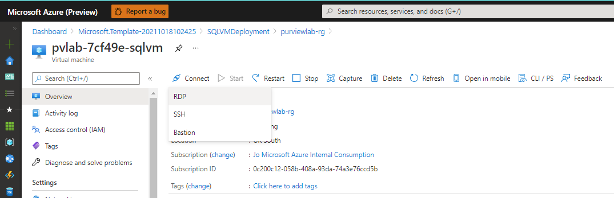

2. In the next page, click '**Download RDP File**'. Once the file has downloaded, click '**Open**'.
    
    

3. You will need to access the SQL username and password generated when deploying the lab environment from [module 00](../modules/module00.md). To find these details, navigate to the resource group in the [Azure portal](https://portal.azure.com/). Under '**Settings > Deployments**', click on '**SQLVMDeployment**'.

    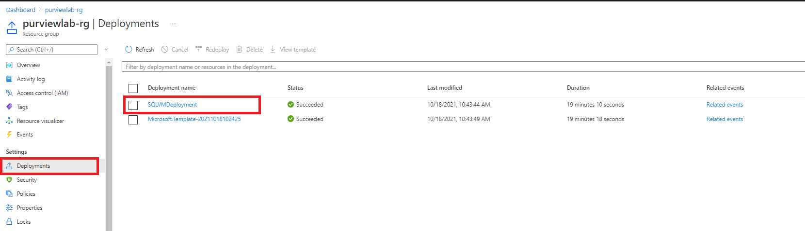
    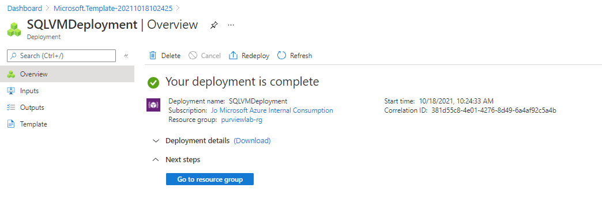

4. Navigate to the '**Outputs**' blade within the SQLVMDeployment area to find your SQL Admin username and password. 

    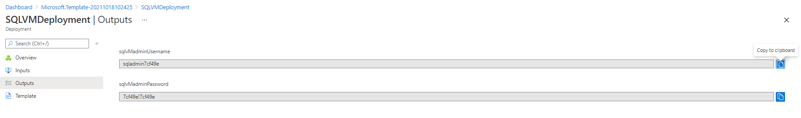

5. In the Remote Desktop Connection pop-up window, click '**Connect**'.

    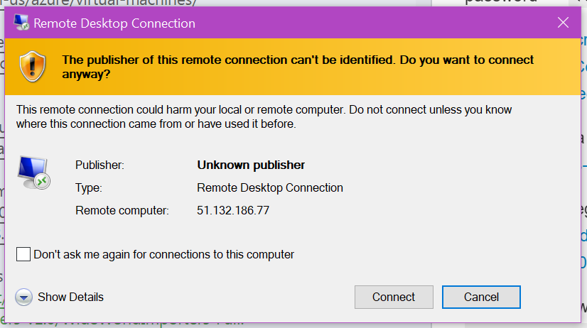
    
6. Here you need to log into the virtual machine using the credentials supplied in the '**Outputs**' blade in the deployment area of the resource group you created in [module 00](../modules/module00.md). You'll need to select the '**More Choices**' option and/or '**Use a different account**' options in the log in window. 

    > :book: **Note** You'll need to log in using the format **username** = _vm name\sqladmin username_ and **password** = _sql password_

    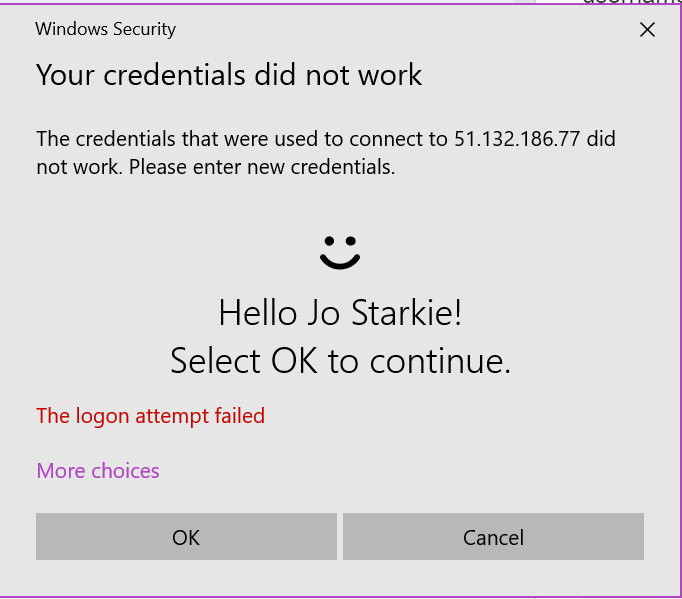
    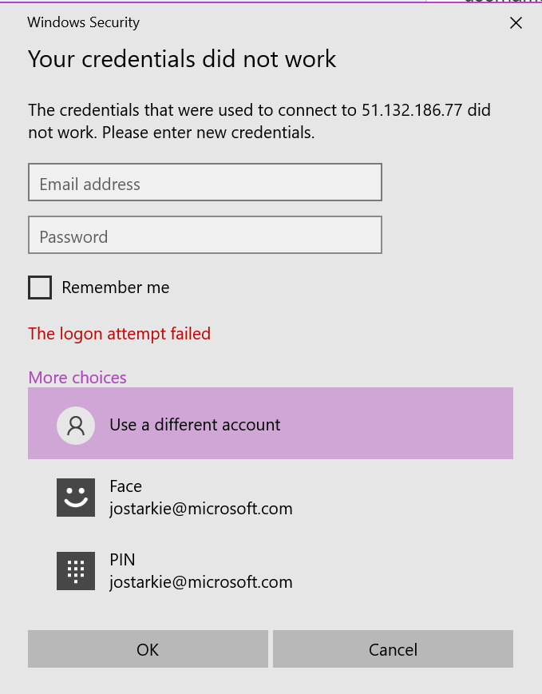

7. You'll see a warning message, click **Yes** to continue. 

    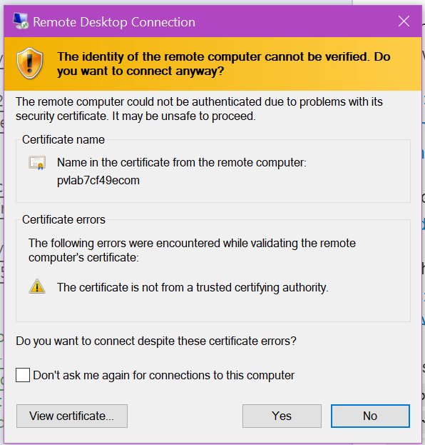

<a href="#module-11---self-hosted-integration-runtime">↥ back to top</a>

## 2. Install Self-Hosted Integration Runtime

> :bulb: **Did you know?**
>
>  Integration Runtime (IR) is a secure compute infrastructure that is used to provide the data integration capabilities across the different network environments and make sure that these activities will be executed in the closest possible region to the data store.
>
> Self-hosted Integration Runtime (SHIR) is an implementation of IR that is installed on an on-premises machine or virtual machine within a virtual network.

1. In the virtual machine, open the browser and navigate to the [integration runtime download page](https://www.microsoft.com/en-us/download/confirmation.aspx?id=39717). If the download doesn't start automatically, download the latest version of the integraion runtime from the list presented. Click '**Run**' when the download begins. 

    
    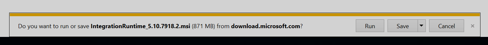

2. Follow the instruction on screen to complete the installation process and click finish to proceed to the next step. 

    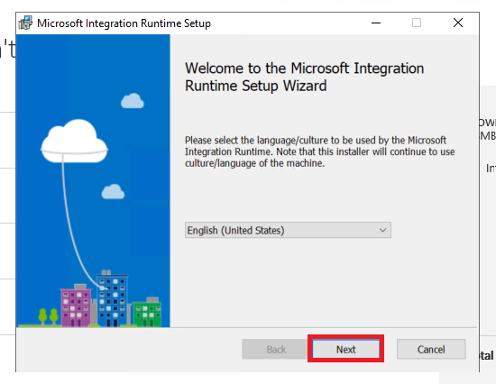
    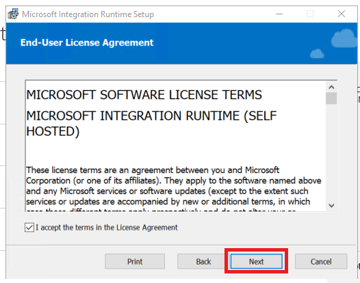
    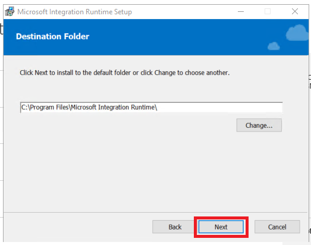
    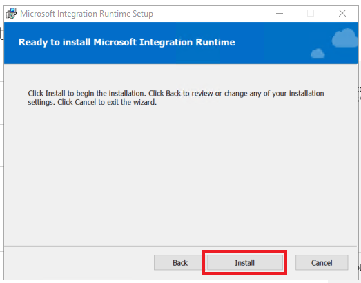
    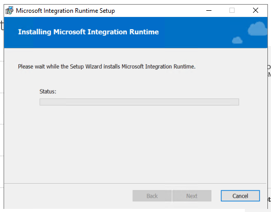
    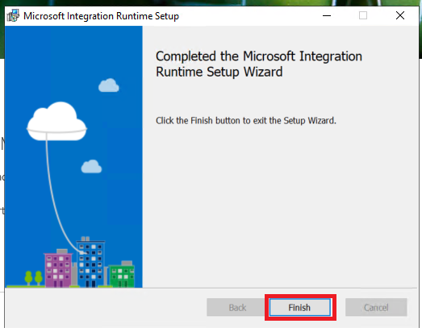

3. If the integration runtime manager doesn't open automatically, navigate to the **Start Menu** and click '**Microsoft Integration Runtime**'. Once the IR Manager window opens, we can move on to the next step to [authenticate to Azure Purview](#3-authenticate-to-azure-purview).

    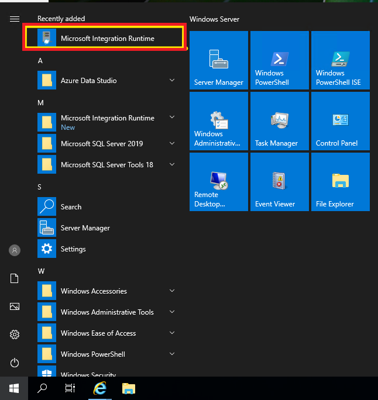

<a href="#module-11---self-hosted-integration-runtime">↥ back to top</a>

## 3. Authenticate to Azure Purview

> :bulb: **Did you know?**
>
> The Purview Integration Runtime cannot be shared with an Azure Synapse Analytics or Azure Data Factory Integration Runtime on the same machine. It needs to be installed on a separated machine.

1. Within the Azure Purview Studio, navigate to the **Data Map** in the left blade, click **Integration Runtime** and click **+ New**.

    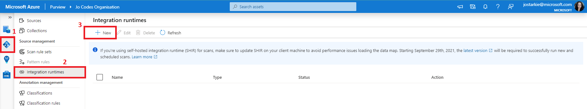

2. Ensure the **Self-Hosted** option is selected, then click **Continue**.

    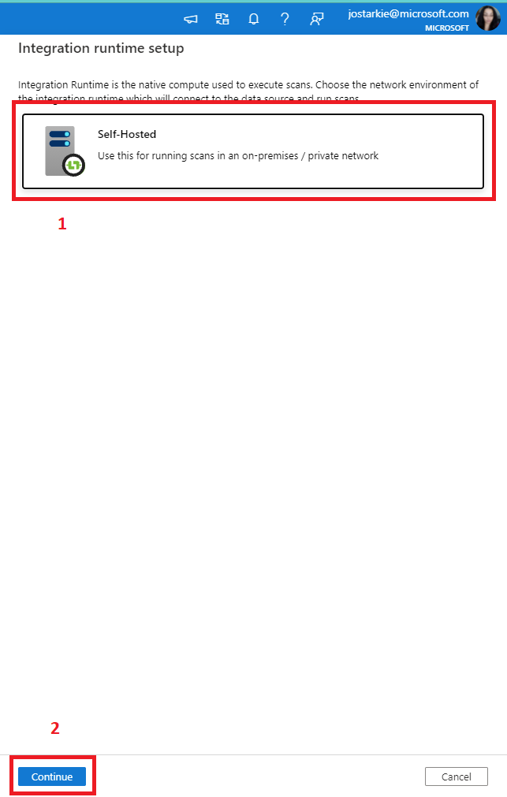

3. Give your integration runtime a name _(mandatory)_ and a description _(optional)_, then click **Create**.

    

4. Copy one of the **keys** to your clipboard then open your virtual machine window and paste this key into the **integration runtime manager window**. Click **Register** when the button becomes active and then **Finish** in the next screen. 

    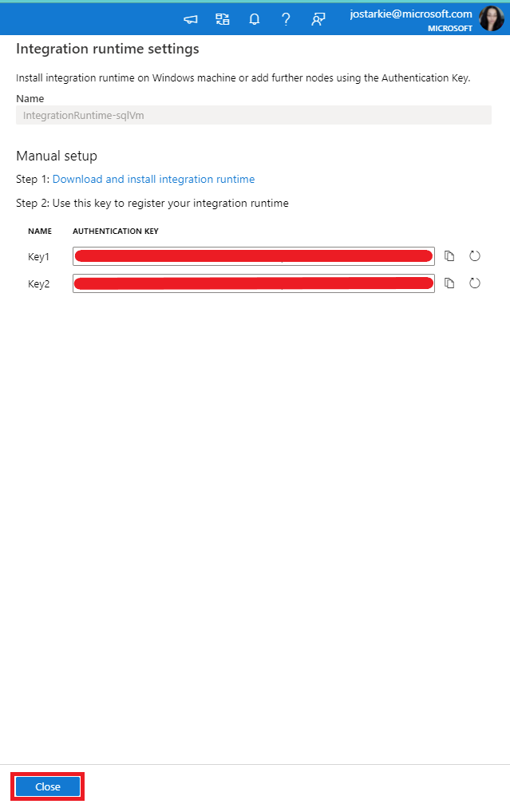
    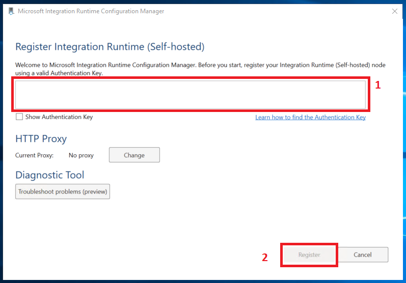
    

5. Once successfully registered, you should see a  green tick :heavy_check_mark: within the **integration runtime manager window** and the **Azure Purview Studio integration runtime manager area**.

    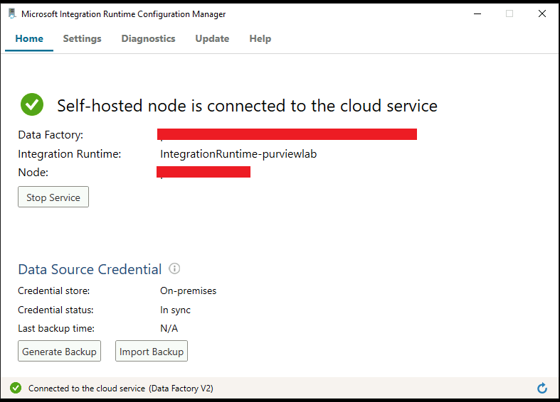
    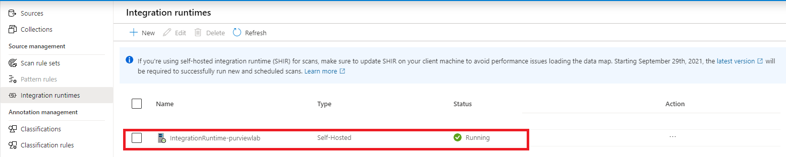

> :bulb: **Did you know?**
>
> The Purview Integration Runtime can also be used to scan and ingest metadata assets from Azure cloud services that are hidden behind private endpoints, such as Azure Data Lake, Azure SQL Database, Azure Cosmos DB [and more](https://docs.microsoft.com/en-us/azure/purview/catalog-private-link#support-matrix-for-scanning-data-sources-through-ingestion-private-endpoint). 

<a href="#module-11---self-hosted-integration-runtime">↥ back to top</a>

## :mortar_board: Knowledge Check

[http://aka.ms/purviewlab/q11](http://aka.ms/purviewlab/q11)

1. What is an Self-Hosted Integration Runtime used for?

    A ) It's used for copying data from or to an on-premises data store or networks with access control  
    B ) It's used for copying data between cloud based data stores or networks with access control  
    C ) It's used for copying data between managed environments

2. Self-Hosted Integration Runtime can be shared across multiple services when installed on one machine/VM.

    A ) True  
    B ) False  

3. Which Azure services can be scanned and have metadata assets ingested from using the self-hosted integration runtime?

    A) Azure Blob Storage  
    B) Azure SQL Database  
    C) Azure Synapse Analytics  
    D) All of these  
    E) None of these

<a href="#module-11---self-hosted-integration-runtime">↥ back to top</a>

## :tada: Summary

In this module, you learned how to install the self-hosted integration runtime to your virtual machine network and get it connected up to Azure Purview. If you'd like continue with this module to complete further tasks, please feel free to complete the tutorial links below:

- [Setting up authentication for a scan](https://docs.microsoft.com/en-us/azure/purview/register-scan-on-premises-sql-server#setting-up-authentication-for-a-scan)
- [Register SQL Server on VM as a data source in Purview](https://docs.microsoft.com/en-us/azure/purview/register-scan-on-premises-sql-server#register-a-sql-server-data-source)
- Upload same data to the SQL Server on the VM
    - [World Wide Importers dataset](https://github.com/Microsoft/sql-server-samples/tree/master/samples/databases/wide-world-importers)
    - [Contoso BI dataset](https://www.microsoft.com/en-us/download/details.aspx?id=18279)
- [Trigger a scan of the on-premise data source](https://docs.microsoft.com/en-us/azure/purview/register-scan-on-premises-sql-server#creating-and-running-a-scan)

[Back to Home >](../README.md)