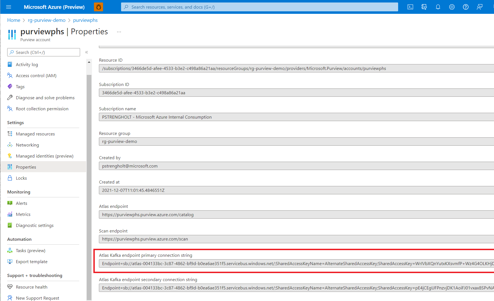
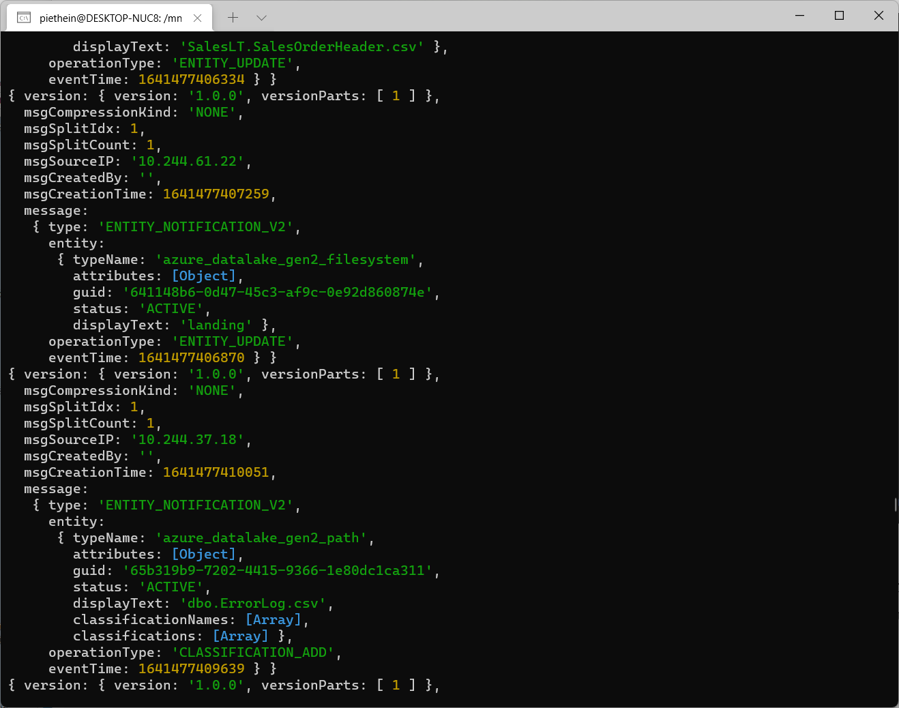
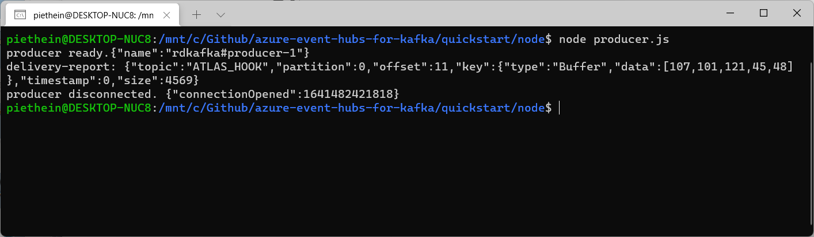
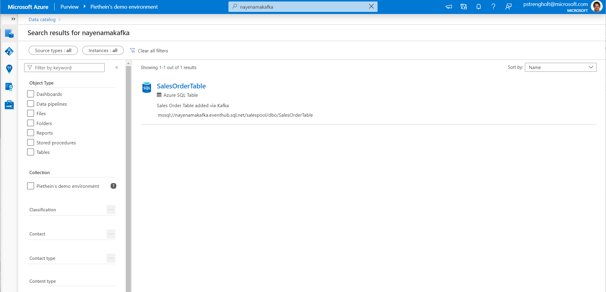

# Module 13 - Process events using Atlas Kafka topics via Event Hubs and NodeJS

[< Previous Module](../modules/module12.md) - **[Home](../README.md)** - [Next Module >](../modules/module14.md)

## :loudspeaker: Introduction

Microsoft Purview is a unified data governance solution that runs on Azure. Some people say it is a data catalog, but it better to think of Purview as a control framework for managing and controlling your data landscape. For example, you can use Microsoft Purview as a metastore for dynamically orchestrating your data pipelines.

When Microsoft Purview is deployed, a managed event hub is created as part of your Purview account creation. This opens up many possibilities when integrating Microsoft Purview with other applications. Because of the open nature of Microsoft Purview, you can automate and integration different aspects. For example, you can trigger a workflow outside Microsoft Purview, when new data is scanned, or make an API call for fetching and storing additional metadata inside Purview. In this tutorial I want to show you how this works.

In this lab you'll learn how read and publish events using Azure Event Hubs and NodeJS.

## :thinking: Prerequisites

- An [Azure account](https://azure.microsoft.com/free/) with an active subscription.
- A Microsoft Purview account (see [module 01](../modules/module01.md)).
- NodeJS installed: [https://nodejs.org/en/download/](https://nodejs.org/en/download/)

## :dart: Objectives

- Read and publish events using Azure Event Hubs.

## Table of Contents

1. [Setup environment](#1-setup-environment)
2. [Read events](#2-read-events)
3. [Publish events](#3-publish-events)

<div align="right"><a href="#module-13---process-events-using-atlas-kafka-topics-via-event-hubs-and-nodejs">↥ back to top</a></div>

## 1. Setup environment

1. For reading and publishing messages to Purview we will use the Event Hubs endpoint, which is compatible with the Apache Kafka. First we need to get the namespace associated with your Purview Account. You can lookup the endpoint configuration from the Properties pane in the Azure Portal. This connection string includes both the workspace name and access key.

   

2. Next we need to create a new project. You can simply do this by installing the required package for NodeJS, allowing to communicate with the Kafka Endpoint:

   ```
   npm install node-rdkafka
   ```

## 2. Read events

1. For reading events from Microsoft Purview you can use the sample code below. Important is to copy and paste the connection string in the configuration section at the top. All changes are published to the ATLAS_ENTITIES topic, so also pay attention to this.

   ```javascript
   var Transform = require('stream').Transform;
   var Kafka = require('node-rdkafka'); //See more info: https://github.com/Blizzard/node-rdkafka

   var consumer = new Kafka.KafkaConsumer({
      //'debug' : 'all',
      'metadata.broker.list': 'atlas-004133bc-3c87-4862-bf9d-b0ea6ae351f5.servicebus.windows.net:9093', //REPLACE
      'group.id': 'nodejs-cg', //The default consumer group for EventHubs is $Default
      'socket.keepalive.enable': true,
      'enable.auto.commit': false,
      'security.protocol': 'SASL_SSL',
      'sasl.mechanisms': 'PLAIN',
      'sasl.username': '$ConnectionString', //do not replace $ConnectionString
      'sasl.password': 'Endpoint=sb://atlas-004133bc-3c87-4862-bf9d-b0ea6ae351f5.servicebus.windows.net/;SharedAccessKeyName=AlternateSharedAccessKey;SharedAccessKey=WrIVbXQnYutxKXsvmfP+Wz4G4OLKHjDtuuR8sdfsE1=', //REPLACE
   });

   //Purview's default topic name: https://docs.microsoft.com/azure/purview/manage-kafka-dotnet
   var topicName = 'ATLAS_ENTITIES';

   //logging debug messages, if debug is enabled
   consumer.on('event.log', function(log) {
      console.log(log);
   });

   //logging all errors
   consumer.on('event.error', function(err) {
      console.error('Error from consumer');
      console.error(err);
   });

   consumer.on('ready', function(arg) {
      console.log('consumer ready.' + JSON.stringify(arg));

      consumer.subscribe([topicName]);
         //start consuming messages
         consumer.consume();
   });

   consumer.on('data', function(event) {
      // Output the actual message contents
      const obj = JSON.parse(event.value);
      console.log(obj);
   });

   consumer.on('disconnected', function(arg) {
      console.log('consumer disconnected. ' + JSON.stringify(arg));
   });

   //starting the consumer
   consumer.connect();

   //stopping this example after 300s
   setTimeout(function() {
      consumer.disconnect();
   }, 300000);
   ```

2. When everything is configured properly you can start the script by running the following command:

   ```
   node consumer.js
   ```

3. For creating notifications go back to your Microsoft the Microsoft Purview Governance Portal. Make some changes to your environment, for example, by scanning an existing source. If everything goes well, you should see the following output on the screen:

   

4. In the output above, you see an Array with classifications and operation type using CLASSIFICATION_ADD. This, for example, you could use to trigger a workflow or send out an email requiring somebody to investigate the newly scanned data. Or you see new data coming in via the ENTITY_UPDATE operation type, allowing you to trigger process or pipeline.

## 3. Publish events

1. The same endpoint we could also use to submit events. Important here is that we should change the topic name to ATLAS_HOOK. In the example below you can use a JSON message to create a SQL table including two columns:

   ```javascript
   var Kafka = require('node-rdkafka');

   var producer = new Kafka.Producer({
   //'debug' : 'all',
   'metadata.broker.list': 'atlas-004133bc-3c87-4862-bf9d-b0ea6ae351f5.servicebus.windows.net:9093', //REPLACE
   'dr_cb': true,  //delivery report callback
   'security.protocol': 'SASL_SSL',
   'sasl.mechanisms': 'PLAIN',
   'sasl.username': '$ConnectionString', //do not replace $ConnectionString
   'sasl.password': 'Endpoint=sb://atlas-004133bc-3c87-4862-bf9d-b0ea6ae351f5.servicebus.windows.net/;SharedAccessKeyName=AlternateSharedAccessKey;SharedAccessKey=WrIVbXQnYutxKXsvmfP+Wz4G4OLKHjDtuKH&6=' //REPLACE
   });

   var topicName = 'ATLAS_HOOK';

   //logging debug messages, if debug is enabled
   producer.on('event.log', function(log) {
   console.log(log);
   });

   //logging all errors
   producer.on('event.error', function(err) {
   console.error('Error from producer');
   console.error(err);
   });

   //counter to stop this sample after maxMessages are sent
   var counter = 0;
   var maxMessages = 1;

   producer.on('delivery-report', function(err, report) {
   console.log('delivery-report: ' + JSON.stringify(report));
   counter++;
   });

   //Wait for the ready event before producing
   producer.on('ready', function(arg) {
   console.log('producer ready.' + JSON.stringify(arg));

   for (var i = 0; i < maxMessages; i++) {
      var value = new Buffer(`{
         "msgCreatedBy":"nayenama",
         "message":{
            "type":"ENTITY_CREATE_V2",
            "user":"admin",
            "entities":{
               "entities":[
                     {
                        "typeName":"azure_sql_table",
                        "attributes":{
                           "owner":"admin",
                           "temporary":false,
                           "qualifiedName":"mssql://nayenamakafka.eventhub.sql.net/salespool/dbo/SalesOrderTable",
                           "name":"SalesOrderTable",
                           "description":"Sales Order Table added via Kafka"
                        },
                        "relationshipAttributes":{
                           "columns":[
                                 {
                                    "guid":"-1102395743156037",
                                    "typeName":"azure_sql_column",
                                    "uniqueAttributes":{
                                       "qualifiedName":"mssql://nayenamakafka.eventhub.sql.net/salespool/dbo/SalesOrderTable#OrderID"
                                    }
                                 },
                                 {
                                    "guid":"-1102395743156038",
                                    "typeName":"azure_sql_column",
                                    "uniqueAttributes":{
                                       "qualifiedName":"mssql://nayenamakafka.eventhub.sql.net/salespool/dbo/SalesOrderTable#OrderDate"
                                    }
                                 }
                           ]
                        },
                        "guid":"-1102395743156036",
                        "version":0
                     }
               ],
               "referredEntities":{
                     "-1102395743156037":{
                        "typeName":"azure_sql_column",
                        "attributes":{
                           "owner":null,
                           "userTypeId":61,
                           "qualifiedName":"mssql://nayenamakafka.eventhub.sql.net/salespool/dbo/SalesOrderTable#OrderID",
                           "precision":23,
                           "length":8,
                           "description":"Sales Order ID",
                           "scale":3,
                           "name":"OrderID",
                           "data_type":"int"
                        },
                        "relationshipAttributes":{
                           "table":{
                                 "guid":"-1102395743156036",
                                 "typeName":"azure_sql_table",
                                 "entityStatus":"ACTIVE",
                                 "displayText":"SalesOrderTable",
                                 "uniqueAttributes":{
                                    "qualifiedName":"mssql://nayenamakafka.eventhub.sql.net/salespool/dbo/SalesOrderTable"
                                 }
                           }
                        },
                        "guid":"-1102395743156037",
                        "version":2
                     },
                     "-1102395743156038":{
                        "typeName":"azure_sql_column",
                        "attributes":{
                           "owner":null,
                           "userTypeId":61,
                           "qualifiedName":"mssql://nayenamakafka.eventhub.sql.net/salespool/dbo/SalesOrderTable#OrderDate",
                           "description":"Sales Order Date",
                           "scale":3,
                           "name":"OrderDate",
                           "data_type":"datetime"
                        },
                        "relationshipAttributes":{
                           "table":{
                                 "guid":"-1102395743156036",
                                 "typeName":"azure_sql_table",
                                 "entityStatus":"ACTIVE",
                                 "displayText":"SalesOrderTable",
                                 "uniqueAttributes":{
                                    "qualifiedName":"mssql://nayenamakafka.eventhub.sql.net/salespool/dbo/SalesOrderTable"
                                 }
                           }
                        },
                        "guid":"-1102395743156038",
                        "status":"ACTIVE",
                        "createdBy":"ServiceAdmin",
                        "version":0
                     }
               }
            }
         },
         "version":{
            "version":"1.0.0"
         },
         "msgCompressionKind":"NONE",
         "msgSplitIdx":1,
         "msgSplitCount":1
   }`);
      var key = "key-"+i;
      // if partition is set to -1, librdkafka will use the default partitioner
      var partition = -1;
      producer.produce(topicName, partition, value, key);
   }

   //need to keep polling for a while to ensure the delivery reports are received
   var pollLoop = setInterval(function() {
         producer.poll();
         if (counter === maxMessages) {
         clearInterval(pollLoop);
         producer.disconnect();
         }
      }, 1000);

   });

   producer.on('disconnected', function(arg) {
   console.log('producer disconnected. ' + JSON.stringify(arg));
   });

   //starting the producer
   producer.connect();
   ```

2. To submit this message to the Kafka endpoint use the following command:

   ```
   node producer.js
   ```

3. If everything goes well you see the following output:

   

4. And finally you should see your newly created object in Microsoft Purview itself:

   

As demonstrated in this tutorial you can programmatically monitor for metadata changes in real-time. Via this approach you can enrich your user experience by also integrating with other services.

<div align="right"><a href="#module-13---process-events-using-atlas-kafka-topics-via-event-hubs-and-nodejs">↥ back to top</a></div>

## :mortar_board: Knowledge Check

1. When publishing events to Microsoft Purview you need to make use of the ATLAS_HOOK topic name.

   A) True  
   B) False

<div align="right"><a href="#module-13---process-events-using-atlas-kafka-topics-via-event-hubs-and-nodejs">↥ back to top</a></div>

## :tada: Summary

In this module, you learned how to send events to and receive events from Microsoft Purview's Atlas Kafka topics via event hub using the NodeJS library. If you'd like continue with this module to complete further tasks, please feel free to complete the tutorial links below:

- [Publish messages to and process messages from Microsoft Purview's Atlas Kafka topics via Event Hubs using .NET](https://docs.microsoft.com/azure/purview/manage-kafka-dotnet)
- [Modern Data Pipelines with Azure Synapse Analytics and Microsoft Purview](https://piethein.medium.com/modern-data-pipelines-with-azure-synapse-analytics-and-microsoft-purview-fe752d874c67)

[Back to Home >](../README.md)
