# Module 15 - Azure SQL Database Lineage Extraction

[< Previous Module](../modules/module14.md) - **[Home](../README.md)**

## :loudspeaker: Introduction

As you've learned in the [Lineage Module](../modules/module06.md), Microsoft Purview can show us how data moves through various systems; this is referred to as data lineage and part of the lifecycle of any piece of data in an organization.

Lineage extraction is a complicated process because there are many ways data may be moved and transformed thoughout its lifecycle. Lineage information can either be extracted by Purview during the scanning process (when supported), or lineage information can be pushed to Purview via the Apache Atlas REST API.

In this module, we'll implement the Azure SQL Database Lineage functionality.

## :thinking: Prerequisites

* An [Azure account](https://azure.microsoft.com/free/) with an active subscription.
* An Azure SQL Database (see [module 00](../modules/module00.md)).
* A Microsoft Purview account (see [module 01](../modules/module01.md)).

This module steps through what is required for connecting an Azure SQL Database with a Microsoft Purview account to track data lineage.

## :dart: Objectives

* Connect an Azure SQL Database with a Microsoft Purview account, with lineage extraction enabled.
* Observe scanning process and examine lineage extracted by using the sample code below.

## :bookmark_tabs: Table of Contents

| #  | Section | Role |
| --- | --- | --- |
| 1 | [Add Azure SQL Database Administrator](#1-add-azure-sql-database-administrator) | Azure Administrator |
| 2 | [Configure the Microsoft Purview MSI in the Azure SQL Database](#2-configure-the-microsoft-purview-msi-in-the-azure-sql-database) | Azure Administrator |
| 2 | [Configure the Microsoft Purview MSI in the Azure SQL Database](#2-configure-the-microsoft-purview-msi-in-the-azure-sql-database) | Azure Administrator |
| 3 | [Add example tables and stored procedure to Azure SQL Database](#3-add-example-tables-and-stored-procedure-to-azure-sql-database) | Microsoft Purview Administrator |
| 4 | [Add a new Azure SQL Database Scan with lineage enabled](#4-add-a-new-azure-sql-database-scan-with-lineage-enabled) | Microsoft Purview Administrator |
| 5 | [Execute the stored procedure to simulate data movement](#5-execute-the-stored-procedure-to-simulate-data-movement) | Azure Administrator |
| 6 | [Re-run lineage scan and observe output](#6-re-run-lineage-scan-and-observe-output) | Azure Administrator |


<div align="right"><a href="#module-00---title">↥ back to top</a></div>

## 1. Add Azure SQL Database Administrator

In order for Microsoft Purview to be able to scan for lineage in an Azure SQL Database, we'll need to configure the appropriate permissions. In the steps below, we'll assume you are using the Azure SQL Database provisioned in this lab. If you are using a new or other Azure SQL Database, apply these steps to that database.

1. From the Azure portal, open the Azure SQL Database server, select **Azure Active Directory**, and click **Set admin**.

    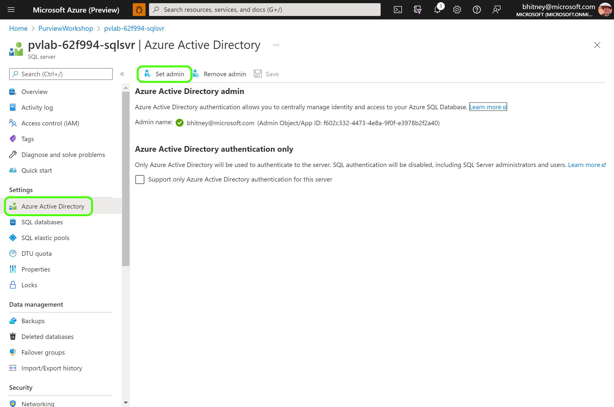

2. In the menu that appears, search for your user and click **Select**.

    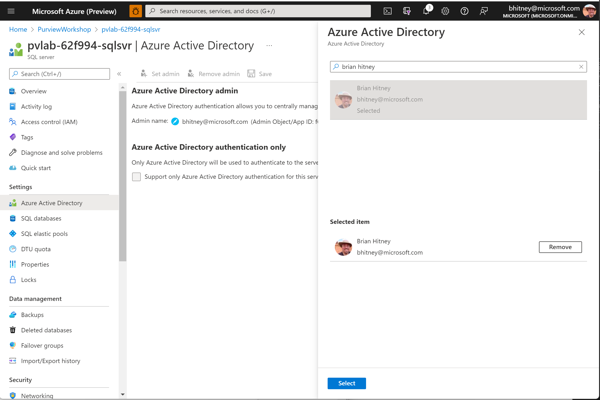

> :bulb: **Did you know?**
>
> An Azure AD account is required do add the Microsoft Purview MSI in the next step.

## 2. Configure the Microsoft Purview MSI in the Azure SQL Database

1. From the Azure portal, open the Azure SQL Database instance and select **Query editor**. If necessary, log into the **Query editor** using your account.

    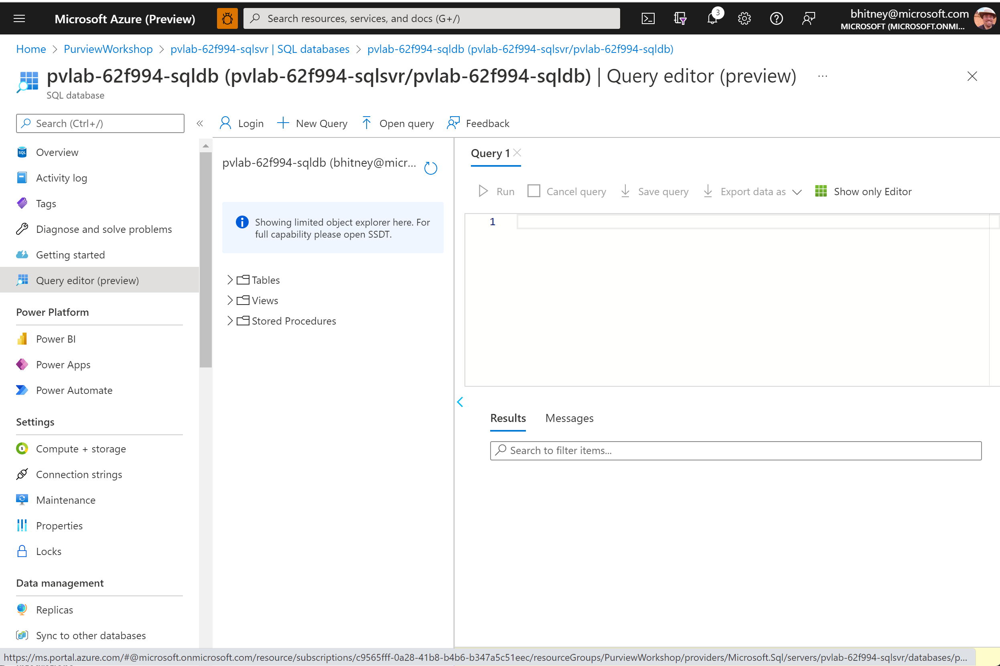

2. From within the Query window, run the following:

```sql
CREATE MASTER KEY

-- PurviewExample is the name of the Microsoft Purview account
CREATE USER [PurviewExample] FROM EXTERNAL PROVIDER
GO
EXEC sp_addrolemember 'db_owner', [PurviewExample] 
GO
```
The SQL statements above will: 
* Create a Master Key if it does not already exist.
* Add the Microsoft Purview Managed Identity as a user in the Azure SQL Database.
* Assign the Microsoft Purview Managed Identity db_owner access, required for determining lineage.

    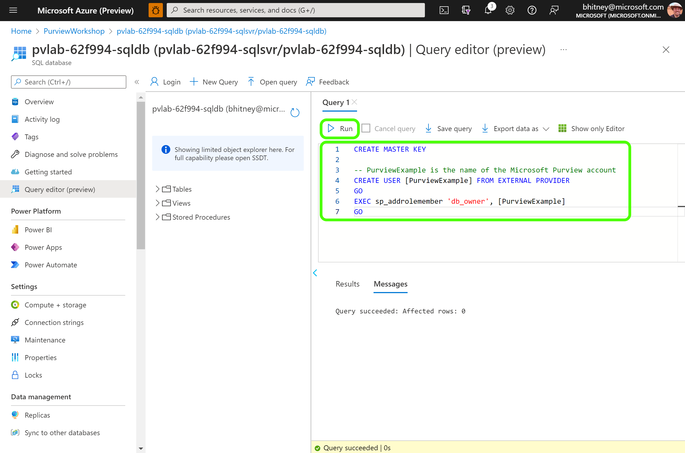

## 3. Add example tables and stored procedure to Azure SQL Database

1. Clear the Query editor and run the script below. This script will create two tables (**SourceTest** and **DestinationTest**), insert 3 rows of test data, and add a stored procedure to move an entry from **SourceTest** to **DestinationTest**.

```sql
CREATE TABLE [dbo].[SourceTest](
ID int PRIMARY KEY,
FirstName nvarchar(50),
LastName nvarchar(50)
);

CREATE TABLE [dbo].[DestinationTest](
ID int PRIMARY KEY,
FirstName nvarchar(50),
LastName nvarchar(50)
);

INSERT INTO dbo.SourceTest
(ID, FirstName, LastName)
VALUES (1, 'First1', 'Last1');
GO

INSERT INTO dbo.SourceTest
(ID, FirstName, LastName)
VALUES (2, 'First2', 'Last2');
GO

INSERT INTO dbo.SourceTest
(ID, FirstName, LastName)
VALUES (3, 'First3', 'Last3');
GO

CREATE PROCEDURE dbo.MoveDataTest 
@UserId int
AS
INSERT INTO dbo.DestinationTest
SELECT * FROM dbo.SourceTest
WHERE dbo.SourceTest.ID = @UserId
```

    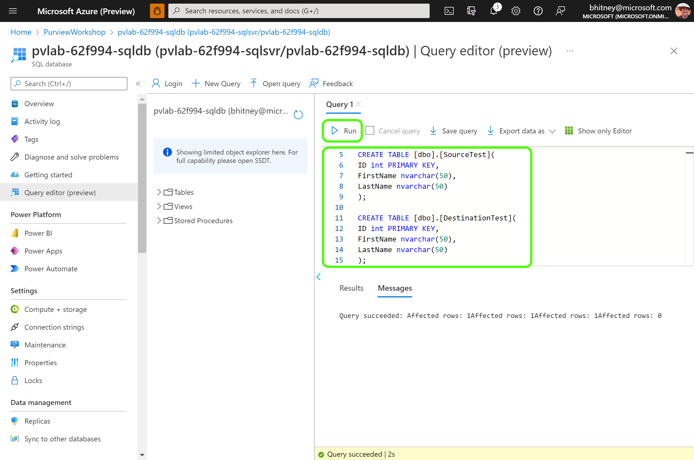

 > Note: We'll be returning to the Query editor shortly, so we recommend opening the Microsoft Purview portal, if not already open, in another tab for convenience as you progress in the next steps.

## 4. Add a new Azure SQL Database Scan with lineage enabled

1. Open the **Microsoft Purview Governance Portal**, navigate to **Data map** > **Sources**, and within the Azure SQL Database tile, click the **New Scan** button.

    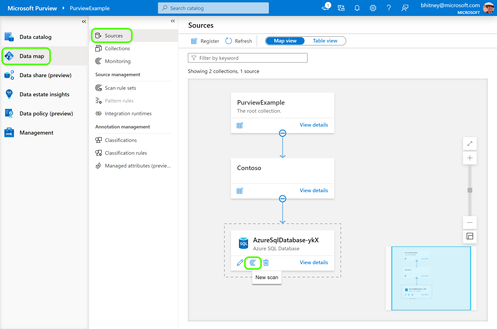

2. Assign the scan a name, such as `Scan-Lineage`. Select your **Database** (e.g. `pvlab-{randomID}-sqldb`), set the **Credential** to `credential-SQL`, ensure **Lineage extraction** is `On`, and click **Test connection**. Once the connection test is successful, click **Continue**.

    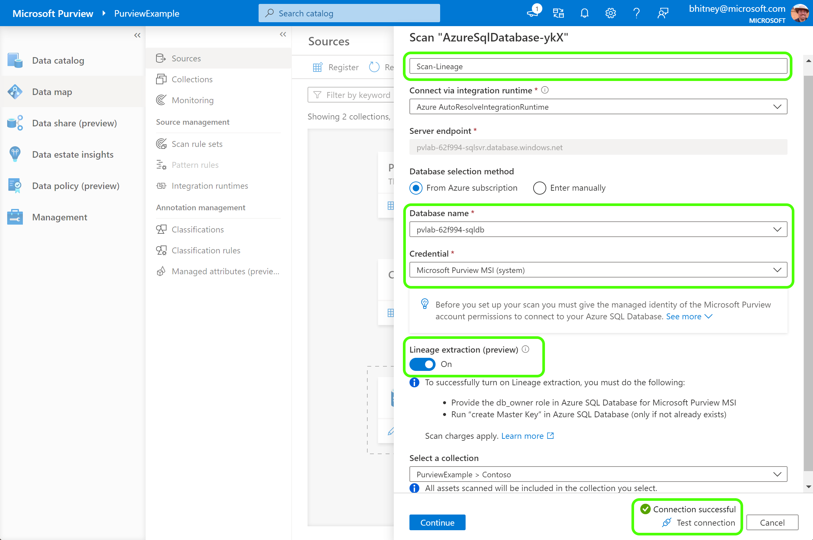

 > Note: If the "Test connection" appears to be hanging, click Cancel and re-try. This may happen if the database has been inactive and deprovisioned. 
 > Note: If the "Test connection" fails because of a permissions issue, ensure the earlier steps have been followed to add the Microsoft Purview MSI to the db_owner role.

3. When the list of database tables appears, select our two new tables, **dbo.SourceTest** and **dbo.DestinationTest**. All others can be deselected, as they were configured in the previous scan.

    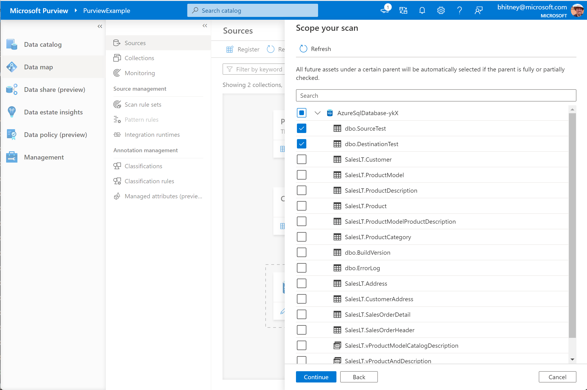

4. Click **Continue**, and **Continue** again accepting the default scan rule set.

    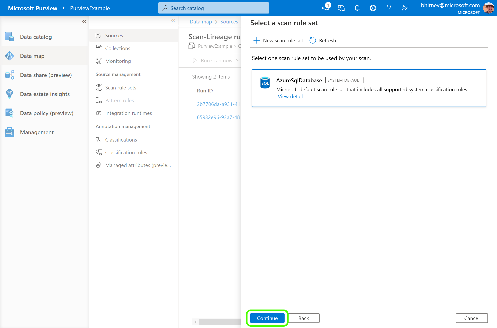

5. Set the trigger to **Once**, click **Continue**.

    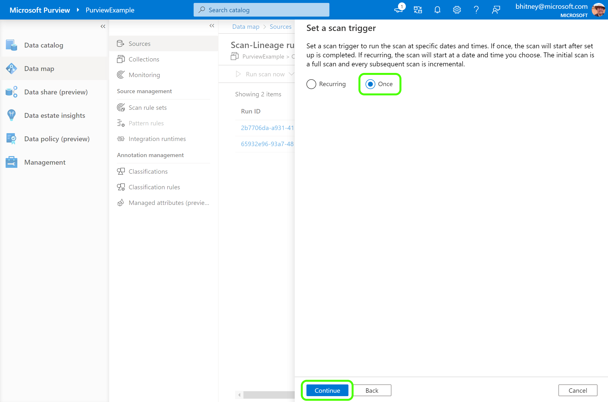

6. Once the scan has been saved, it will be queued for execution. Navigate to the scan history by selecting **View Details** on the Azure SQL Database connection on the **Data Map**. 

    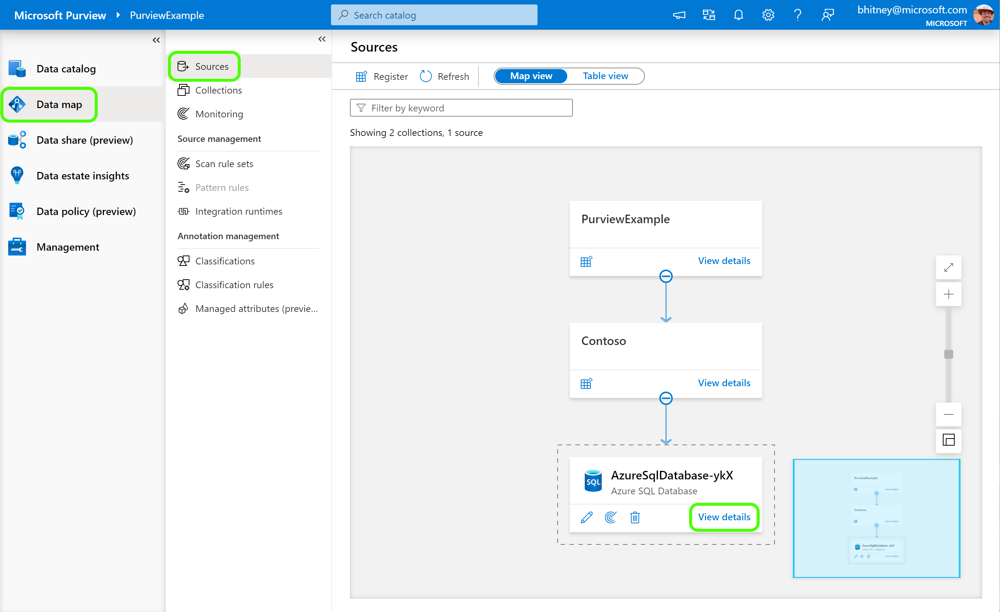

7. Select the scan name you created, `Scan-Lineage`, and observe it actually created two scans. One for the lineage, and the other for the tables.

    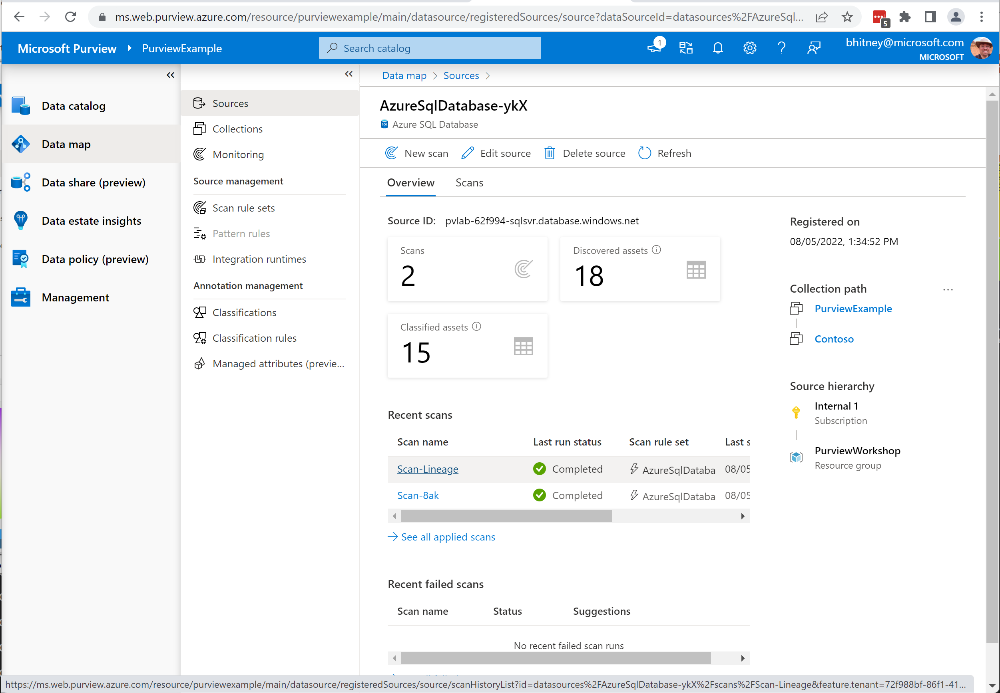

    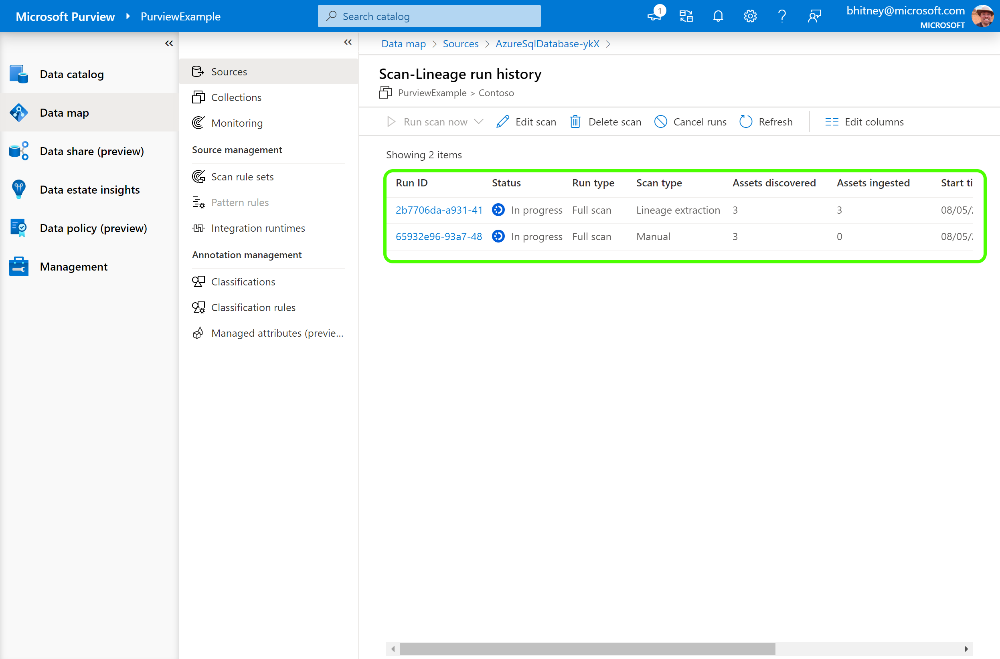

 > Note: Keep this page open in the Microsoft Purview portal as we'll be returning here shortly.

## 5. Execute the stored procedure to simulate data movement

1. In the Query editor window (in the Azure portal), clear the Query editor once again, and run the script below. This will execute the stored procedure created above, simulating data movement of ID #3 from **SourceTest** to **DestinationTest**. 

    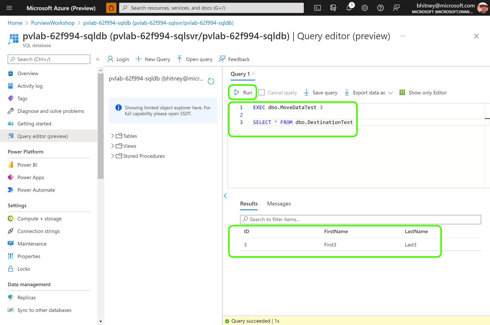

```sql
EXEC dbo.MoveDataTest 3

SELECT * FROM dbo.DestinationTest
```

The select statement should show the row in the **DestinationTest** table.

## 6. Re-run lineage scan and observe output

1. On the Microsoft Purview portal tab, we can manually trigger a run of the scan in order to pick up the lineage. In a typical production environment, these scans would run periodically, but we only run them as needed in dev/test. To trigger the scan, click **Run scan now** > **Full scan** and observe the scan has been Queued once more.

    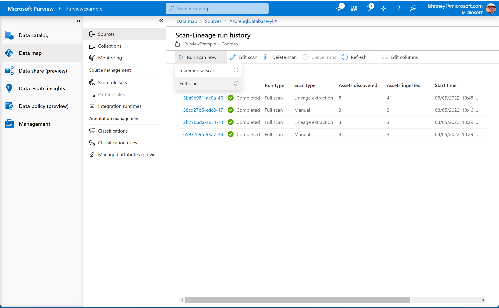

> :bulb: **Did you know?**
>
> In order for Microsoft Purview to detect the lineage, it observes the actual execution of the stored procedure. Therefore, the lineage will not be detected until there is an execution of the MoveDataTest stored procedure.

2. In a few moments, the scan will complete. You may need to refresh the page to check on the run status. Once the scans have completed, the scan history should look like the below image.

    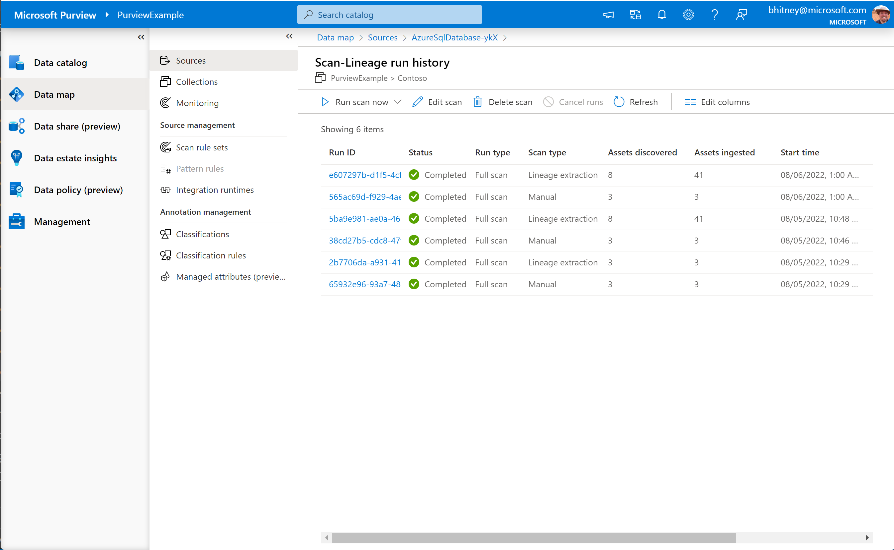

4. To observe the lineage, select **Data Catalog** > **Browse**, select the Contoso collection, and select the SourceTest table.

    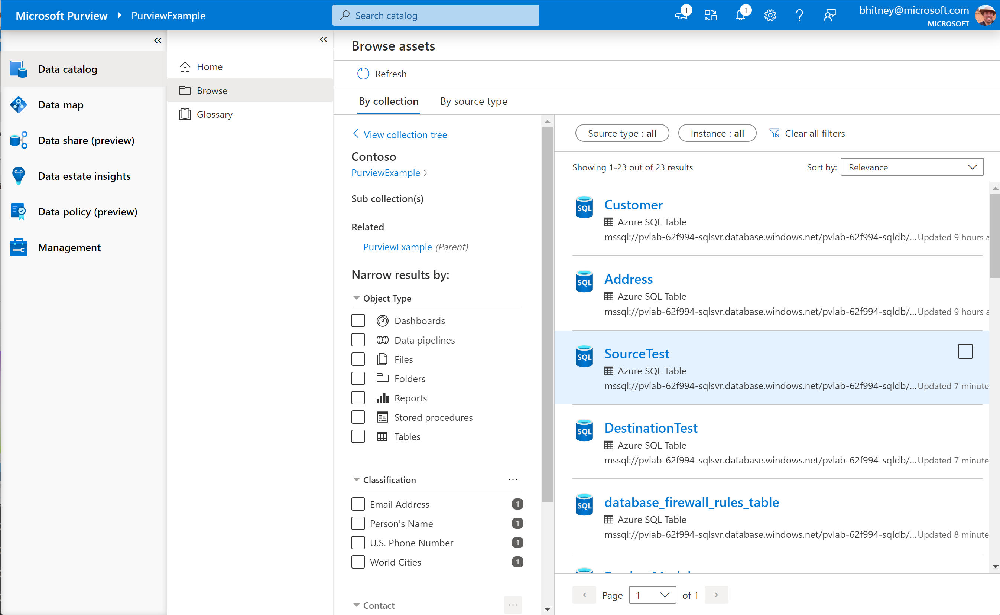

5. Navigate to the Lineage tab, and observe the lineage from SourceTest to DestinationTest via the MoveTest stored procedure.

    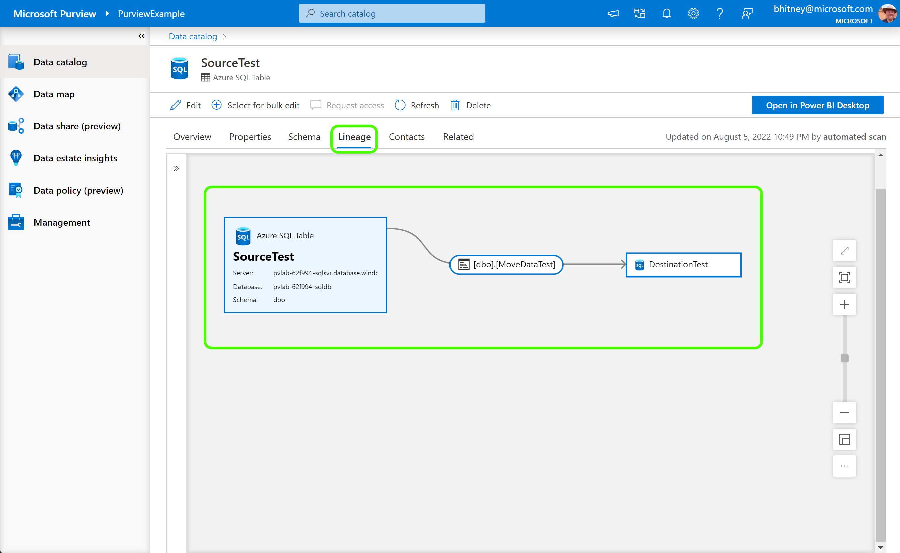

<div align="right"><a href="#module-15---azure-sql-database-lineage-extraction">↥ back to top</a></div>

## :mortar_board: Knowledge Check

1. When creating a scan with Lineage Extraction enabled, how many scans are actually created as a result?

    A ) One 
    B ) Two

2. The Microsoft Purview MSI requires a user with which database role permission?

    A ) db_datareader  
    B ) db_owner
    C ) db_securityadmin  

3. Lineage information is extracted from the database:

    A ) When the intial scan is completed
    B ) After there is at least one execution of a stored procedure that moves data
    C ) When the lineage scan completes after there is at least one execution of a stored procedure that moves data

4. Extra credit test: Can lineage extraction occur from an ad-hoc SQL statement that moves data like the stored procedure?
    A ) Yes 
    B ) No

<div align="right"><a href="#module-15---azure-sql-database-lineage-extraction">↥ back to top</a></div>

## :tada: Summary

In this module, you learned how to configure Microsoft Purview to extract lineage information from stored procedures.

[Continue >](../modules/module00.md)
