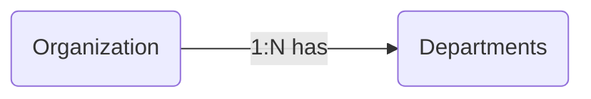
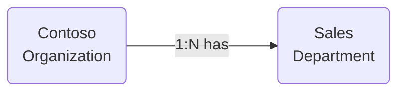

# Module 17 - Metamodel

[< Previous Module](../modules/module16.md) - **[Home](../README.md)**

## :loudspeaker: Introduction

Metamodel is a feature in the Microsoft Purview Data Map that helps add rich business context to your data catalog. It tells a story about how your data is grouped in data domains, how it's used in business processes, what projects are impacted by the data, and ultimately how the data fits in the day to day of your business.

The context metamodel provides is important because business users, the people who are consuming the data, often have non-technical questions about the data, such as:

* What department produces this dataset?
* Are there any projects that are using this dataset?
* Where does this report come from?

When you scan data into Microsoft Purview, the technical metadata can tell you what the data looks like, if the data has been classified, or if it has glossary terms assigned, but it can't tell you where and how that data is used. The metamodel gives your users that information.

With Metamodel, you have the ability to:

* Create **asset types** that describe important parts of your business (e.g. business processes, departments, lines of business, products, etc).
* Establish **relationships** between assets that you want to represent (e.g. a department *manages* a business process. An organization *has* departments, etc).

Example below of two **asset types** (*Organization* and *Department*) connected via a **relationship** (*has*).



Once asset types and relationships have been defined, we can create and relate **business assets** (instances of an asset type).



## :thinking: Prerequisites

* A Microsoft Purview account (see [module 01](../modules/module01.md)).

## :dart: Objectives

* Create a custom asset type.
* Define a custom relationship.
* Create and relate business assets.
* Bulk import business assets.

## :bookmark_tabs: Table of Contents

| #  | Section | Role |
| --- | --- | --- |
| 1 | [Create an Asset Type](#1-create-an-asset-type) | Data map administrator |
| 2 | [Create a Relationship](#2-create-a-relationship) | Data map administrator |
| 3 | [Create a Business Asset](#3-create-a-business-asset) | Data curator |
| 4 | [Bulk Import Assets](#4-bulk-import-assets) | Data curator |

<div align="right"><a href="#module-17---metamodel">↥ back to top</a></div>

## 1. Create an Asset Type

An **asset type** is a template definition for a particular type of  asset. For example, you may create an asset type called `Parent Company` with asset type specific attributes such as `Industry` and `Founded`. Once the asset type for Parent Company has been created, we can then create business assets of that type (*instances of parent company*). For example, an instance of parent company might be `XYZ Inc`, who specialize in the `Manufacturing` industry, and was founded in `1985`.

> :bulb: **Did you know?**
>
> Microsoft Purview provides a set of predefined asset types which you can augment and extend to meet your business needs.

1. From the Microsoft Purview Governance Portal, navigate to **Data map** > **Asset types**, and click **New asset type**.

    

2. Copy and paste the values below into the matching fields (**Name** and **Description**), set the **Type** to `Organization`, and click **New attribute**.

    **Name**

    ```text
    Parent Company
    ```

    **Description**

    ```text
    A parent company is a company that owns one or more other companies, known as subsidiaries. 
    ```

    

3. Copy and paste the values below into the matching fields (**Name** and **Description**), check **Mark as required**, set the **Field type** to `Date`, and click **Apply**.

    **Attribute name**

    ```text
    Founded
    ```

    **Description**

    ```text
    The founded date of a company refers to the date on which the company was established or incorporated.
    ```

    

4. Click **Create**.

    

<div align="right"><a href="#module-17---metamodel">↥ back to top</a></div>

## 2. Create a Relationship

Similar to asset types, we can create **relationship definitions** (e.g. *Parent Company has Organizations*) which act as the template describing how asset instances interact with one another (e.g. `XYZ Conglomerate` *has* `ABC Labs`).

1. From the Microsoft Purview Governance Portal, navigate to **Data map** > **Asset types** and click **New relationship**.

    

2. Set **Asset type (Head)** to `Parent Company`, set **Asset type (Tail)** to `Organization`, set **Relationship** to `Has`, set the **Relationship category** to `Composition`, set the **Cardinality** to `One to many`, and click **Create**.

    

> :bulb: **Did you know?**
>
> Microsoft Purview has three types of relationship categories: `Association`, `Aggregation`, and `Composition`.
>
> * **Association** is a relationship between two assets where one asset uses the other asset, but there is no ownership (no containment). This means that the two asset types are independent of each other. For example, a `Department` asset type might have an association with an `Application` asset type, but the `Application` can exist without the `Department` and vice versa.
> * **Aggregation** is a special kind of containment association where one asset is the owner (container) of the other asset, but the lifecycles of the container and the children are totally independent. For example, a `System` asset type might have an aggregation relationship with a `Database` asset type.
> * **Composition** is  a special kind of containment association where one asset type is the owner of the other asset type and the ownership is exclusive. This means throughout the lifetime of the objects, the children cannot exist without the container (tightly bound). For example, an `Organization` asset type might have a composition relationship with a `Department` asset type, where a `Department` object can't exist without an `Organization` object. When the `Organization` object is deleted, the `Department` objects associated with it is also deleted.
> 
>     | Relationship Category | Type | Lifecycle | If Container (Head) Deleted... |
>     | -- | -- | -- | -- |
>     | Association | No Containment | Independant | Children (Tail) continue to exist |
>     | Aggregation | Containment | Independant | Children (Tail) continue to exist |
>     | Composition |  Containment | Dependant | Children (Tail) are deleted |

<div align="right"><a href="#module-17---metamodel">↥ back to top</a></div>

## 3. Create a Business Asset

Now that we have our prerequisite asset types, we can create and relate business assets (instances of an asset type).

1. From the Microsoft Purview Governance Portal, navigate to **Data catalog** > **Business assets**, and click **New asset**.

    

2. Set the **Asset type** to `Parent Company`, copy and paste the values below into the matching fields (**Name** and **Description**), and set the **Founded** attribute to `10/18/2003`, and click **Create**.

    **Name**

    ```text
    XYZ Conglomerate
    ```

    **Description**

    ```text
    The XYZ Conglomerate is a multinational corporation that specializes in a diverse range of industries, including technology, healthcare, finance, and retail. The company was founded in the early 21st century and has since grown to become one of the largest and most powerful corporations in the world.
    ```

    

3. We will now create an `Organization` asset, which will be part of parent company `XYZ Conglomerate`. Navigate to **Data catalog** > **Business assets**, and click **New asset**.

    

4. Set the **Asset type** to `Organization`, copy and paste the values below into the matching fields (**Name** and **Description**), and navigte to the  **Related** tab.

    **Name**

    ```text
    ABC Labs
    ```

    **Description**

    ```text
    The ABC Labs is a subsidiary of the XYZ Conglomerate, focused on providing cutting-edge technology solutions to businesses and governments worldwide. Founded in the mid-21st century, the ABC Labs has quickly established itself as a leader in the field of artificial intelligence and automation. 
    ```

    

5. Within the **Define relationships** panel, click **Add linked assets (Parent Company)**.

    

6. From the search results, select `XYZ Conglomerate`, and click **Add**.

    

7. Click **Create**.

    

8. Visualize the relationship between the business assets by navigating to the **Related** tab. Reveal the reverse relationship by setting the drop down menu to `Show reverse relationship`.

    

<div align="right"><a href="#module-17---metamodel">↥ back to top</a></div>

## 4. Bulk Import Assets

Microsoft Purview also allows for the bulk creation of business assets by uploading a prepared CSV file.

1. Navigate to **Data catalog** > **Business assets** and click **Import assets**.

    

2. Download a copy of **[import_business_assets.csv](https://github.com/tayganr/purviewlab/raw/main/assets/import_business_assets.csv)** to your local machine. Open the link in a new tab, right-click within the body of the content, and click **Save as**.

    

3. Set the **Asset type** to `Department`, click Browse, open the local copy of **import_business_assets.csv**, and click **OK**.

    

4. Once the import is complete, click **Refresh**. You should see a list of the newly created assets.

    

<div align="right"><a href="#module-17---metamodel">↥ back to top</a></div>

## :mortar_board: Knowledge Check

1. Which application within the Microsoft Purview Governance Portal has the ability to define new asset types?

    A ) Data policy  
    B ) Data catalog  
    C ) Data map  

2. Which category is most appropriate where two asset types are related, while also being completely independent of one another (can exist without the other, and vice versa)?

    A ) Association  
    B ) Aggregation  
    C ) Composition  

3. A Business Asset is an instance of an Asset Type.

    A ) True  
    B ) False  

<div align="right"><a href="#module-17---metamodel">↥ back to top</a></div>

## :tada: Summary

You have successfully defined a custom asset type, created and related business assets, and used the import method to create assets in bulk.

[Continue >](../modules/module00.md)