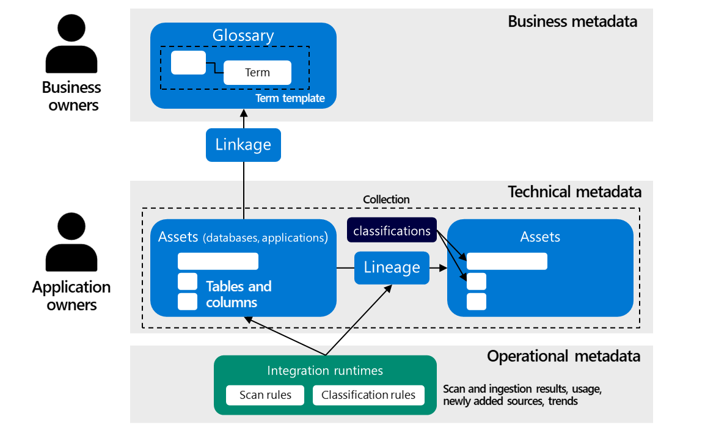

# Use Microsoft Purview for managing your data estate at large

Microsoft Purview is a unified data governance solution that helps you manage and govern your on-premises, multi-cloud, and software-as-a-service (SaaS) data. It does data governance at scale, because it's a fully automated service that intelligently performs data discovery, data scanning and access management. It also provides a holistic map for providing many insights of your data mesh architecture.

When implementing Microsoft Purview, it's recommend not introducing too much change and complexity quickly. The technical metadata is recommended to be the foundation. You'll need to gather and organize this before you can make sense of it. After this, start with the basics: business terms, lists of authoritative data sources and databases, schema information, data ownership and stewardship, and security. Slowly scale by involving more domain owners and data stewards. Also scale by adding more classifications and sensitivity labels. This improves the search experience and allows for better data access management. For your custom metadata attributes, such as list of domains and application metadata, you could consider creating extra type definitions in Microsoft Purview using Purview's REST APIs.

When you envision a domain-oriented or more decentralized architecture, it's recommended to align your Microsoft Purview Collections and Glossaries with your data domains. Collections in Microsoft Purview are used to organize assets and sources. You can use a Collection as a boundary for your assets and sources and align this with a particular domain. You can do the same for your Glossary: create hierarchy structures within your glossary and align these with your domains. Ask your domains to take ownership for creating relationships between your glossary terms and collection attributes. This creates transparency over data ownership and improves your data semantics.

## Relationship to Metadata Management

Data Governance has a strong relationship with Metadata Management. Metadata is data about data. It describes other data, providing a reference that helps you to find, secure and control data. Metadata also binds data together. It can be used for validating the integrity and quality of the data, routing or replicating it to the new location, transforming the data, and knowing its meaning are all performed through metadata. Metadata is also essential in democratizing data through self-service portals.

A good metadata management strategy grows organically. It starts simple and small by first identifying the most important areas. A good metadata management strategy also is supported with services and clear processes. To get started, it's good to be aware of the different metadata categories:

- **Business metadata** is a category of metadata that describes all aspects used for governance, finding & understanding data. Some well-known examples are business terms, definitions, data ownership information, information about data usage and origination, and so on.
- **Technical metadata** is a category of metadata that describes the structural aspects of data at design time. Some well-known examples are schema information, information about data formats and protocols, encryption and decryption keys, and so on.
- **Operational metadata** is a category of metadata that describes processing aspects of data at run time. Some well-known examples are process information, execution time, information about whether a process failed, ID of the job, and so on.
- **Social metadata** is a category of metadata that describes the user perspective of the data by its consumers. Some well-known examples are use and user tracking information, data on search results, filters and clicks, viewing time, profile hits, comments, and so on.

When it comes to decentralized data architecture, metadata management is mostly an organizational challenge. It's about finding the right balance between centrally managed metadata and federated managed metadata. Metadata in this respect also has a strong relationship with [DataOps](https://docs.microsoft.com/azure/architecture/example-scenario/data-warehouse/dataops-mdw), which is an advanced and collaborative data management practice focused on improving the efficiency of communication, integration, and automation of data flows between teams across an organization. DataOps addresses some of the complexity associated with metadata management. It strikes a balance between central governance and domain ownership for metadata management.

Before you start implementing and deciding what metadata to manage centrally or federate to your data domains, first ask yourself: What business metadata is critical? What technical metadata is required for interoperability? What processes and streams capture the data? Where are the models or schemas created and maintained? What information teams need to deliver centrally to allow the data governance department to do its work correctly? After you've analyzed your most important questions, you need to map out the content life cycle for each of the metadata streams and determine all dependencies. What you will end up with is a metadata model that can connect business domains, processes, technology, and data.

   

After you know what metadata you need, you need to find a place for storing and processing metadata. This brings you to Microsoft Purview.

## Collections for organizing technical metadata

When planning your Microsoft Purview deployment and aligning your data governance activities, you need to define how technical metadata, such as data asset information, will be managed together. This grouping and the granularity of your technical metadata is what collections are for. A collection is a logical container or a boundary in which your metadata, such as data sources, will be managed. When creating collections and placing them in a hierarchy, you need to make different considerations, such as your security requirements, governance structure and democratization needs. For example, a more centralized-alined style of data management could lead to a different collection structure then a more domain-oriented style of data management. Microsoft has provided some best practices for organizing your collections, which can be found over here: [Microsoft Purview collections architectures and best practices](https://docs.microsoft.com/azure/purview/concept-best-practices-collections).

The collection metadata, as you can see in the image from the previous section, mostly sits on a technical level. This also often implies a more technical-oriented data ownership. The contact persons assigned to your data assets are typically application- or database owners, knowing how these systems are designed. You can support these users also with additional roles in Purview:

- **Collection Admins** can edit Microsoft Purview collections and their details and add sub-collections. They can also add users to other Microsoft Purview roles on collections where they're admins.
- **Data Source Admins** can manage data sources and data scans.

Assigning users to roles enables them to maintain technical metadata themselves without any help from a central departments. Enabling them with these roles makes your metadata activities more self-service.

## Glossary for capturing business knowledge

The glossary, contrasting to collections, sit on a business level. It is used to capture business knowledge that is commonly used, communicated, and shared in the organization. A glossary can help for improving an organizations overall business productivity and performance. It can also help to find data more easily.

Within Microsoft Purview, the Glossary supports several features:

- Supports adding business terms, including definitions, for capture relevant knowledge.
- Supports relationship between terms, such as synonyms and related.
- Supports hierarchies for better organizing your terms.
- Supports term templates for capturing additional custom attributes.
- Bulk import and exports of terms.
- Allows terms to be mapped to assets like a database, tables, columns etc.

Because business terms provide vocabulary for business users, it's also logical to assign business-oriented ownership. Purview uses data experts and data stewards. Data experts are typically the knowledge holder. They know a particular domain or business unit very well. Data stewards are often the people accountable. They oversee completeness and correctness. You can support these users also with additional roles in Purview:

- **Data curators** - a role that provides access to the data catalog to manage assets, configure custom classifications, set up glossary terms, and view insights. Data curators can create, read, modify, move, and delete assets. They can also apply annotations to assets.

Business terms and information from your collections can also be linked together. This method of bringing information from your source systems together by linking it to the same business terms, gives a richer experience to your organization. It helps you to understand how concepts and business terms have been translated to technical designs. It also enables you to correlate data across different systems and applications. Customer data, for example, often is stored across many different systems. By linking to business terms you can better oversee and more efficiently manage your data landscape.

## Lineage

Lineage is a vital aspect of data governance. It is the silver bullet that helps us track where our data originated, how it was gathered, how it has been modified, and how it is consumed downstream. It provides traceability as data flows through the enterprise. The need for such insight is driven by compliance, regulations, privacy, ethics, and reproducibility and transparency of advanced analytics models.

To consistently capture lineage, you need to set standards like tools and methodologies to use. Users tend to follow the path of least resistance, so keep this in mind when offering services to your organization. Services like Azure Data Factory, AzureData Share, and Power BI automatically capture the lineage of data as it moves. Alternatively you create custom lineage, which is supported via Atlas hooks and REST API. Lineage in Microsoft Purview includes datasets and processes. Datasets are also referred to as nodes while processes can be also called edges:

- **Dataset (Node)**: A dataset (structured or unstructured) provided as an input to a process. For example, a SQL Table, Azure blob, and files (such as .csv and .xml), are all considered datasets. In the lineage section of Microsoft Purview, datasets are represented by rectangular boxes.

- **Process (Edge)**: An activity or transformation performed on a dataset is called a process. For example, ADF Copy activity, Data Share snapshot and so on. In the lineage section of Microsoft Purview, processes are represented by round-edged boxes.

Lineage can also be used to provide insights in an end-to-end context. You could for example organize your metadata in Microsoft Purview as a graph by connecting it to other metadata subjects, such as domains, data quality, data usage, business capabilities, application functions, application life cycle management information, and so on. This approach of bringing metadata closer to data analysts and scientists is also known as "Data observability".