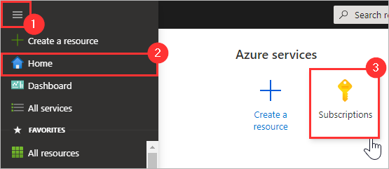
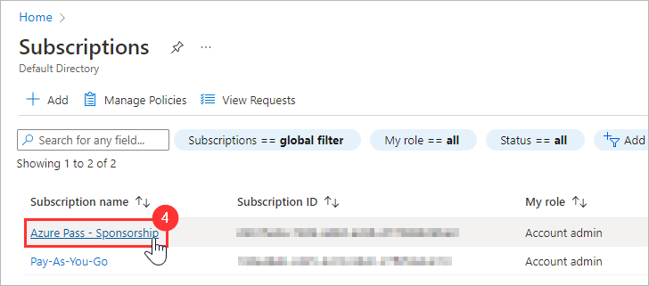
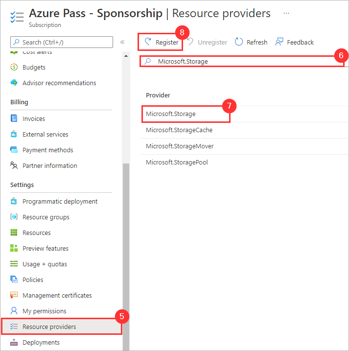

# Register a Resource Provider

[< Previous Module](../modules/module00.md) - **[Home](../README.md)**

## :loudspeaker: Introduction

An Azure resource provider is a collection of REST operations that provide functionality for an Azure service. For example, the Key Vault service consists of a resource provider named Microsoft.KeyVault. The resource provider defines REST operations for working with vaults, secrets, keys, and certificates.

## :thinking: Prerequisites

* An [Azure account](https://azure.microsoft.com/free/) with an active subscription.
* Sufficient permissions to register a resource provider (e.g. Contributor or Owner roles).

## Azure Portal

1. Navigate to the Azure Portal and open the portal menu
1. Click **Home**
1. Click **Subscriptions**
    
1. Select `YOUR_AZURE_SUBSCRIPTION`
    
1. Click **Resource Providers**
1. Search for a Resource Provider (e.g. `Microsoft.Storage`)
1. Select the Resource Provider from the list
1. Click **Register**
    

<a href="#register-a-resource-provider">↥ back to top</a>

## :tada: Summary

You have successfully registered a resource provider.

[Continue >](../modules/module00.md)
